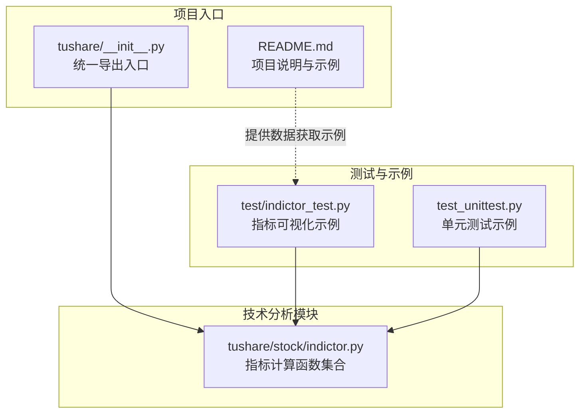
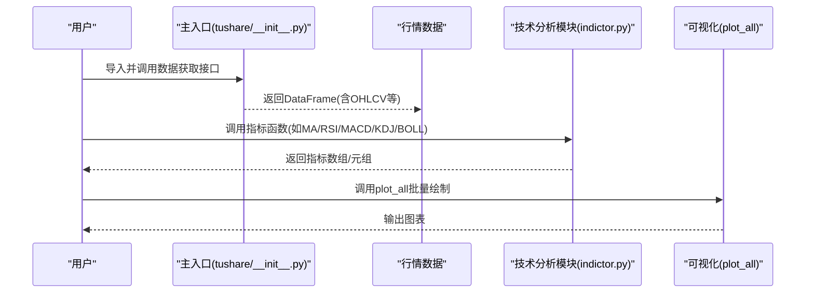
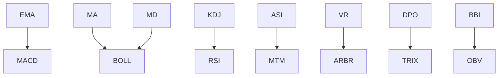

# 技术分析API

<cite>
**本文引用的文件**
- [tushare/stock/indictor.py](file://tushare/stock/indictor.py)
- [test/indictor_test.py](file://test/indictor_test.py)
- [README.md](file://README.md)
- [tushare/__init__.py](file://tushare/__init__.py)
- [test_unittest.py](file://test_unittest.py)
</cite>

## 目录
1. [简介](#简介)
2. [项目结构](#项目结构)
3. [核心组件](#核心组件)
4. [架构总览](#架构总览)
5. [详细组件分析](#详细组件分析)
6. [依赖分析](#依赖分析)
7. [性能考量](#性能考量)
8. [故障排查指南](#故障排查指南)
9. [结论](#结论)
10. [附录](#附录)

## 简介
本文件为 TuShare 技术分析 API 的权威参考文档，聚焦于股票市场常用技术指标的计算接口与使用方法，涵盖移动平均线（MA）、指数平滑移动平均线（EMA）、MACD、随机指标（KDJ）、相对强弱指数（RSI）、布林带（BOLL）、威廉指标（W%R）、动向指标（DMI）、乖离率（BIAS）、振动升降指标（ASI）、成交量变异率（VR）、AR/BR、区间震荡线（DPO）、三重指数平滑（TRIX）、多空指标（BBI）、动量指标（MTM）、能量潮（OBV）等。文档从指标原理、参数设置、适用场景与注意事项出发，结合实际应用示例，帮助读者建立系统化的技术分析体系。

## 项目结构
- 技术分析指标集中于 tushare/stock/indictor.py，提供各类指标的纯 Python 实现，便于理解与二次开发。
- 测试用例位于 test/indictor_test.py，演示如何加载数据并可视化指标。
- README.md 提供项目背景、安装与快速入门示例，便于初学者快速上手。
- tushare/__init__.py 暴露主入口模块，便于统一导入与使用。
- test_unittest.py 展示了单元测试风格的调用方式，体现 API 的易用性。

图表来源
- [tushare/stock/indictor.py](file://tushare/stock/indictor.py)
- [test/indictor_test.py](file://test/indictor_test.py)
- [test_unittest.py](file://test_unittest.py)
- [README.md](file://README.md)
- [tushare/__init__.py](file://tushare/__init__.py)

章节来源
- [README.md](file://README.md)
- [tushare/__init__.py](file://tushare/__init__.py)

## 核心组件
- 指标计算函数集合：位于 tushare/stock/indictor.py，包含 MA、EMA、MACD、KDJ、RSI、BOLL、W%R、DMI、BIAS、ASI、VR、ARBR、DPO、TRIX、BBI、MTM、OBV 等。
- 数据输入约定：多数函数要求传入 pandas DataFrame，包含日期、开盘、最高、最低、收盘、成交量等字段；部分函数支持指定列名（如 val_name）。
- 返回值约定：多数函数返回 numpy 数组或数组元组，便于后续绘图与进一步计算。
- 可视化辅助：plot_all 函数提供批量绘制各指标的便捷入口，便于快速验证与展示。

章节来源
- [tushare/stock/indictor.py](file://tushare/stock/indictor.py)
- [test/indictor_test.py](file://test/indictor_test.py)

## 架构总览
技术分析 API 的典型调用链如下：用户通过主入口获取历史行情数据，然后将数据传入技术分析模块的指标函数，得到指标序列，最后进行可视化或策略信号生成。

图表来源
- [tushare/__init__.py](file://tushare/__init__.py)
- [tushare/stock/indictor.py](file://tushare/stock/indictor.py)
- [test/indictor_test.py](file://test/indictor_test.py)

## 详细组件分析

### 移动平均线（MA）
- 计算原理：对 N 日收盘价求算术平均，逐日滚动更新。
- 参数设置：n 为周期长度；val_name 指定用于计算的列名（默认收盘价）。
- 适用场景：趋势判断、支撑阻力识别、均线系统策略。
- 注意事项：N 过小噪声大，N 过大滞后性强；需结合其他指标确认趋势强度。
- 使用示例路径：[ma 函数定义](file://tushare/stock/indictor.py)

章节来源
- [tushare/stock/indictor.py](file://tushare/stock/indictor.py)

### 指数平滑移动平均线（EMA）
- 计算原理：基于指数加权递推公式，近期权重更大，响应更快。
- 参数设置：n 为平滑系数对应的周期；val_name 指定列名。
- 适用场景：短期趋势跟踪、MACD 差值计算的基础。
- 注意事项：EMA 对价格波动更敏感，适合震荡偏弱或上升初期。
- 使用示例路径：[ema 函数定义](file://tushare/stock/indictor.py)

章节来源
- [tushare/stock/indictor.py](file://tushare/stock/indictor.py)

### 指数平滑异同移动平均线（MACD）
- 计算原理：快线（EMA(q)）与慢线（EMA(s)）之差为 DIFF，DIFF 的 EMA(d) 为 DEM，OSC=DIFF-DEM。
- 参数设置：quick_n（快线周期，默认12）、slow_n（慢线周期，默认26）、dem_n（DEm周期，默认9）、val_name。
- 适用场景：趋势转折、背离信号、零轴穿越。
- 注意事项：参数组合常以经典值为主；注意顶部/底部背离与趋势持续性的匹配。
- 使用示例路径：[macd 函数定义](file://tushare/stock/indictor.py)

章节来源
- [tushare/stock/indictor.py](file://tushare/stock/indictor.py)

### 随机指标（KDJ）
- 计算原理：基于最近 N 日内的最高/最低与收盘价的关系，计算 RSV，再以指数平滑法得到 K、D、J。
- 参数设置：默认周期 N=9（KDJ 默认周期），函数内部固定。
- 适用场景：超买超卖判断、短期反转信号。
- 注意事项：震荡市效果好，单边行情易误判；建议结合趋势过滤。
- 使用示例路径：[kjd 函数定义](file://tushare/stock/indictor.py)

章节来源
- [tushare/stock/indictor.py](file://tushare/stock/indictor.py)

### 相对强弱指数（RSI）
- 计算原理：统计 N 日内上涨平均值与下跌平均值，计算相对强度比，再转换为 0-100 区间的 RSI。
- 参数设置：n 为统计周期（默认6）；val_name。
- 适用场景：超买超卖、背离信号、动能强弱。
- 注意事项：不同周期对极端行情敏感度不同；结合价格形态与成交量。
- 使用示例路径：[rsi 函数定义](file://tushare/stock/indictor.py)

章节来源
- [tushare/stock/indictor.py](file://tushare/stock/indictor.py)

### 布林带（BOLL）
- 计算原理：中轨=MA(n)，上下轨=中轨±k×N日收盘价标准差。
- 参数设置：n（均值周期，默认10）、val_name、k（默认2）。
- 适用场景：通道突破、压力支撑、波动率放大/收窄判断。
- 注意事项：参数 n、k 影响通道宽度；单边行情可能突破后继续运行。
- 使用示例路径：[boll 函数定义](file://tushare/stock/indictor.py)

章节来源
- [tushare/stock/indictor.py](file://tushare/stock/indictor.py)

### 威廉指标（W%R）
- 计算原理：基于 N 日最高/最低与当前收盘价，计算动向强度。
- 参数设置：n（默认14）。
- 适用场景：超买超卖、短期反转。
- 注意事项：与 RSI 类似，震荡市更有效。
- 使用示例路径：[wnr 函数定义](file://tushare/stock/indictor.py)

章节来源
- [tushare/stock/indictor.py](file://tushare/stock/indictor.py)

### 动向指标（DMI/ADX/ADXR）
- 计算原理：计算 +DI、-DI、DX、ADX、ADXR，衡量趋势强度与方向。
- 参数设置：n（+DI/-DI 周期，默认14）、m（ADX 周期，默认14）、k（ADXR 周期，默认6）。
- 适用场景：趋势识别、趋势强度判断、方向确认。
- 注意事项：ADX 值越高表示趋势越强；+DI 与 -DI 交叉仅反映方向变化。
- 使用示例路径：[dmi 函数定义](file://tushare/stock/indictor.py)

章节来源
- [tushare/stock/indictor.py](file://tushare/stock/indictor.py)

### 乖离率（BIAS）
- 计算原理：(收盘价 - N 日均线) / N 日均线。
- 参数设置：n（默认5）。
- 适用场景：短期偏离度、超买超卖修正。
- 注意事项：偏离过大易发生回抽。
- 使用示例路径：[bias 函数定义](file://tushare/stock/indictor.py)

章节来源
- [tushare/stock/indictor.py](file://tushare/stock/indictor.py)

### 振动升降指标（ASI）
- 计算原理：综合考虑收盘价、开盘价、最高价、最低价与前一日关系，构造累计指标。
- 参数设置：n（默认5）。
- 适用场景：多空力量累积、趋势延续判断。
- 注意事项：适合中长期趋势观察。
- 使用示例路径：[asi 函数定义](file://tushare/stock/indictor.py)

章节来源
- [tushare/stock/indictor.py](file://tushare/stock/indictor.py)

### 成交量变异率（VR）
- 计算原理：按收盘价与开盘价比较，分别统计多方/空方/中性成交量，计算比率。
- 参数设置：n（默认26）。
- 适用场景：成交量视角的趋势确认与分歧判断。
- 注意事项：需结合价格走势解读。
- 使用示例路径：[vr 函数定义](file://tushare/stock/indictor.py)

章节来源
- [tushare/stock/indictor.py](file://tushare/stock/indictor.py)

### AR/BR 指标
- 计算原理：基于 N 日内最高价、最低价、开盘价与昨日收盘价的统计关系。
- 参数设置：n（默认26）。
- 适用场景：市场情绪、买卖压力对比。
- 注意事项：与量能配合使用更可靠。
- 使用示例路径：[arbr 函数定义](file://tushare/stock/indictor.py)

章节来源
- [tushare/stock/indictor.py](file://tushare/stock/indictor.py)

### 区间震荡线（DPO）
- 计算原理：收盘价减去按 (N/2+1) 计算的偏移均线，再对 DPO 做移动平均 MADPO。
- 参数设置：n（默认20）、m（默认6）。
- 适用场景：震荡区间内择机、周期性反转。
- 注意事项：对震荡周期敏感，参数需结合品种调整。
- 使用示例路径：[dpo 函数定义](file://tushare/stock/indictor.py)

章节来源
- [tushare/stock/indictor.py](file://tushare/stock/indictor.py)

### 三重指数平滑（TRIX）
- 计算原理：对 N 日收盘价做三次指数平滑，计算连续变化百分比，再对其做移动平均。
- 参数设置：n（默认12）、m（默认20）。
- 适用场景：趋势持续性、长期动能。
- 注意事项：对趋势确认较稳健，但信号较慢。
- 使用示例路径：[trix 函数定义](file://tushare/stock/indictor.py)

章节来源
- [tushare/stock/indictor.py](file://tushare/stock/indictor.py)

### 多空指标（BBI）
- 计算原理：对不同周期（3/6/12/24）的均价做平均，形成多空平衡线。
- 参数设置：无显式参数。
- 适用场景：多周期共振、中期趋势。
- 注意事项：对多周期组合敏感。
- 使用示例路径：[bbi 函数定义](file://tushare/stock/indictor.py)

章节来源
- [tushare/stock/indictor.py](file://tushare/stock/indictor.py)

### 动量指标（MTM）
- 计算原理：当前收盘价与 N 日前收盘价之差。
- 参数设置：n（默认6）。
- 适用场景：短期动量、价格加速/减速。
- 注意事项：易受噪音干扰，建议结合均线过滤。
- 使用示例路径：[mtm 函数定义](file://tushare/stock/indictor.py)

章节来源
- [tushare/stock/indictor.py](file://tushare/stock/indictor.py)

### 能量潮（OBV）
- 计算原理：根据当日收盘价与当日价格区间的相对位置，对成交量进行正负加权累计。
- 参数设置：无显式参数。
- 适用场景：资金流量、量价配合。
- 注意事项：需结合价格形态与消息面。
- 使用示例路径：[obv 函数定义](file://tushare/stock/indictor.py)

章节来源
- [tushare/stock/indictor.py](file://tushare/stock/indictor.py)

### 可视化与批量绘制（plot_all）
- 功能：批量绘制收盘价、MA、MD、EMA、MACD、KDJ、RSI、BOLL、W%R、DMI、BIAS、ASI、VR、ARBR、DPO、TRIX、BBI、MTM、OBV 等。
- 参数：is_show 控制是否显示，output 控制保存路径。
- 使用示例路径：[plot_all 函数定义](file://tushare/stock/indictor.py)

章节来源
- [tushare/stock/indictor.py](file://tushare/stock/indictor.py)

## 依赖分析
- 模块内聚：indictor.py 将指标计算封装为独立函数，彼此独立，便于按需调用。
- 外部依赖：主要依赖 numpy（数组计算）与 pandas（数据结构），matplotlib（plot_all 可视化）。
- 数据依赖：多数函数依赖 OHLCV 字段；部分函数依赖前一日数据（如 EMA、KDJ、RSI、ASI 等）。
- 调用关系：plot_all 会依次调用各指标函数进行批量绘制；MACD 依赖 EMA；BOLL 依赖 MA 与 MD；KDJ、RSI、ASI、VR、ARBR、DPO、TRIX、BBI、MTM、OBV 等各自独立。

图表来源
- [tushare/stock/indictor.py](file://tushare/stock/indictor.py)

章节来源
- [tushare/stock/indictor.py](file://tushare/stock/indictor.py)

## 性能考量
- 时间复杂度：大多数指标为 O(T×N) 或 O(T)，其中 T 为交易日数量，N 为周期参数；EMA、MACD、KDJ、RSI、ASI、VR、ARBR、DPO、TRIX、BBI、MTM、OBV 等涉及滚动窗口或递推，通常线性复杂度。
- 空间复杂度：多数返回一维数组，空间复杂度 O(T)；plot_all 会临时创建多个子图，注意内存占用。
- 优化建议：
  - 对长序列数据，优先使用 numpy 向量化操作（已有实现）。
  - 批量绘制时控制子图数量与刷新频率，避免频繁绘图导致的性能损耗。
  - 对高频数据，可先降采样或缓存中间结果（如 MA/EMA）以减少重复计算。

## 故障排查指南
- 输入数据格式错误
  - 现象：索引非日期、缺失必要字段（如 close/high/low/open/volume）。
  - 排查：确保使用主入口提供的数据获取接口，返回 DataFrame 已包含所需字段。
  - 参考路径：[主入口导出](file://tushare/__init__.py)
- 参数取值不当
  - 现象：指标异常波动或全为 0。
  - 排查：检查 n、val_name 是否合理；部分指标对 n 较敏感（如 RSI、BOLL、KDJ）。
- 可视化失败
  - 现象：plot_all 无法显示或保存。
  - 排查：确认 matplotlib 环境可用；is_show 与 output 参数设置正确。
  - 参考路径：[plot_all 实现](file://tushare/stock/indictor.py)
- 单元测试与示例
  - 参考路径：[指标测试示例](file://test/indictor_test.py)、[单元测试示例](file://test_unittest.py)

章节来源
- [tushare/stock/indictor.py](file://tushare/stock/indictor.py)
- [test/indictor_test.py](file://test/indictor_test.py)
- [test_unittest.py](file://test_unittest.py)
- [tushare/__init__.py](file://tushare/__init__.py)

## 结论
本技术分析 API 提供了覆盖广泛的技术指标实现，既可用于教学与研究，也可作为策略研发的基础设施。建议在实际应用中：
- 明确指标适用场景与参数范围；
- 结合多种指标与价格形态进行交叉验证；
- 关注趋势强度与动量指标的协同；
- 在回测与实盘中逐步优化参数与信号规则。

## 附录

### 实际应用示例（步骤说明）
- 获取数据
  - 使用主入口的数据接口获取历史行情（包含 OHLCV），参考：[主入口导出](file://tushare/__init__.py)
  - 示例输出字段与用法参考：[README 快速开始](file://README.md)
- 计算指标
  - 选择所需指标函数，传入 DataFrame 与参数，参考：
    - [ma 函数定义](file://tushare/stock/indictor.py)
    - [ema 函数定义](file://tushare/stock/indictor.py)
    - [macd 函数定义](file://tushare/stock/indictor.py)
    - [kjd 函数定义](file://tushare/stock/indictor.py)
    - [rsi 函数定义](file://tushare/stock/indictor.py)
    - [boll 函数定义](file://tushare/stock/indictor.py)
    - [其他指标函数定义](file://tushare/stock/indictor.py)
- 可视化
  - 使用 plot_all 快速绘制多指标对比图，参考：[plot_all 函数定义](file://tushare/stock/indictor.py)
- 策略信号生成
  - 常见思路：均线多头/空头排列、MACD 金叉死叉、KDJ 超买超卖背离、RSI 区间与趋势结合、BOLL 突破与回归、OBV 量价配合等。
  - 注意：单一指标易产生噪音，建议采用多因子融合与风控约束。

章节来源
- [README.md](file://README.md)
- [tushare/__init__.py](file://tushare/__init__.py)
- [tushare/stock/indictor.py](file://tushare/stock/indictor.py)
- [test/indictor_test.py](file://test/indictor_test.py)