# 新闻事件API

<cite>
**本文档引用的文件**
- [newsevent.py](file://tushare/stock/newsevent.py)
- [news_vars.py](file://tushare/stock/news_vars.py)
- [cons.py](file://tushare/stock/cons.py)
- [news_test.py](file://test/news_test.py)
- [caixinnews.py](file://tushare/internet/caixinnews.py)
- [__init__.py](file://tushare/__init__.py)
- [README.md](file://README.md)
</cite>

## 目录
1. [简介](#简介)
2. [项目结构](#项目结构)
3. [核心组件](#核心组件)
4. [架构概览](#架构概览)
5. [详细组件分析](#详细组件分析)
6. [数据流分析](#数据流分析)
7. [性能考量](#性能考量)
8. [故障排除指南](#故障排除指南)
9. [应用示例](#应用示例)
10. [结论](#结论)

## 简介

TuShare新闻事件API是一套专门用于获取金融新闻数据的接口集合，主要涵盖最新新闻、个股公告、重大事件等信息获取功能。该API基于Python开发，提供了简洁易用的数据接口，能够帮助量化分析师和金融研究人员获取实时的市场新闻信息，进行事件驱动策略分析和消息面分析。

该API的核心特点包括：
- 实时财经新闻获取
- 个股公告信息检索
- 股吧热点消息监控
- 多数据源整合
- 标准化的数据输出格式

## 项目结构

TuShare项目采用模块化设计，新闻事件API位于股票模块下的专用子模块中：

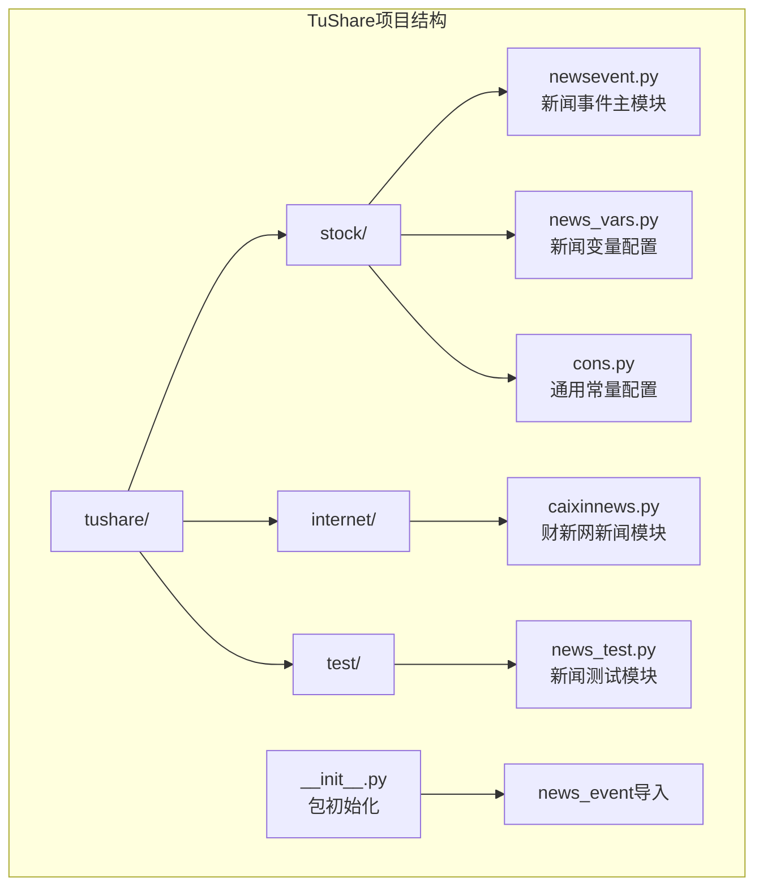

**图表来源**
- [__init__.py:52-54](file://tushare/__init__.py#L52-L54)

**章节来源**
- [__init__.py:1-140](file://tushare/__init__.py#L1-L140)

## 核心组件

新闻事件API由三个核心组件构成：

### 主要接口函数

1. **get_latest_news()** - 获取最新财经新闻
2. **get_notices()** - 获取个股公告信息
3. **guba_sina()** - 获取新浪股吧热点消息
4. **latest_content()** - 获取新闻详细内容
5. **notice_content()** - 获取公告详细内容

### 数据源配置

- **LATEST_URL** - 新浪滚动新闻接口地址
- **NOTICE_INFO_URL** - 个股公告信息接口
- **GUBA_SINA_URL** - 新浪股吧接口地址
- **PAGE_NUM** - 分页参数配置

**章节来源**
- [newsevent.py:26-221](file://tushare/stock/newsevent.py#L26-L221)
- [news_vars.py:1-10](file://tushare/stock/news_vars.py#L1-L10)
- [cons.py:19-45](file://tushare/stock/cons.py#L19-L45)

## 架构概览

新闻事件API采用分层架构设计，实现了数据获取、处理和输出的完整流程：

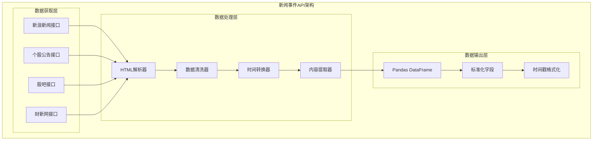

**图表来源**
- [newsevent.py:45-68](file://tushare/stock/newsevent.py#L45-L68)
- [caixinnews.py:45-67](file://tushare/internet/caixinnews.py#L45-L67)

## 详细组件分析

### get_latest_news() - 最新新闻获取

该函数负责获取最新的财经新闻信息，支持参数化配置和内容显示控制。

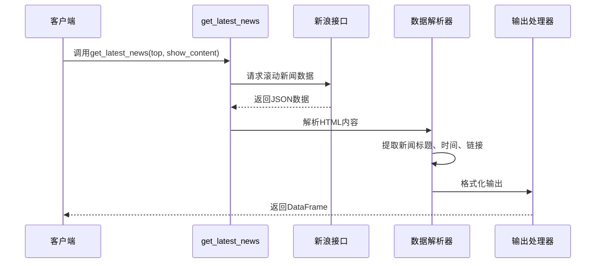

**图表来源**
- [newsevent.py:26-68](file://tushare/stock/newsevent.py#L26-L68)

#### 函数参数详解

| 参数名 | 类型 | 默认值 | 描述 |
|--------|------|--------|------|
| top | int | None | 显示最新消息的条数，默认使用PAGE_NUM配置 |
| show_content | bool | False | 是否显示新闻内容 |

#### 返回数据结构

| 字段名 | 类型 | 描述 |
|--------|------|------|
| classify | string | 新闻类别 |
| title | string | 新闻标题 |
| time | string | 发布时间 |
| url | string | 新闻链接 |
| content | string | 新闻内容（当show_content为True时） |

**章节来源**
- [newsevent.py:26-68](file://tushare/stock/newsevent.py#L26-L68)

### get_notices() - 个股公告获取

该函数专门用于获取指定股票的公告信息，支持按日期过滤。

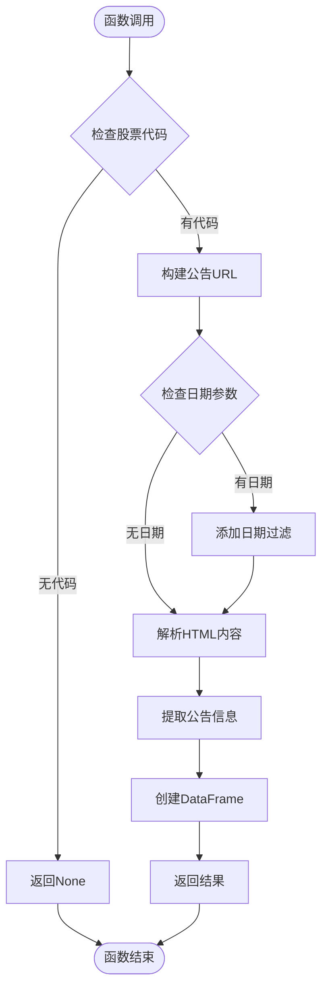

**图表来源**
- [newsevent.py:97-129](file://tushare/stock/newsevent.py#L97-L129)

#### 功能特性

- 自动识别股票市场（上交所/深交所）
- 支持按日期过滤公告
- 提供完整的公告详情链接
- 标准化的数据输出格式

**章节来源**
- [newsevent.py:97-129](file://tushare/stock/newsevent.py#L97-L129)

### guba_sina() - 股吧热点消息

该函数获取新浪股吧首页的重点消息，包含用户互动数据。

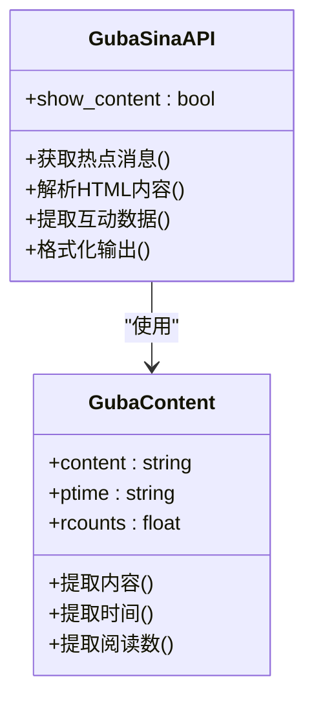

**图表来源**
- [newsevent.py:151-212](file://tushare/stock/newsevent.py#L151-L212)

#### 输出字段说明

| 字段名 | 类型 | 描述 |
|--------|------|------|
| title | string | 消息标题 |
| content | string | 消息内容（可选） |
| ptime | string | 发布时间 |
| rcounts | float | 阅读次数 |

**章节来源**
- [newsevent.py:151-212](file://tushare/stock/newsevent.py#L151-L212)

### 数据源配置管理

新闻事件API通过集中配置管理所有数据源：

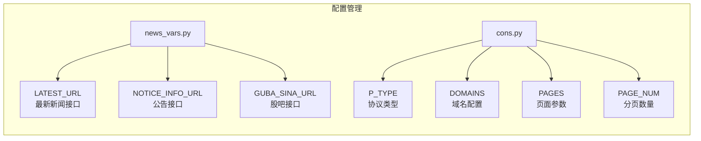

**图表来源**
- [news_vars.py:1-10](file://tushare/stock/news_vars.py#L1-L10)
- [cons.py:19-45](file://tushare/stock/cons.py#L19-L45)

**章节来源**
- [news_vars.py:1-10](file://tushare/stock/news_vars.py#L1-L10)
- [cons.py:19-45](file://tushare/stock/cons.py#L19-L45)

## 数据流分析

新闻事件API的数据处理流程遵循标准的数据获取-解析-清洗-输出模式：

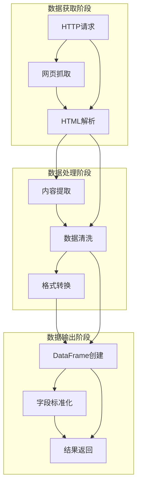

**图表来源**
- [newsevent.py:45-94](file://tushare/stock/newsevent.py#L45-L94)

### 数据质量保证

1. **编码处理** - 统一使用GBK编码解码
2. **异常处理** - 完善的错误捕获机制
3. **数据验证** - 字段存在性检查
4. **格式标准化** - 时间戳格式统一

**章节来源**
- [newsevent.py:45-94](file://tushare/stock/newsevent.py#L45-L94)

## 性能考量

### 网络请求优化

- **超时控制** - 设置10秒超时限制
- **随机参数** - 添加随机数避免反爬虫检测
- **连接复用** - 使用urllib的连接池机制

### 内存管理

- **流式处理** - 对于大文本内容采用流式解析
- **延迟加载** - 可选的内容获取避免不必要的网络请求
- **数据类型优化** - 使用适当的数据类型减少内存占用

### 并发处理

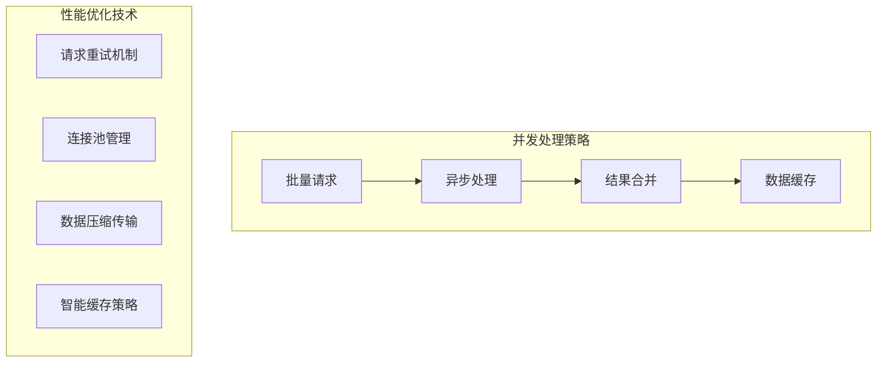

## 故障排除指南

### 常见问题及解决方案

| 问题类型 | 症状描述 | 解决方案 |
|----------|----------|----------|
| 网络连接失败 | 抛出网络异常 | 检查网络连接，增加重试次数 |
| 编码错误 | UnicodeDecodeError | 指定正确的编码格式GBK |
| 解析失败 | HTML解析异常 | 检查目标网站结构变化 |
| 数据为空 | 返回空DataFrame | 验证参数设置和数据源可用性 |

### 调试建议

1. **启用详细日志** - 在开发环境中打印中间结果
2. **参数验证** - 检查输入参数的有效性
3. **数据完整性检查** - 验证关键字段的存在性
4. **错误恢复机制** - 实现优雅的降级处理

**章节来源**
- [newsevent.py:67-94](file://tushare/stock/newsevent.py#L67-L94)

## 应用示例

### 事件驱动策略应用

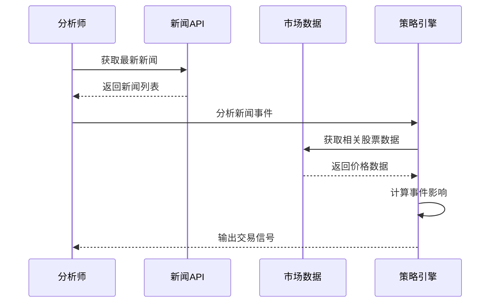

### 消息面分析实践

1. **新闻分类** - 基于标题关键词进行自动分类
2. **情感分析** - 评估新闻对市场情绪的影响
3. **传播监测** - 跟踪热点话题的传播路径
4. **关联分析** - 分析新闻与股价走势的关系

### 舆情监控系统

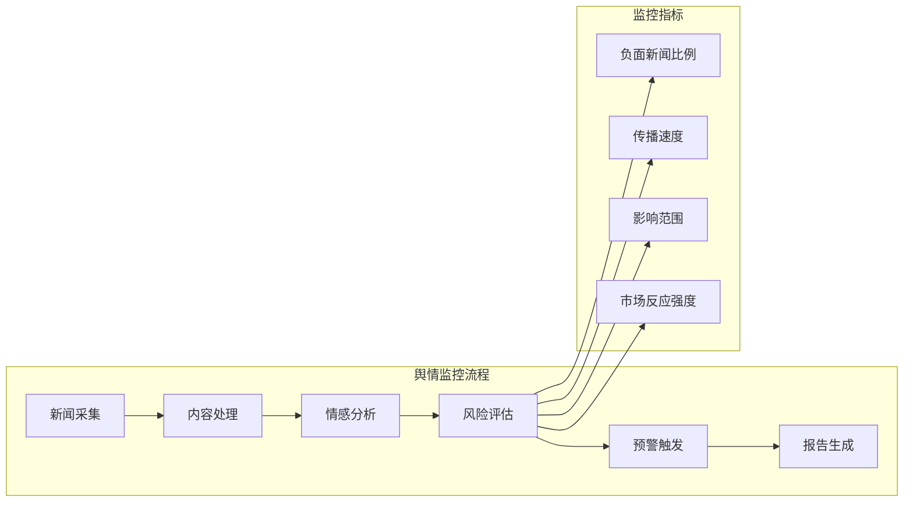

### 高级应用技巧

#### 新闻数据清洗

1. **文本清理** - 移除HTML标签和特殊字符
2. **去重处理** - 基于标题和内容的相似度去重
3. **时间过滤** - 按时间窗口筛选有效新闻
4. **语言处理** - 中文分词和词性标注

#### 情感分析

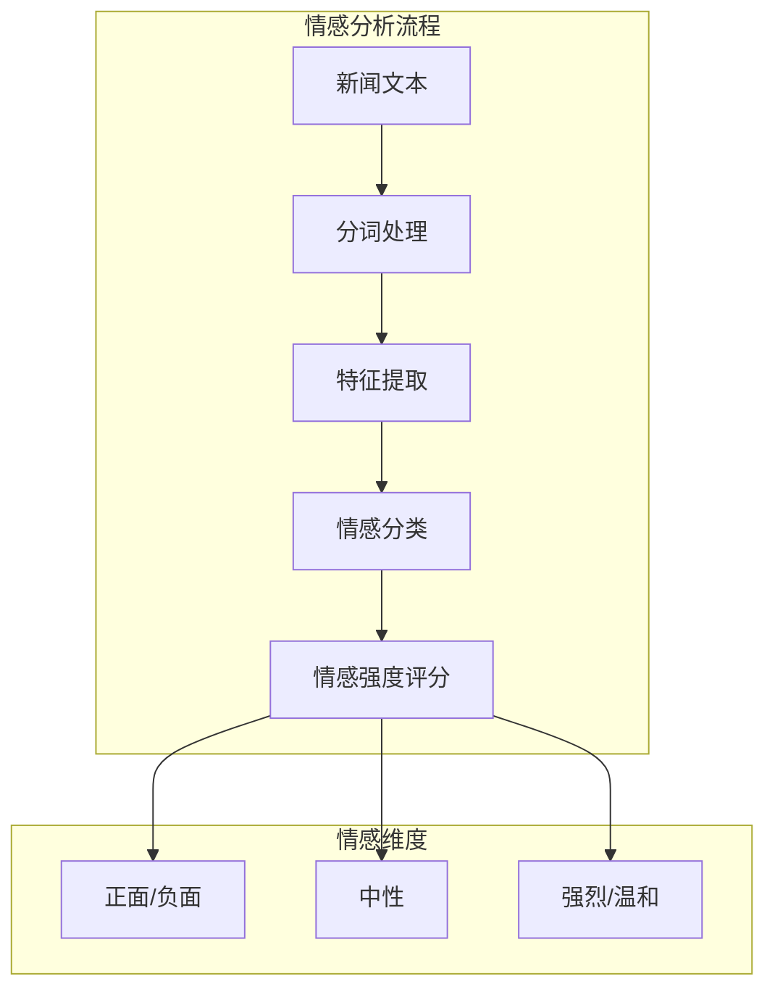

#### 关键词提取

1. **TF-IDF算法** - 提取重要词汇
2. **TextRank算法** - 基于图的关键词抽取
3. **领域词典匹配** - 结合金融专业词汇
4. **上下文分析** - 考虑词汇间的语义关系

## 结论

TuShare新闻事件API为金融数据研究提供了强大的新闻数据获取能力。通过其简洁的接口设计和丰富的功能特性，研究人员可以轻松获取实时的市场新闻信息，构建各种基于新闻事件的投资策略。

### 主要优势

1. **易用性强** - 简洁的API接口，易于集成
2. **数据丰富** - 覆盖多个重要的新闻数据源
3. **扩展性好** - 支持自定义数据源和处理逻辑
4. **稳定性高** - 完善的错误处理和异常恢复机制

### 发展方向

1. **多语言支持** - 扩展到更多语言的新闻数据
2. **实时推送** - 实现新闻的实时推送功能
3. **深度分析** - 集成更多高级的自然语言处理功能
4. **可视化** - 提供新闻数据的可视化展示功能

该API为量化金融研究提供了坚实的基础，通过合理的应用和扩展，可以构建更加完善的消息面分析系统。