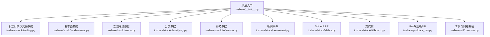
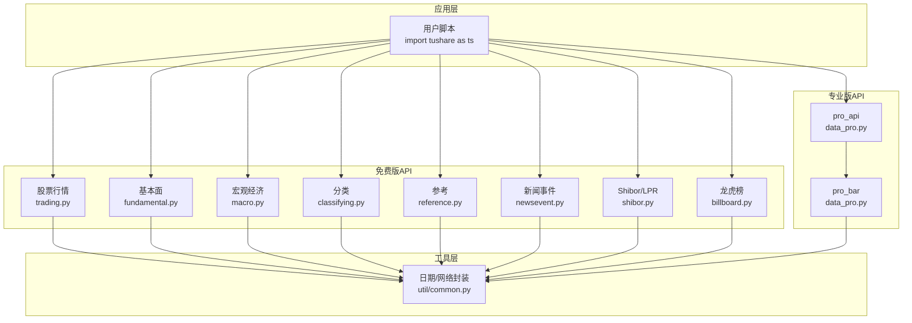
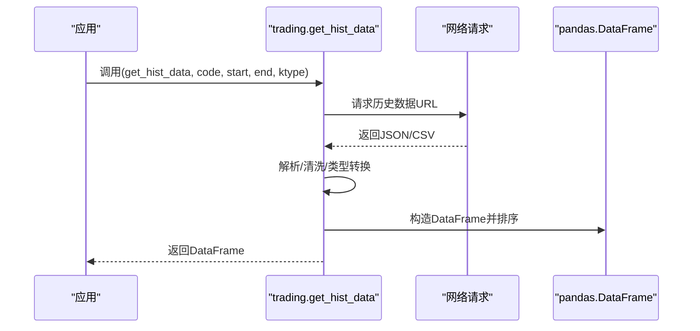
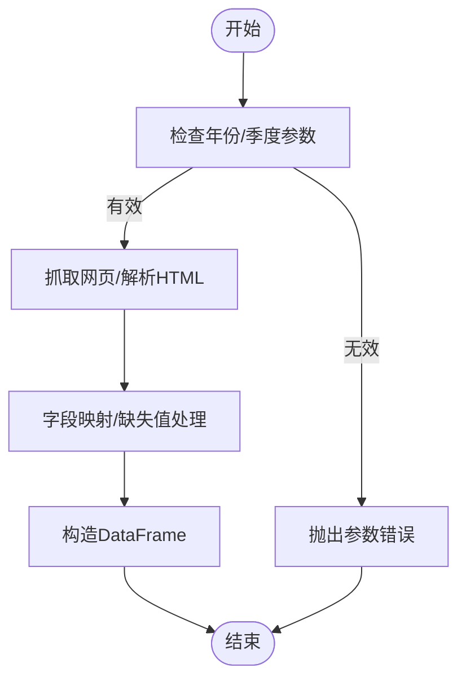
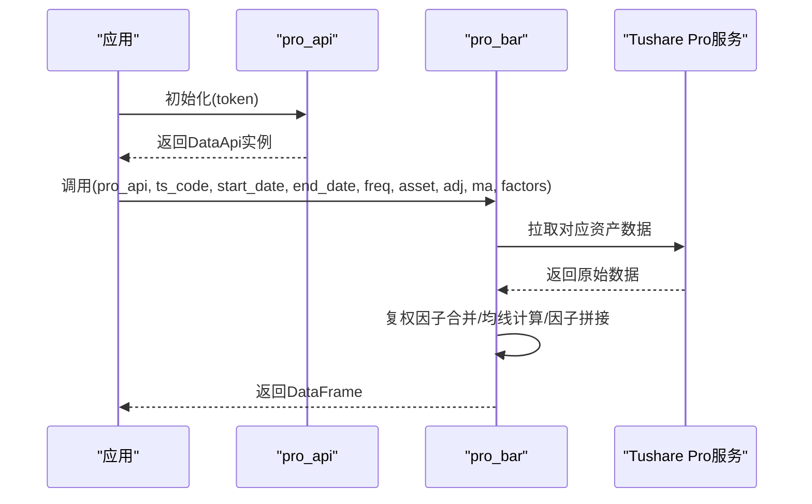
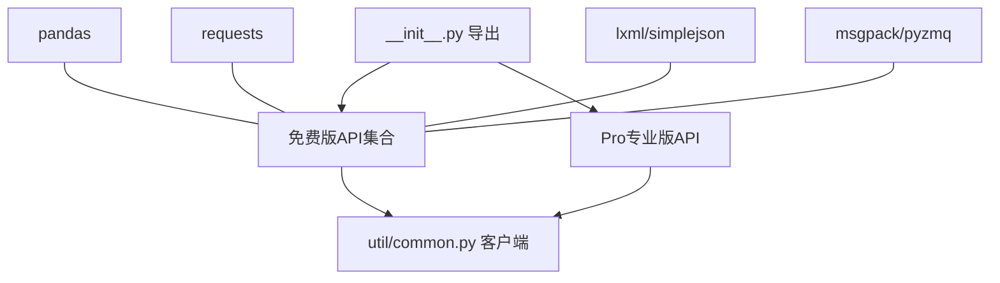

# 核心API参考

<cite>
**本文引用的文件**
- [README.md](file://README.md)
- [__init__.py](file://tushare/__init__.py)
- [setup.py](file://setup.py)
- [requirements.txt](file://requirements.txt)
- [trading.py](file://tushare/stock/trading.py)
- [fundamental.py](file://tushare/stock/fundamental.py)
- [macro.py](file://tushare/stock/macro.py)
- [classifying.py](file://tushare/stock/classifying.py)
- [reference.py](file://tushare/stock/reference.py)
- [shibor.py](file://tushare/stock/shibor.py)
- [data_pro.py](file://tushare/pro/data_pro.py)
- [billboard.py](file://tushare/stock/billboard.py)
- [newsevent.py](file://tushare/stock/newsevent.py)
- [common.py](file://tushare/util/common.py)
- [trading_test.py](file://test/trading_test.py)
- [macro_test.py](file://test/macro_test.py)
</cite>

## 目录
1. [简介](#简介)
2. [项目结构](#项目结构)
3. [核心组件](#核心组件)
4. [架构总览](#架构总览)
5. [详细组件分析](#详细组件分析)
6. [依赖分析](#依赖分析)
7. [性能考量](#性能考量)
8. [故障排查指南](#故障排查指南)
9. [结论](#结论)
10. [附录](#附录)

## 简介
本参考文档面向TuShare核心API，系统梳理免费版与专业版（Pro）两大体系的公开接口，覆盖股票行情、分笔与K线、复权、基本面、技术分析、宏观经济、分类数据、新闻事件、参考数据、Shibor/LPR等模块。文档提供参数说明、返回值格式、使用模式与注意事项，并通过序列图与流程图展示典型调用链路与数据处理逻辑，帮助用户构建稳定、可扩展的数据获取流程。

## 项目结构
TuShare采用按领域分层的模块化组织方式：
- 免费版API集中在tushare/stock子包，提供历史行情、实时行情、分笔、复权、宏观、分类、参考、新闻事件、龙虎榜等接口。
- 专业版（Pro）API集中在tushare/pro，提供统一认证入口与更丰富的数据类型（股票/指数/期货/期权/基金/数字货币等）。
- 工具与公共组件位于tushare/util，如日期工具、网络客户端封装等。
- 顶层入口通过tushare/__init__.py聚合导出，便于用户直接import tushare as ts调用。

图表来源
- [__init__.py:11-140](file://tushare/__init__.py#L11-L140)
- [trading.py:32-800](file://tushare/stock/trading.py#L32-L800)
- [fundamental.py:22-520](file://tushare/stock/fundamental.py#L22-L520)
- [macro.py:23-422](file://tushare/stock/macro.py#L23-L422)
- [classifying.py:27-359](file://tushare/stock/classifying.py#L27-L359)
- [reference.py:28-800](file://tushare/stock/reference.py#L28-L800)
- [shibor.py:16-207](file://tushare/stock/shibor.py#L16-L207)
- [data_pro.py:21-158](file://tushare/pro/data_pro.py#L21-L158)
- [billboard.py:28-347](file://tushare/stock/billboard.py#L28-L347)
- [newsevent.py:26-221](file://tushare/stock/newsevent.py#L26-L221)
- [common.py:18-86](file://tushare/util/common.py#L18-L86)

章节来源
- [__init__.py:11-140](file://tushare/__init__.py#L11-L140)
- [README.md:43-188](file://README.md#L43-L188)

## 核心组件
- 免费版API（tushare/stock/*）
  - 行情与交易：历史日线/分钟线、实时行情、分笔、当日分笔、复权、指数行情、K线合并等。
  - 基本面：公司概况、业绩报表、盈利能力、营运能力、成长能力、偿债能力、现金流量、资产负债表、利润表、现金流量表。
  - 宏观经济：GDP、CPI、PPI、存贷款利率、准备金率、货币供应量、黄金与外汇储备等。
  - 分类：行业/概念/地域/创业板/中小板/ST等分类，以及沪深300/上证50/中证500成分。
  - 参考：分配预案、业绩预告、限售解禁、基金持股、新股与可转债、融资融券（沪/深）。
  - 新闻事件：即时新闻、公告与信息地雷、雪球/新浪股吧热点。
  - Shibor/LPR：Shibor、报价、均值、LPR及其均值。
  - 龙虎榜：每日榜单、个股/营业部/机构统计与明细。
- 专业版API（tushare/pro/data_pro.py）
  - 认证初始化：pro_api(token)
  - 通用BAR：pro_bar(ts_code, start_date, end_date, freq, asset, exchange, adj, ma, factors, contract_type, retry_count)
  - 支持资产类型：E（股票/ETF）、I（指数）、FT（期货）、O（期权）、FD（基金）、C（数字货币），并可选复权与均线增强。

章节来源
- [trading.py:32-800](file://tushare/stock/trading.py#L32-L800)
- [fundamental.py:22-520](file://tushare/stock/fundamental.py#L22-L520)
- [macro.py:23-422](file://tushare/stock/macro.py#L23-L422)
- [classifying.py:27-359](file://tushare/stock/classifying.py#L27-L359)
- [reference.py:28-800](file://tushare/stock/reference.py#L28-L800)
- [shibor.py:16-207](file://tushare/stock/shibor.py#L16-L207)
- [data_pro.py:21-158](file://tushare/pro/data_pro.py#L21-L158)
- [billboard.py:28-347](file://tushare/stock/billboard.py#L28-L347)
- [newsevent.py:26-221](file://tushare/stock/newsevent.py#L26-L221)

## 架构总览
免费版与专业版的协作关系如下：
- 免费版适合日常行情与基础数据获取，接口以pandas DataFrame输出，便于后续分析。
- 专业版通过统一认证（token）访问Tushare Pro服务，支持更多资产类型与高频数据，提供复权与均线增强能力。
- 工具层（util）提供日期工具、网络客户端封装，保障跨平台兼容与稳定传输。

图表来源
- [__init__.py:11-140](file://tushare/__init__.py#L11-L140)
- [data_pro.py:21-158](file://tushare/pro/data_pro.py#L21-L158)
- [common.py:18-86](file://tushare/util/common.py#L18-L86)

## 详细组件分析

### 股票行情与交易数据（免费版）
- 接口清单与职责
  - 历史日线/分钟线：get_hist_data
  - 实时行情：get_realtime_quotes
  - 分笔与当日分笔：get_tick_data、get_today_ticks
  - 复权数据：get_h_data
  - 指数行情：get_index
  - K线合并：get_k_data
  - 批量历史：get_hists
  - 每日收盘行情：get_day_all
- 设计要点
  - 参数校验与默认值：如ktype、autype、start/end、retry_count/pause。
  - 数据清洗与类型转换：字符串转浮点、去逗号、索引设置与排序。
  - 错误处理：网络异常抛出统一错误消息，支持重试。
- 使用模式
  - 单股票：get_hist_data('600848', start='2023-01-01', end='2023-12-31')
  - 批量股票：get_hists(['600848', '600036'], start='2023-01-01', end='2023-12-31')
  - 实时行情：get_realtime_quotes(['600848', '000001'])
  - 复权：get_h_data('600848', autype='qfq', start='2023-01-01', end='2023-12-31')

图表来源
- [trading.py:32-100](file://tushare/stock/trading.py#L32-L100)

章节来源
- [trading.py:32-800](file://tushare/stock/trading.py#L32-L800)

### 基本面数据（免费版）
- 接口清单与职责
  - 公司概况：get_stock_basics
  - 业绩报表：get_report_data
  - 盈利能力：get_profit_data
  - 营运能力：get_operation_data
  - 成长能力：get_growth_data
  - 偿债能力：get_debtpaying_data
  - 现金流量：get_cashflow_data
  - 资产负债表/利润表/现金流量表：get_balance_sheet, get_profit_statement, get_cash_flow
- 设计要点
  - 分页抓取与HTML解析，字段映射与缺失值处理。
  - 日期格式与数值类型规范化。
- 使用模式
  - 获取单只股票历史报表：get_balance_sheet('600518')

图表来源
- [fundamental.py:62-127](file://tushare/stock/fundamental.py#L62-L127)

章节来源
- [fundamental.py:22-520](file://tushare/stock/fundamental.py#L22-L520)

### 宏观经济数据（免费版）
- 接口清单与职责
  - GDP：get_gdp_year, get_gdp_quarter, get_gdp_for, get_gdp_pull, get_gdp_contrib
  - CPI/PPI：get_cpi, get_ppi
  - 利率与准备金：get_deposit_rate, get_loan_rate, get_rrr
  - 货币供应量：get_money_supply, get_money_supply_bal
  - 黄金与外汇储备：get_gold_and_foreign_reserves
- 设计要点
  - JSON解析与字段清洗，空值替换为NaN。
- 使用模式
  - 获取CPI月度序列：get_cpi()

章节来源
- [macro.py:23-422](file://tushare/stock/macro.py#L23-L422)

### 分类数据（免费版）
- 接口清单与职责
  - 行业/概念/地域/创业板/中小板/ST：get_industry_classified, get_concept_classified, get_area_classified, get_gem_classified, get_sme_classified, get_st_classified
  - 指数成分：get_hs300s, get_sz50s, get_zz500s
  - 终止/暂停上市：get_terminated, get_suspended
- 设计要点
  - 基于基本面数据或静态CSV生成分类表。
- 使用模式
  - 获取沪深300成分：get_hs300s()

章节来源
- [classifying.py:27-359](file://tushare/stock/classifying.py#L27-L359)

### 参考数据（免费版）
- 接口清单与职责
  - 分配预案：profit_data, profit_divis
  - 业绩预告：forecast_data
  - 限售解禁：xsg_data
  - 基金持股：fund_holdings
  - 新股与可转债：new_stocks, new_cbonds
  - 融资融券：sh_margins, sh_margin_details, sz_margins, sz_margin_details
- 设计要点
  - 多页面抓取与分页控制，字段提取与单位换算。
- 使用模式
  - 获取最新分配预案：profit_data(2024, top=25)

章节来源
- [reference.py:28-800](file://tushare/stock/reference.py#L28-L800)

### 新闻事件（免费版）
- 接口清单与职责
  - 即时新闻：get_latest_news, latest_content
  - 信息地雷：get_notices, notice_content
  - 股吧热点：guba_sina
- 设计要点
  - HTML解析与XPath定位，内容清洗与时间格式化。
- 使用模式
  - 获取最新新闻并显示内容：get_latest_news(top=50, show_content=True)

章节来源
- [newsevent.py:26-221](file://tushare/stock/newsevent.py#L26-L221)

### Shibor/LPR（免费版）
- 接口清单与职责
  - Shibor：shibor_data, shibor_quote_data, shibor_ma_data
  - LPR：lpr_data, lpr_ma_data
- 设计要点
  - Excel读取与列名映射，日期类型标准化。
- 使用模式
  - 获取Shibor报价：shibor_quote_data(2024)

章节来源
- [shibor.py:16-207](file://tushare/stock/shibor.py#L16-L207)

### 龙虎榜（免费版）
- 接口清单与职责
  - 每日榜单：top_list
  - 统计：cap_tops, broker_tops, inst_tops
  - 明细：inst_detail
- 设计要点
  - JSON解析与字段计算（占比等），缺失值填充。
- 使用模式
  - 获取最近龙虎榜：top_list()

章节来源
- [billboard.py:28-347](file://tushare/stock/billboard.py#L28-L347)

### 专业版API（Pro）
- 接口清单与职责
  - 认证：pro_api(token)
  - 通用BAR：pro_bar(ts_code, start_date, end_date, freq, asset, exchange, adj, ma, factors, contract_type, retry_count)
- 设计要点
  - 统一token认证，资产类型与频率映射，复权因子合并与均线计算。
- 使用模式
  - 获取股票日线并计算均线：pro_bar(ts_code='000001.SZ', start_date='20230101', end_date='20231231', freq='D', ma=[5,10])

图表来源
- [data_pro.py:21-158](file://tushare/pro/data_pro.py#L21-L158)

章节来源
- [data_pro.py:21-158](file://tushare/pro/data_pro.py#L21-L158)

## 依赖分析
- 顶层聚合
  - tushare/__init__.py集中导出免费版与专业版API，便于用户统一调用。
- 第三方依赖
  - setup.py与requirements.txt声明pandas、requests、lxml、simplejson、msgpack、pyzmq等依赖。
- 工具依赖
  - util/common.py提供HTTPS客户端封装，支持路径编码与授权头注入。

图表来源
- [__init__.py:11-140](file://tushare/__init__.py#L11-L140)
- [setup.py:65-74](file://setup.py#L65-L74)
- [requirements.txt:1-6](file://requirements.txt#L1-L6)
- [common.py:18-86](file://tushare/util/common.py#L18-L86)

章节来源
- [setup.py:65-74](file://setup.py#L65-L74)
- [requirements.txt:1-6](file://requirements.txt#L1-L6)
- [common.py:18-86](file://tushare/util/common.py#L18-L86)

## 性能考量
- 网络与重试
  - 所有网络请求均支持retry_count与pause参数，避免频繁请求导致的失败。
- 数据规模
  - 批量接口（如get_hists、get_today_all）建议分批调用，避免单次返回过大。
- 复权与均线
  - 复权与均线计算在内存中进行，建议在数据量较大时分段处理或限制时间范围。
- 专业版优势
  - Pro支持更多资产类型与更高频数据，适合高频策略与回测场景。

## 故障排查指南
- 常见错误与处理
  - 网络超时/连接失败：检查retry_count与pause，确认代理与防火墙设置。
  - 参数非法：核对日期格式、代码格式、资产类型与频率映射。
  - 数据为空：确认目标日期区间内是否存在数据，或调整start/end。
- 日志与提示
  - 部分接口会在控制台打印进度与提示信息，便于定位问题。
- 测试参考
  - 可参考test目录中的单元测试样例，验证接口行为与返回格式。

章节来源
- [trading_test.py:18-43](file://test/trading_test.py#L18-L43)
- [macro_test.py:11-47](file://test/macro_test.py#L11-L47)

## 结论
TuShare通过清晰的模块划分与统一的返回格式，为用户提供从免费到专业的全栈数据获取能力。建议用户优先使用免费版完成日常数据采集，当业务需要扩展至更多资产类型、复权与高频数据时，迁移至Pro专业版。结合本文档的参数说明、使用模式与故障排查建议，可高效构建稳定的数据获取流程。

## 附录
- 快速开始示例（基于README）
  - 历史行情：get_hist_data('600848')
  - 实时行情：get_realtime_quotes('000001')
  - 即时新闻：get_latest_news(top=50)
  - 宏观数据：get_cpi()
  - 专业版：pro_api(); pro_bar(ts_code='000001.SZ', start_date='20230101', end_date='20231231', freq='D', ma=[5,10])

章节来源
- [README.md:43-188](file://README.md#L43-L188)