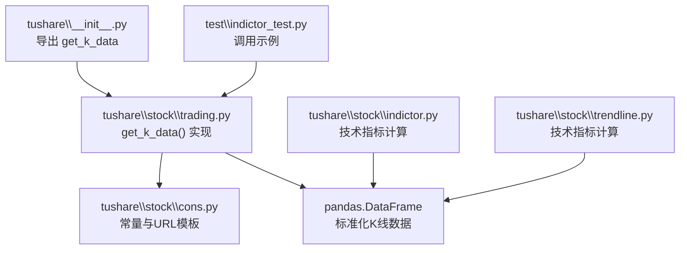
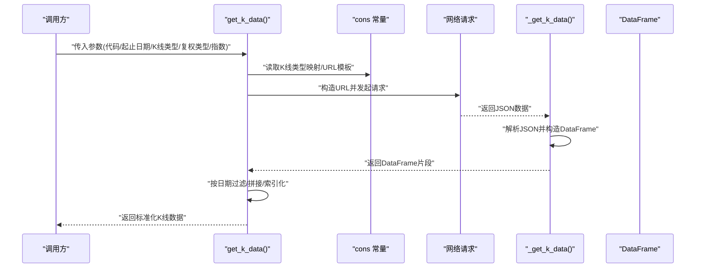
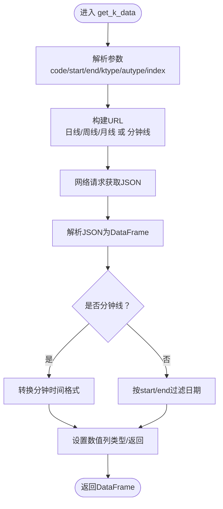
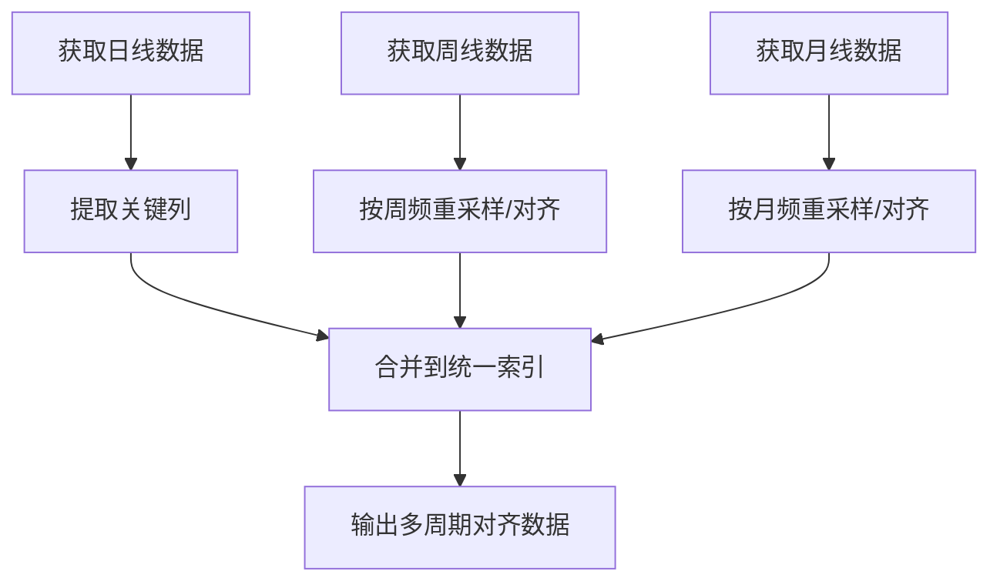
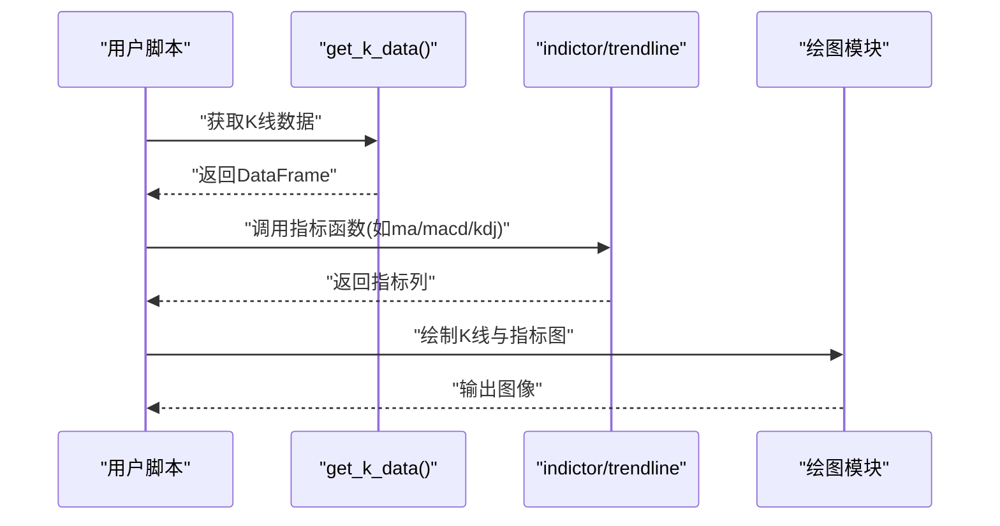
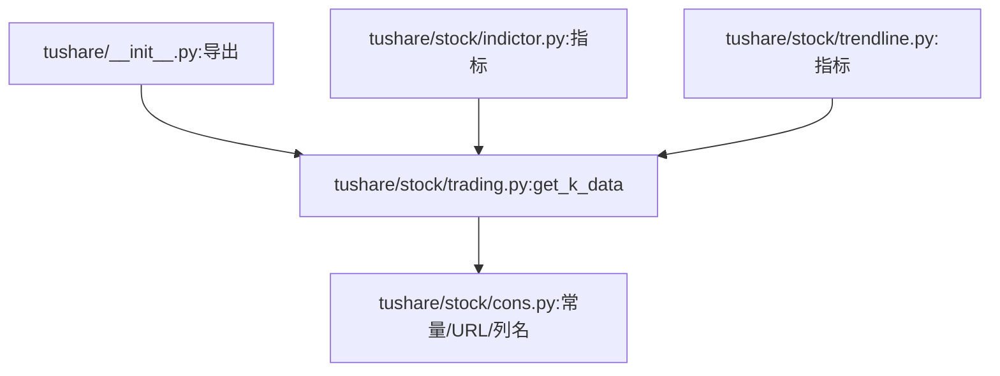

# K线数据API

<cite>
**本文引用的文件**
- [tushare\stock\trading.py](file://tushare/stock/trading.py)
- [tushare\stock\cons.py](file://tushare/stock/cons.py)
- [tushare\__init__.py](file://tushare/__init__.py)
- [test\indictor_test.py](file://test/indictor_test.py)
- [tushare\stock\indictor.py](file://tushare/stock/indictor.py)
- [tushare\stock\trendline.py](file://tushare/stock/trendline.py)
- [README.md](file://README.md)
</cite>

## 目录
1. [简介](#简介)
2. [项目结构](#项目结构)
3. [核心组件](#核心组件)
4. [架构总览](#架构总览)
5. [详细组件分析](#详细组件分析)
6. [依赖关系分析](#依赖关系分析)
7. [性能考量](#性能考量)
8. [故障排查指南](#故障排查指南)
9. [结论](#结论)
10. [附录](#附录)

## 简介
本文件面向TuShare K线数据API，聚焦于统一的K线数据获取接口get_k_data()，系统阐述其功能特性、参数配置、数据标准化格式、多周期组合策略、与技术分析工具的集成方式，以及常见问题排查与性能建议。读者无需深入编程背景即可理解并高效使用该接口。

## 项目结构
- 接口入口位于tushare\stock\trading.py中的get_k_data()函数，负责统一拉取日线、周线、月线、分钟线的K线数据，并按需处理复权。
- 常量与URL模板集中于tushare\stock\cons.py，包含K线周期映射、URL占位符、列名、指数映射等。
- 包导出入口tushare\__init__.py将get_k_data暴露给外部使用。
- 示例与测试位于test目录，展示如何调用get_k_data并结合技术分析模块绘图。
- 技术分析模块位于tushare\stock\indictor.py与tushare\stock\trendline.py，演示如何基于get_k_data返回的DataFrame进行移动平均、MACD、KDJ等指标计算与可视化。

**图表来源**
- [tushare\__init__.py:11-18](file://tushare/__init__.py#L11-L18)
- [tushare\stock\trading.py:624-707](file://tushare/stock/trading.py#L624-L707)
- [tushare\stock\cons.py:83-85](file://tushare/stock/cons.py#L83-L85)

**章节来源**
- [tushare\__init__.py:11-18](file://tushare/__init__.py#L11-L18)
- [README.md:43-50](file://README.md#L43-L50)

## 核心组件
- get_k_data()：统一的K线数据获取接口，支持日线、周线、月线、分钟线，支持前复权、后复权、不复权，支持指数数据获取。
- 常量与URL模板：K_LABELS/K_MIN_LABELS、K_TYPE、TT_K_TYPE、KLINE_TT_URL/KLINE_TT_MIN_URL、KLINE_TT_COLS/KLINE_TT_COLS_MINS等。
- 返回数据：标准化的pandas.DataFrame，包含日期索引、OHLCV、换手率、代码字段等。

**章节来源**
- [tushare\stock\trading.py:624-707](file://tushare/stock/trading.py#L624-L707)
- [tushare\stock\cons.py:10-18](file://tushare/stock/cons.py#L10-L18)
- [tushare\stock\cons.py:77-78](file://tushare/stock/cons.py#L77-L78)
- [tushare\stock\cons.py:83-85](file://tushare/stock/cons.py#L83-L85)

## 架构总览
get_k_data()通过解析参数构造目标URL，调用内部解析函数获取JSON并转换为DataFrame，最终按日期过滤与索引化输出。对于日线/周线/月线，若指定起止日期，会按年份切片多次请求以保证数据完整性。

**图表来源**
- [tushare\stock\trading.py:624-707](file://tushare/stock/trading.py#L624-L707)
- [tushare\stock\trading.py:710-748](file://tushare/stock/trading.py#L710-L748)
- [tushare\stock\cons.py:83-85](file://tushare/stock/cons.py#L83-L85)

## 详细组件分析

### 函数：get_k_data()
- 功能：统一获取日线、周线、月线、分钟线K线数据，支持复权类型与指数数据。
- 参数要点：
  - code：股票代码或指数标识
  - start/end：起止日期，格式YYYY-MM-DD
  - ktype：K线周期，D/W/M/5/15/30/60
  - autype：复权类型，qfq/hfq/None
  - index：是否指数数据
  - retry_count/pause：网络重试与间隔
- 数据标准化：
  - 列：date、open、high、close、low、volume、amount、turnoverratio、code
  - 索引：date（字符串或datetime）
  - 类型：数值列转换为浮点型
- 复权逻辑：
  - autype为None时，不进行复权处理
  - autype为'qfq'或'hfq'时，按相应规则调整OHLC
  - 对于指数与特定代码，复权参数会被忽略
- 指数数据：
  - index=True时，使用指数映射表与对应URL模板
- 日期过滤：
  - 若指定start/end，会对结果按日期区间过滤

**图表来源**
- [tushare\stock\trading.py:624-707](file://tushare/stock/trading.py#L624-L707)
- [tushare\stock\trading.py:710-748](file://tushare/stock/trading.py#L710-L748)

**章节来源**
- [tushare\stock\trading.py:624-707](file://tushare/stock/trading.py#L624-L707)
- [tushare\stock\trading.py:710-748](file://tushare/stock/trading.py#L710-L748)

### 参数配置详解
- 股票代码与指数：
  - 普通股票：传入6位数字代码
  - 指数：传入指数标识（如'000001'），或index=True配合映射表
- 日期范围：
  - start/end为空时，日线/周线/月线默认取完整历史；分钟线仅取当日
- K线类型：
  - 日线：'D'；周线：'W'；月线：'M'
  - 分钟线：'5'、'15'、'30'、'60'
- 复权类型：
  - qfq：前复权
  - hfq：后复权
  - None：不复权
- 指数数据：
  - index=True时，自动映射到指数URL与列名

**章节来源**
- [tushare\stock\cons.py:10-18](file://tushare/stock/cons.py#L10-L18)
- [tushare\stock\cons.py:205-316](file://tushare/stock/cons.py#L205-L316)
- [tushare\stock\cons.py:83-85](file://tushare/stock/cons.py#L83-L85)

### 数据标准化格式
- 列定义（日线/周线/月线）：
  - date：日期（字符串）
  - open、high、close、low：开盘/最高/收盘/最低（数值）
  - volume：成交量（数值）
  - amount：成交额（数值）
  - turnoverratio：换手率（数值）
  - code：股票代码（字符串）
- 列定义（分钟线）：
  - date：时间戳（字符串，格式包含时分）
  - open、high、close、low：OHLC（数值）
  - volume：成交量（数值）
- 索引与排序：
  - 返回DataFrame以date为索引并按升序排列
- 类型转换：
  - OHLCV等数值列转换为浮点型

**章节来源**
- [tushare\stock\trading.py:629-659](file://tushare/stock/trading.py#L629-L659)
- [tushare\stock\trading.py:735-747](file://tushare/stock/trading.py#L735-L747)
- [tushare\stock\cons.py:77-78](file://tushare/stock/cons.py#L77-L78)

### 多周期K线数据组合与对齐
- 组合策略：
  - 使用get_k_data分别获取D/W/M周期数据
  - 将各周期数据按日期对齐（以日线为基础，向上采样周/月）
  - 通过pandas的resample、asfreq或外键对齐实现时间序列对齐
- 数据合并：
  - 将不同周期的指标（如MA、MACD）合并到同一DataFrame
  - 注意缺失值处理与填充策略
- 实战建议：
  - 优先以日线为主，周线/月线作为趋势确认层
  - 对齐时保持日期索引一致，避免未来数据泄漏

[本图为概念流程图，不直接映射具体源码文件]

### 与技术分析工具的集成
- 移动平均线（MA）：
  - 可使用tushare\stock\indictor.py或tushare\stock\trendline.py中的ma函数
  - 基于get_k_data返回的DataFrame计算N日均线
- 指标应用（MACD、KDJ等）：
  - 在get_k_data基础上调用indictor/trendline模块函数
  - 输出指标列并进行可视化
- 图表绘制：
  - 结合matplotlib/seaborn等库绘制K线与指标叠加图
  - 示例见test\indictor_test.py中对plot_all的调用

**图表来源**
- [test\indictor_test.py:13-18](file://test/indictor_test.py#L13-L18)
- [tushare\stock\indictor.py:12-42](file://tushare/stock/indictor.py#L12-L42)
- [tushare\stock\trendline.py:17-25](file://tushare/stock/trendline.py#L17-L25)

**章节来源**
- [test\indictor_test.py:13-18](file://test/indictor_test.py#L13-L18)
- [tushare\stock\indictor.py:12-42](file://tushare/stock/indictor.py#L12-L42)
- [tushare\stock\trendline.py:17-25](file://tushare/stock/trendline.py#L17-L25)

## 依赖关系分析
- get_k_data依赖cons中的K线类型映射、URL模板、列名定义与指数映射。
- 包导出入口将get_k_data暴露至tushare顶层，便于直接调用。
- 技术分析模块依赖get_k_data返回的DataFrame结构，确保列名与索引一致。

**图表来源**
- [tushare\stock\trading.py:624-707](file://tushare/stock/trading.py#L624-L707)
- [tushare\stock\cons.py:10-18](file://tushare/stock/cons.py#L10-L18)
- [tushare\__init__.py:11-18](file://tushare/__init__.py#L11-L18)

**章节来源**
- [tushare\stock\trading.py:624-707](file://tushare/stock/trading.py#L624-L707)
- [tushare\stock\cons.py:10-18](file://tushare/stock/cons.py#L10-L18)
- [tushare\__init__.py:11-18](file://tushare/__init__.py#L11-L18)

## 性能考量
- 请求频率控制：合理设置pause，避免触发目标站点限流。
- 数据量控制：尽量限定start/end范围，减少网络与内存压力。
- 复权处理：复权计算为纯数值运算，注意在大数据集上的向量化效率。
- 对齐与合并：多周期对齐建议在索引层面完成，避免逐行遍历。

[本节为通用指导，不直接分析具体文件]

## 故障排查指南
- 网络错误：
  - 现象：抛出网络超时或返回空数据
  - 处理：增大retry_count，延长pause；检查网络与代理
- 参数错误：
  - 现象：ktype输入非法
  - 处理：确认ktype为D/W/M/5/15/30/60之一
- 数据为空：
  - 现象：返回None或空DataFrame
  - 处理：检查代码是否正确、日期范围是否合理、指数映射是否有效
- 复权异常：
  - 现象：复权后数值异常
  - 处理：确认autype参数与目标代码类型（指数/特殊代码可能忽略复权）

**章节来源**
- [tushare\stock\trading.py:693-694](file://tushare/stock/trading.py#L693-L694)
- [tushare\stock\trading.py:724-726](file://tushare/stock/trading.py#L724-L726)

## 结论
get_k_data()提供了统一、灵活且标准化的K线数据获取能力，覆盖日线、周线、月线与分钟线，并支持多种复权与指数场景。结合技术分析模块，可快速构建多周期对齐与指标计算的分析流水线。建议在生产环境中合理设置参数与重试策略，确保稳定性与性能。

[本节为总结性内容，不直接分析具体文件]

## 附录

### API定义与行为摘要
- 函数：get_k_data(code, start='', end='', ktype='D', autype='qfq', index=False, retry_count=3, pause=0.001)
- 返回：pandas.DataFrame，列包含date、open、high、close、low、volume、amount、turnoverratio、code，索引为date
- 行为：
  - 根据ktype与autype选择URL模板与列名
  - 指数数据时使用指数映射与特化列名
  - 按start/end过滤日线/周线/月线数据
  - 分钟线对时间字符串做格式化处理
  - 数值列转换为浮点型

**章节来源**
- [tushare\stock\trading.py:624-707](file://tushare/stock/trading.py#L624-L707)
- [tushare\stock\cons.py:77-78](file://tushare/stock/cons.py#L77-L78)
- [tushare\stock\cons.py:83-85](file://tushare/stock/cons.py#L83-L85)