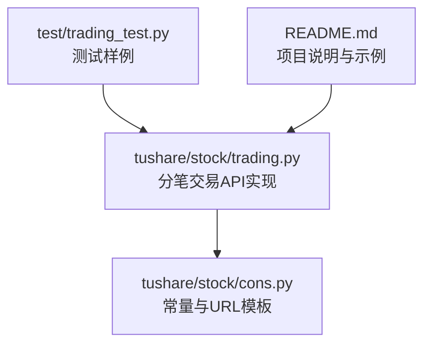
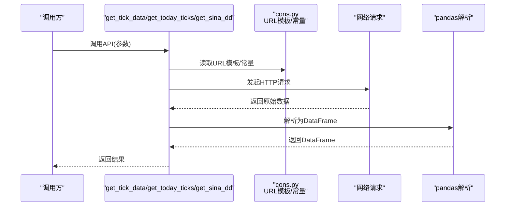
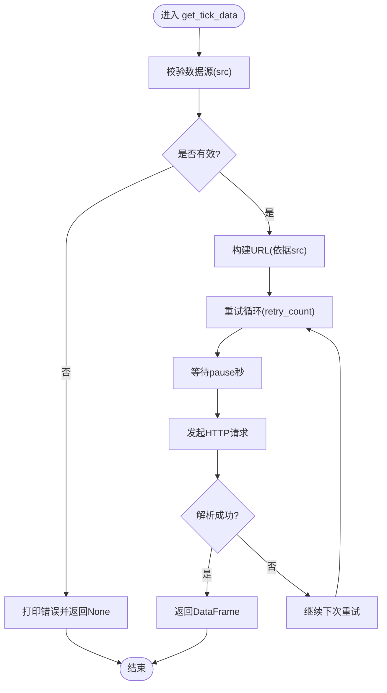
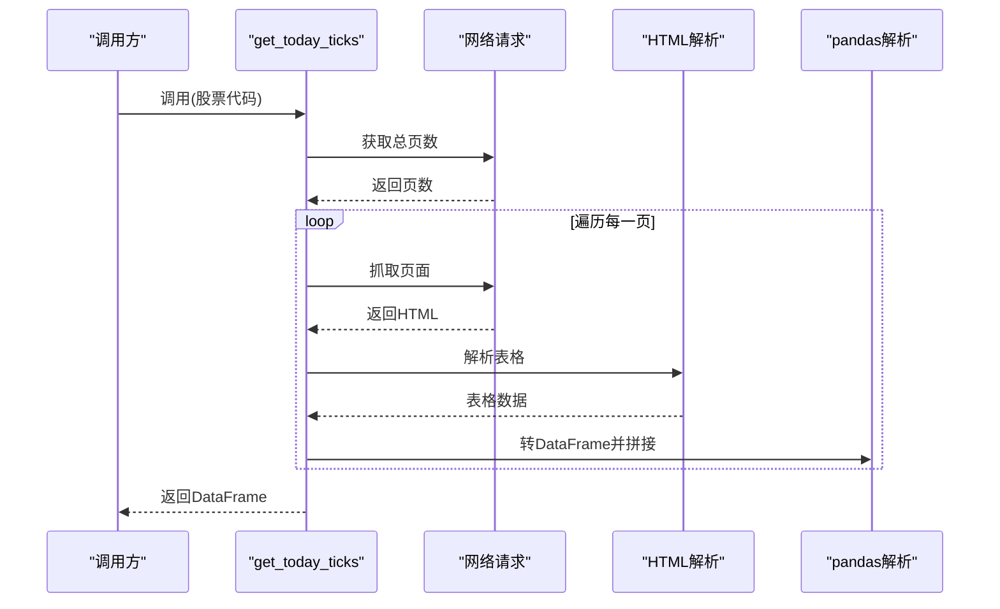
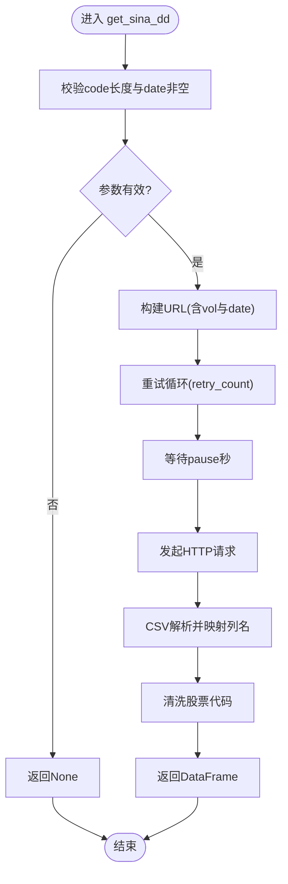
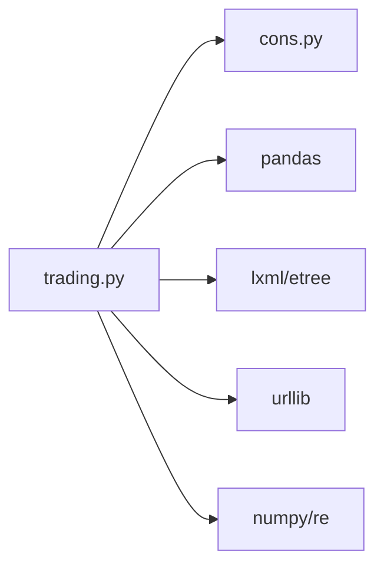

# 分笔交易数据API

<cite>
**本文引用的文件**
- [trading.py](file://tushare/stock/trading.py)
- [cons.py](file://tushare/stock/cons.py)
- [trading_test.py](file://test/trading_test.py)
- [README.md](file://README.md)
</cite>

## 目录
1. [简介](#简介)
2. [项目结构](#项目结构)
3. [核心组件](#核心组件)
4. [架构总览](#架构总览)
5. [详细组件分析](#详细组件分析)
6. [依赖分析](#依赖分析)
7. [性能考量](#性能考量)
8. [故障排查指南](#故障排查指南)
9. [结论](#结论)
10. [附录](#附录)

## 简介
本文件面向TuShare分笔交易数据API，系统化梳理并说明以下函数：
- get_tick_data(): 获取某交易日的历史分笔明细
- get_today_ticks(): 获取当日分笔明细
- get_sina_dd(): 获取大单明细

内容涵盖参数配置、数据源选择、返回值字段、典型使用场景、高频数据获取策略、数据清洗与内存管理建议，以及常见问题排查。

## 项目结构
与分笔交易数据API直接相关的核心文件位于tushare/stock目录，关键常量与URL模板集中于cons.py，测试样例位于test目录。

图表来源
- [trading.py:135-275](file://tushare/stock/trading.py#L135-L275)
- [cons.py:46-88](file://tushare/stock/cons.py#L46-L88)
- [trading_test.py:22-39](file://test/trading_test.py#L22-L39)
- [README.md:142-165](file://README.md#L142-L165)

章节来源
- [trading.py:135-275](file://tushare/stock/trading.py#L135-L275)
- [cons.py:46-88](file://tushare/stock/cons.py#L46-L88)
- [trading_test.py:22-39](file://test/trading_test.py#L22-L39)
- [README.md:142-165](file://README.md#L142-L165)

## 核心组件
- get_tick_data(code, date, retry_count=3, pause=0.001, src='sn')
  - 功能：获取指定日期的历史分笔明细
  - 数据源：src可选sn(新浪)、tt(腾讯)、nt(网易)
  - 返回：DataFrame，字段包括成交时间、成交价格、价格变动、成交量、成交金额、买卖类型
- get_today_ticks(code, retry_count=3, pause=0.001)
  - 功能：获取当日分笔明细
  - 返回：DataFrame，字段与历史分笔一致
- get_sina_dd(code, date, vol=400, retry_count=3, pause=0.001)
  - 功能：获取大单明细（按量级过滤）
  - 返回：DataFrame，字段包括股票代码、股票名称、交易时间、价格、成交量、前一笔价格、类型（买/卖/中性盘）

章节来源
- [trading.py:135-275](file://tushare/stock/trading.py#L135-L275)
- [cons.py:46-47](file://tushare/stock/cons.py#L46-L47)
- [cons.py:129-173](file://tushare/stock/cons.py#L129-L173)

## 架构总览
分笔API的调用链路如下：
- 参数校验与转换：股票代码标准化、日期格式化
- URL构建：根据数据源选择不同URL模板
- 请求与解析：
  - 历史分笔：读取表格或Excel，映射列名
  - 当日分笔：解析HTML表格，分页抓取
  - 大单：CSV文本解析
- 错误处理：重试机制与异常捕获
- 返回：统一为pandas DataFrame

图表来源
- [trading.py:135-275](file://tushare/stock/trading.py#L135-L275)
- [cons.py:46-88](file://tushare/stock/cons.py#L46-L88)

## 详细组件分析

### get_tick_data 函数
- 功能与用途
  - 获取某交易日的历史分笔明细
  - 支持多数据源：新浪、腾讯、网易
- 参数说明
  - code: 股票代码（6位数字）
  - date: 日期，格式YYYY-MM-DD
  - retry_count: 重试次数，默认3
  - pause: 重试间隔（秒），默认0.001
  - src: 数据源选择，'sn'/'tt'/'nt'
- 数据源与URL模板
  - 新浪：TICK_PRICE_URL
  - 腾讯：TICK_PRICE_URL_TT
  - 网易：TICK_PRICE_URL_NT
- 返回值字段
  - time: 成交时间
  - price: 成交价格
  - change: 价格变动
  - volume: 成交量（手）
  - amount: 成交金额（元）
  - type: 买卖类型（买盘/卖盘/中性盘）
- 使用示例（基于测试文件）
  - 参考测试用例中对get_tick_data的调用方式
- 注意事项
  - 若src不在允许集合内，打印错误提示并返回None
  - 对于网易源，使用Excel读取；其他源使用表格读取

图表来源
- [trading.py:135-187](file://tushare/stock/trading.py#L135-L187)
- [cons.py:79-81](file://tushare/stock/cons.py#L79-L81)

章节来源
- [trading.py:135-187](file://tushare/stock/trading.py#L135-L187)
- [cons.py:46-47](file://tushare/stock/cons.py#L46-L47)
- [cons.py:79-81](file://tushare/stock/cons.py#L79-L81)
- [trading_test.py:22-24](file://test/trading_test.py#L22-L24)

### get_today_ticks 函数
- 功能与用途
  - 获取当日分笔明细
- 参数说明
  - code: 股票代码（6位数字）
  - retry_count: 重试次数，默认3
  - pause: 重试间隔（秒），默认0.001
- 数据获取流程
  - 先获取总页数，再逐页抓取
  - 每页解析HTML表格，映射列名
- 返回值字段
  - time: 成交时间
  - price: 成交价格
  - pchange: 价格变动百分比（去除%符号）
  - change: 价格变动
  - volume: 成交量（手）
  - amount: 成交金额（元）
  - type: 买卖类型（买盘/卖盘/中性盘）
- 使用示例（基于测试文件）
  - 参考测试用例中对get_today_ticks的调用方式

图表来源
- [trading.py:232-275](file://tushare/stock/trading.py#L232-L275)
- [cons.py:82-83](file://tushare/stock/cons.py#L82-L83)

章节来源
- [trading.py:232-302](file://tushare/stock/trading.py#L232-L302)
- [cons.py:47-47](file://tushare/stock/cons.py#L47-L47)
- [cons.py:82-83](file://tushare/stock/cons.py#L82-L83)
- [trading_test.py:37-39](file://test/trading_test.py#L37-L39)

### get_sina_dd 函数
- 功能与用途
  - 获取大单明细（按量级过滤）
- 参数说明
  - code: 股票代码（6位数字）
  - date: 日期，格式YYYY-MM-DD
  - vol: 过滤量级（单位百手），内部乘以100
  - retry_count: 重试次数，默认3
  - pause: 重试间隔（秒），默认0.001
- 返回值字段
  - code: 股票代码
  - name: 股票名称
  - time: 交易时间
  - price: 价格
  - volume: 成交量（手）
  - preprice: 前一笔价格
  - type: 类型（买/卖/中性盘）
- 使用场景
  - 识别大额主动买入/卖出行为
  - 辅助判断短期趋势与资金流向

图表来源
- [trading.py:190-229](file://tushare/stock/trading.py#L190-L229)
- [cons.py:129-173](file://tushare/stock/cons.py#L129-L173)

章节来源
- [trading.py:190-229](file://tushare/stock/trading.py#L190-L229)
- [cons.py:129-173](file://tushare/stock/cons.py#L129-L173)

## 依赖分析
- 模块间依赖
  - trading.py 依赖 cons.py 提供的URL模板、列名常量、数据源枚举等
  - get_today_ticks 依赖 util/dateu 获取当前日期
- 外部库依赖
  - pandas: 数据结构与解析
  - lxml/etree: HTML解析
  - urllib: HTTP请求
  - numpy/re: 数值计算与正则
- 关键常量与URL
  - TICK_COLUMNS/TODAY_TICK_COLUMNS: 字段名
  - TICK_PRICE_URL/TICK_PRICE_URL_TT/TICK_PRICE_URL_NT: 历史分笔URL模板
  - TODAY_TICKS_PAGE_URL/TODAY_TICKS_URL: 当日分笔URL模板
  - SINA_DD: 大单URL模板

图表来源
- [trading.py:1-30](file://tushare/stock/trading.py#L1-L30)
- [cons.py:46-88](file://tushare/stock/cons.py#L46-L88)

章节来源
- [trading.py:1-30](file://tushare/stock/trading.py#L1-L30)
- [cons.py:46-88](file://tushare/stock/cons.py#L46-L88)

## 性能考量
- 重试与节流
  - retry_count与pause用于控制网络重试与请求频率，避免触发目标站点限流
- 数据源差异
  - 不同数据源的响应速度与稳定性不同，建议优先选择稳定源
- 解析效率
  - HTML解析与字符串处理较多，建议批量获取时合并请求、减少重复解析
- 内存管理
  - 大量分笔数据建议分批处理、及时释放中间变量，避免内存峰值过高
- 并发与批处理
  - 对多只股票或多个日期进行分笔数据获取时，建议采用并发策略并设置合理的pause

## 故障排查指南
- 常见错误
  - 数据源参数错误：当src不在允许集合时，打印错误提示并返回None
  - 网络超时/无数据：当返回内容过短或解析失败时，抛出网络错误提示
  - 参数校验失败：当日分笔要求code为6位，否则返回None
- 排查步骤
  - 检查参数合法性（code长度、date格式、src取值）
  - 调整retry_count与pause，观察网络波动影响
  - 尝试切换数据源（sn/tt/nt）
  - 检查目标站点可用性与返回格式变化
- 相关常量
  - TICK_SRC_ERROR: 数据源错误提示
  - NETWORK_URL_ERROR_MSG: 网络错误提示

章节来源
- [trading.py:155-157](file://tushare/stock/trading.py#L155-L157)
- [trading.py:187-187](file://tushare/stock/trading.py#L187-L187)
- [trading.py:208-209](file://tushare/stock/trading.py#L208-L209)
- [trading.py:271-274](file://tushare/stock/trading.py#L271-L274)
- [cons.py:203-204](file://tushare/stock/cons.py#L203-L204)
- [cons.py:195-195](file://tushare/stock/cons.py#L195-L195)

## 结论
- get_tick_data、get_today_ticks、get_sina_dd构成TuShare分笔数据获取的完整能力矩阵
- 通过合理配置重试与暂停参数、选择合适数据源、结合pandas高效解析，可稳定获取高质量分笔数据
- 在高频场景下，建议配合并发策略与内存管理，确保系统稳定与性能

## 附录

### API参数与返回值对照表
- get_tick_data
  - 输入参数：code、date、retry_count、pause、src
  - 输出字段：time、price、change、volume、amount、type
- get_today_ticks
  - 输入参数：code、retry_count、pause
  - 输出字段：time、price、pchange、change、volume、amount、type
- get_sina_dd
  - 输入参数：code、date、vol、retry_count、pause
  - 输出字段：code、name、time、price、volume、preprice、type

章节来源
- [trading.py:135-187](file://tushare/stock/trading.py#L135-L187)
- [trading.py:232-302](file://tushare/stock/trading.py#L232-L302)
- [trading.py:190-229](file://tushare/stock/trading.py#L190-L229)
- [cons.py:46-47](file://tushare/stock/cons.py#L46-L47)
- [cons.py:173-173](file://tushare/stock/cons.py#L173-L173)

### 实际应用与最佳实践
- 高频数据获取
  - 设置合理的pause，避免触发限流
  - 使用重试机制应对偶发网络波动
  - 对多股票/多日期采用并发策略
- 数据清洗
  - 统一字段命名与数据类型
  - 处理缺失值与异常值（如pchange中的百分号）
  - 对网易源的Excel列名进行映射
- 内存管理
  - 分批写入或分页处理
  - 及时释放中间DataFrame，避免内存峰值
- 示例参考
  - 参考测试文件中的调用方式，结合实际业务场景调整参数

章节来源
- [trading_test.py:22-39](file://test/trading_test.py#L22-L39)
- [README.md:142-165](file://README.md#L142-L165)