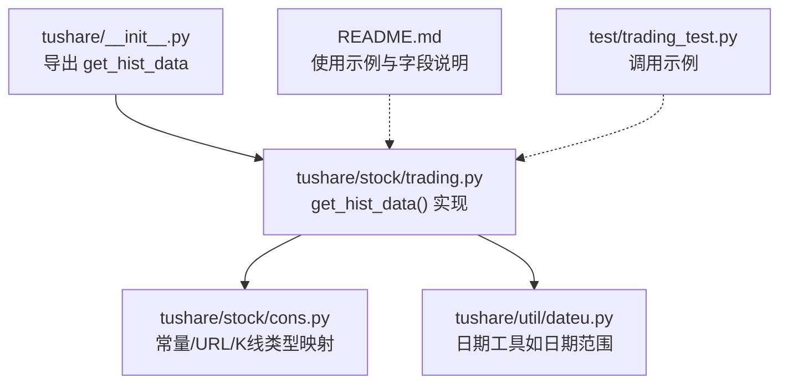
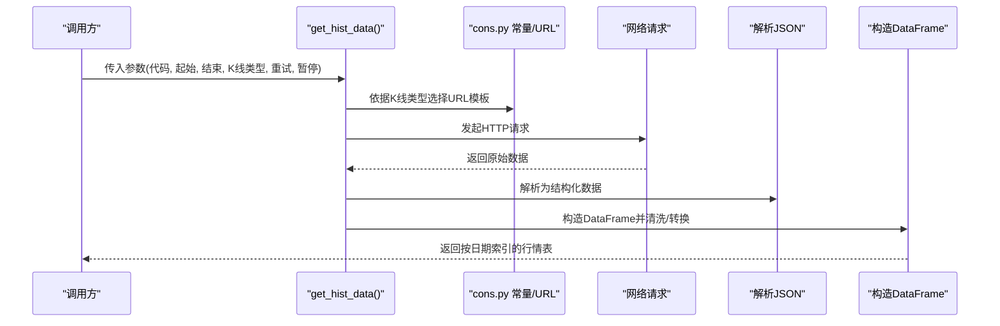
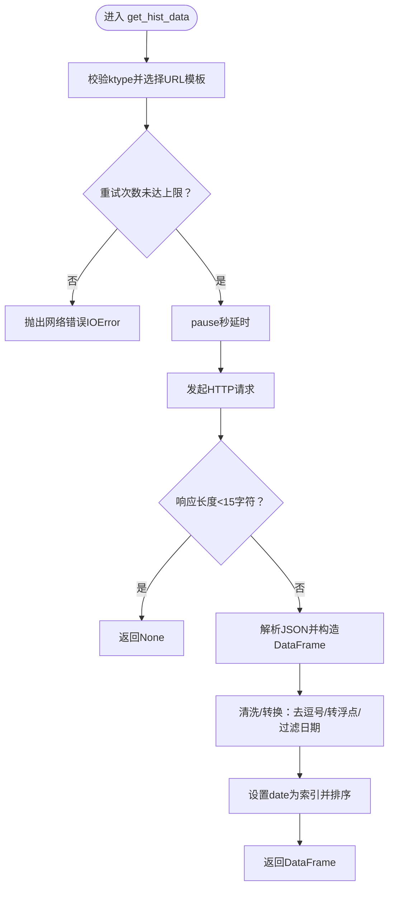
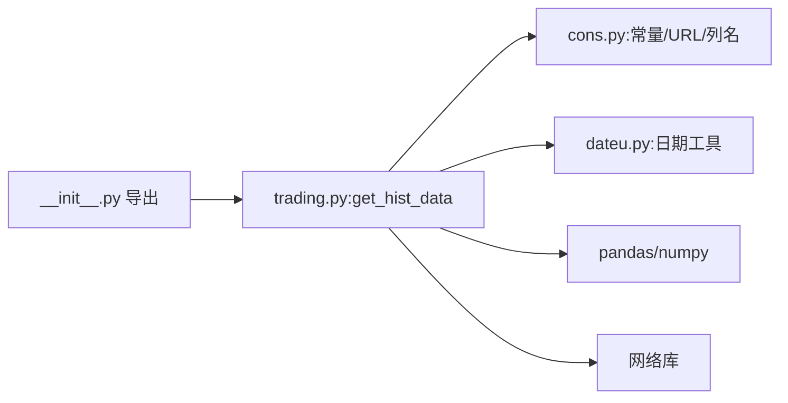

# 历史行情数据API

<cite>
**本文引用的文件**
- [tushare\stock\trading.py](file://tushare/stock/trading.py)
- [tushare\stock\cons.py](file://tushare/stock/cons.py)
- [tushare\util\dateu.py](file://tushare/util/dateu.py)
- [tushare\__init__.py](file://tushare/__init__.py)
- [README.md](file://README.md)
- [test\trading_test.py](file://test/trading_test.py)
</cite>

## 目录
1. [简介](#简介)
2. [项目结构](#项目结构)
3. [核心组件](#核心组件)
4. [架构总览](#架构总览)
5. [详细组件分析](#详细组件分析)
6. [依赖分析](#依赖分析)
7. [性能考量](#性能考量)
8. [故障排查指南](#故障排查指南)
9. [结论](#结论)
10. [附录](#附录)

## 简介
本文件面向TuShare历史行情数据API，聚焦于get_hist_data()函数的能力与用法，涵盖：
- 获取股票历史日线、周线、月线及多种分钟级K线数据
- 参数配置说明（股票代码、起止日期、K线类型、重试次数、暂停间隔）
- 返回值字段与数据格式（日期索引、开盘价、最高价、收盘价、最低价、成交量、换手率等）
- 批量获取最佳实践（时间范围筛选、数据格式转换、异常处理）
- 与其他API的协同使用与性能优化建议

## 项目结构
- 历史行情API主要位于tushare/stock/trading.py中的get_hist_data()与相关辅助函数
- 常量与URL模板、K线类型映射等位于tushare/stock/cons.py
- 日期工具位于tushare/util/dateu.py
- 包入口tushare/__init__.py导出get_hist_data等接口
- README.md提供使用示例与字段说明
- test/trading_test.py包含调用示例

**图表来源**
- [tushare\__init__.py](file://tushare/__init__.py)
- [tushare\stock\trading.py](file://tushare/stock/trading.py)
- [tushare\stock\cons.py](file://tushare/stock/cons.py)
- [tushare\util\dateu.py](file://tushare/util/dateu.py)
- [README.md](file://README.md)
- [test\trading_test.py](file://test/trading_test.py)

**章节来源**
- [tushare\__init__.py](file://tushare/__init__.py)
- [tushare\stock\trading.py](file://tushare/stock/trading.py)
- [tushare\stock\cons.py](file://tushare/stock/cons.py)
- [tushare\util\dateu.py](file://tushare/util/dateu.py)
- [README.md](file://README.md)
- [test\trading_test.py](file://test/trading_test.py)

## 核心组件
- get_hist_data(): 获取个股历史交易记录（日线、周线、月线、5/15/30/60分钟线）
- get_k_data(): 获取K线数据（支持复权与分钟线）
- get_tick_data(): 获取分笔明细
- get_h_data(): 获取历史复权数据（前复权/后复权/不复权）
- get_hists(): 批量获取历史行情（基于get_hist_data）

上述函数共同构成历史行情数据获取体系，其中get_hist_data()是本文重点。

**章节来源**
- [tushare\stock\trading.py](file://tushare/stock/trading.py)
- [tushare\__init__.py](file://tushare/__init__.py)

## 架构总览
get_hist_data()的调用流程与数据来源如下：

**图表来源**
- [tushare\stock\trading.py](file://tushare/stock/trading.py)
- [tushare\stock\cons.py](file://tushare/stock/cons.py)

## 详细组件分析

### get_hist_data()函数详解
- 功能概述
  - 获取单只股票或指数的历史行情（日线、周线、月线、5/15/30/60分钟）
  - 支持按起止日期过滤
  - 自动进行数值类型转换与字段清洗
  - 对指数类分钟线自动剔除换手率字段
- 参数说明
  - code: 股票代码（如600848），或指数标识（如sh/sz等）
  - start: 开始日期，格式YYYY-MM-DD；为空则取接口允许的最早日期
  - end: 结束日期，格式YYYY-MM-DD；为空则取最近交易日
  - ktype: K线类型，D/W/M/5/15/30/60，默认D
  - retry_count: 网络异常时最大重试次数，默认3
  - pause: 重试间暂停秒数，默认0.001
- 返回值
  - DataFrame，索引为date（降序）
  - 字段（以日线为例）：date, open, high, close, low, volume, price_change, p_change, ma5, ma10, ma20, v_ma5, v_ma10, v_ma20, turnover
  - 指数日线字段：date, open, high, close, low, volume, price_change, p_change, ma5, ma10, ma20, v_ma5, v_ma10, v_ma20
  - 指数分钟线：不含turnover字段
- 处理逻辑要点
  - 将代码转换为目标站点的symbol
  - 根据ktype选择日线或分钟线URL模板
  - 循环重试，超时或空数据返回None
  - 解析JSON，按日线/指数日线列名构造DataFrame
  - 日线/周线/月线去除千分位逗号并转为浮点
  - 应用start/end过滤
  - 指数分钟线删除turnover列
  - 设置date为索引并按升序排序（最终返回降序）
- 错误处理
  - 非法ktype抛出TypeError
  - 网络异常达到重试上限抛出IOError

**图表来源**
- [tushare\stock\trading.py](file://tushare/stock/trading.py)
- [tushare\stock\cons.py](file://tushare/stock/cons.py)

**章节来源**
- [tushare\stock\trading.py](file://tushare/stock/trading.py)
- [tushare\stock\cons.py](file://tushare/stock/cons.py)
- [README.md](file://README.md)

### get_k_data()与get_hist_data()的关系
- get_k_data()支持更广泛的K线类型与复权选项，且支持按年区间分段拉取
- get_hist_data()更简洁，适合一次性获取单一时间段的日线/分钟线数据
- 两者均返回DataFrame，字段包含date、open、high、close、low、volume、amount、turnoverratio（若存在）、code等

**章节来源**
- [tushare\stock\trading.py](file://tushare/stock/trading.py)

### get_tick_data()与get_hist_data()的差异
- get_tick_data()获取分笔明细（每笔成交），字段侧重时间、价格、成交量、买卖类型
- get_hist_data()获取聚合后的K线数据，字段侧重OHLCV与技术指标

**章节来源**
- [tushare\stock\trading.py](file://tushare/stock/trading.py)

### 批量获取历史数据的最佳实践
- 使用get_hists()对多只股票进行批量历史数据抓取
- 时间范围策略
  - 明确start与end，避免跨年度导致的分段拉取
  - 对分钟线，建议限定较小时间窗口，减少单次请求数据量
- 数据格式转换
  - 统一将date设为索引，便于时间序列分析
  - 对数值列进行astype(float)确保后续计算稳定
- 异常处理
  - 为每个股票设置合理的retry_count与pause
  - 对返回None的情况进行标记与重试
- 存储与合并
  - 将各股票数据合并为宽表，统一日期索引
  - 保存为高效格式（如Parquet/HDF5）以便后续分析

**章节来源**
- [tushare\stock\trading.py](file://tushare/stock/trading.py)
- [test\trading_test.py](file://test/trading_test.py)

## 依赖分析
- get_hist_data()依赖
  - tushare/stock/cons.py：K线类型映射、URL模板、列名定义
  - tushare/util/dateu.py：日期工具（如日期范围、节假日判断等）
  - pandas/numpy：数据结构与数值计算
  - urllib/requests：网络请求
- 导出入口
  - tushare/__init__.py导出get_hist_data供外部直接调用

**图表来源**
- [tushare\stock\trading.py](file://tushare/stock/trading.py)
- [tushare\stock\cons.py](file://tushare/stock/cons.py)
- [tushare\util\dateu.py](file://tushare/util/dateu.py)
- [tushare\__init__.py](file://tushare/__init__.py)

**章节来源**
- [tushare\stock\trading.py](file://tushare/stock/trading.py)
- [tushare\stock\cons.py](file://tushare/stock/cons.py)
- [tushare\util\dateu.py](file://tushare/util/dateu.py)
- [tushare\__init__.py](file://tushare/__init__.py)

## 性能考量
- 请求频率控制
  - 合理设置pause，避免触发目标站点限流
- 分段拉取
  - 对长时间跨度的日线/分钟线，建议按年或季度分段拉取，降低单次请求压力
- 数据缓存
  - 将常用历史数据落地缓存，减少重复抓取
- 并发策略
  - 在业务允许范围内并发抓取不同股票，但需注意整体pause与重试策略
- 数据类型优化
  - 数值列统一为float，便于后续计算与绘图

[本节为通用指导，无需特定文件引用]

## 故障排查指南
- 常见错误与定位
  - ktype非法：检查ktype是否为D/W/M/5/15/30/60之一
  - 网络错误：当达到retry_count仍未成功，抛出网络错误提示
  - 空数据：响应长度过短返回None，通常表示该时间段无数据或接口不可用
- 排查步骤
  - 核对股票代码与ktype
  - 检查start/end格式与范围是否合理
  - 适当提高retry_count与pause
  - 对分钟线与指数分钟线确认字段差异（如不含turnover）
- 相关常量与提示
  - NETWORK_URL_ERROR_MSG：网络错误提示
  - DATE_CHK_MSG/DATE_CHK_Q_MSG：日期输入错误提示

**章节来源**
- [tushare\stock\trading.py](file://tushare/stock/trading.py)
- [tushare\stock\cons.py](file://tushare/stock/cons.py)

## 结论
get_hist_data()提供了简洁高效的单股票历史行情获取能力，覆盖日线、周线、月线与多分钟级别K线。结合get_k_data()、get_tick_data()与get_h_data()，可构建完整的行情数据获取与处理链路。通过合理的参数配置、时间范围划分、数据清洗与缓存策略，可在保证稳定性的同时提升整体性能。

[本节为总结性内容，无需特定文件引用]

## 附录

### API参数与返回值速查
- get_hist_data()
  - 参数：code, start, end, ktype, retry_count, pause
  - 返回：DataFrame（索引为date），字段包含open, high, close, low, volume, price_change, p_change, ma*, v_ma*, turnover（日线）；指数分钟线不含turnover
- get_k_data()
  - 参数：code, start, end, ktype, autype, index, retry_count, pause
  - 返回：DataFrame（含date, open, high, close, low, volume, amount, turnoverratio, code等）
- get_tick_data()
  - 参数：code, date, retry_count, pause, src
  - 返回：分笔明细（time, price, change, volume, amount, type）
- get_h_data()
  - 参数：code, start, end, autype, index, retry_count, pause, drop_factor
  - 返回：复权后的日线数据（date为索引）
- get_hists()
  - 参数：symbols, start, end, ktype, retry_count, pause
  - 返回：批量历史行情（含code列）

**章节来源**
- [tushare\stock\trading.py](file://tushare/stock/trading.py)
- [README.md](file://README.md)