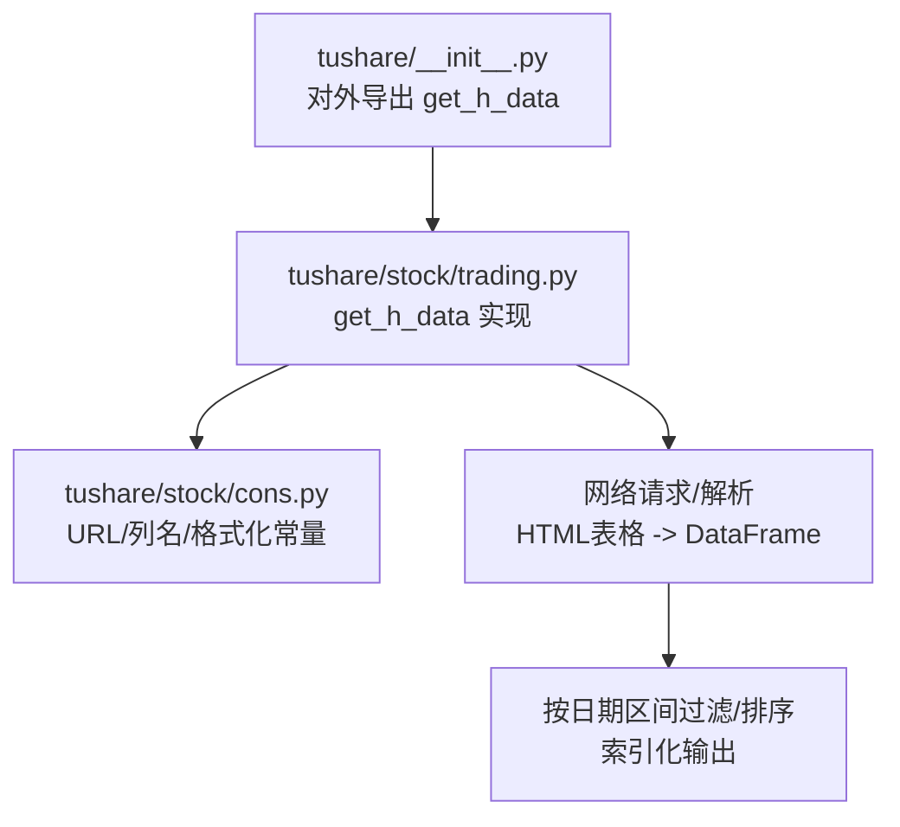
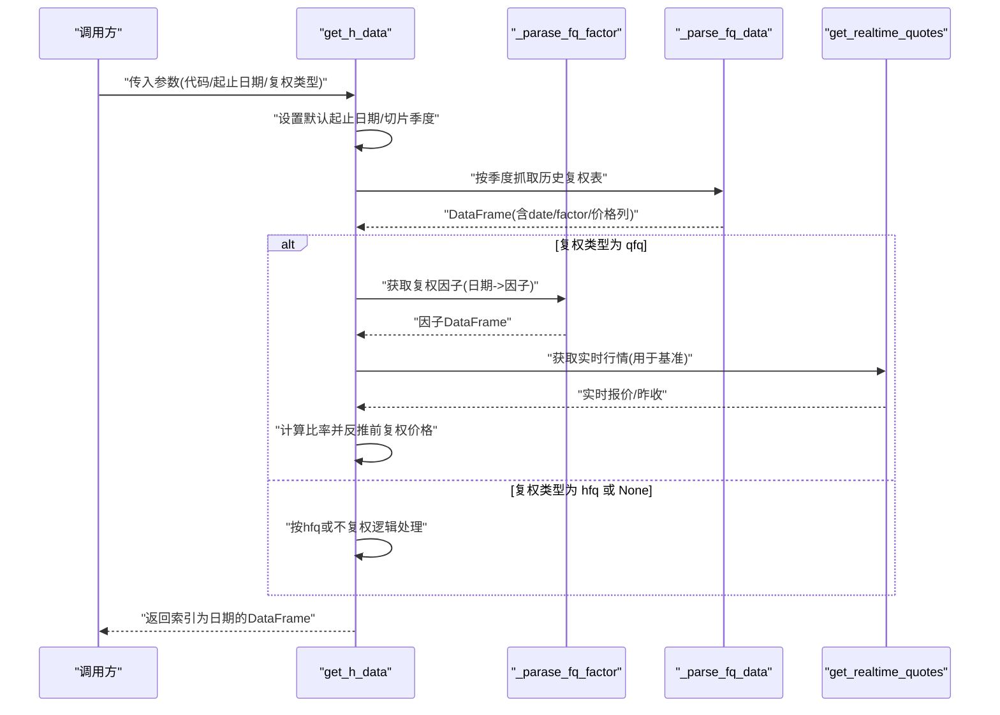
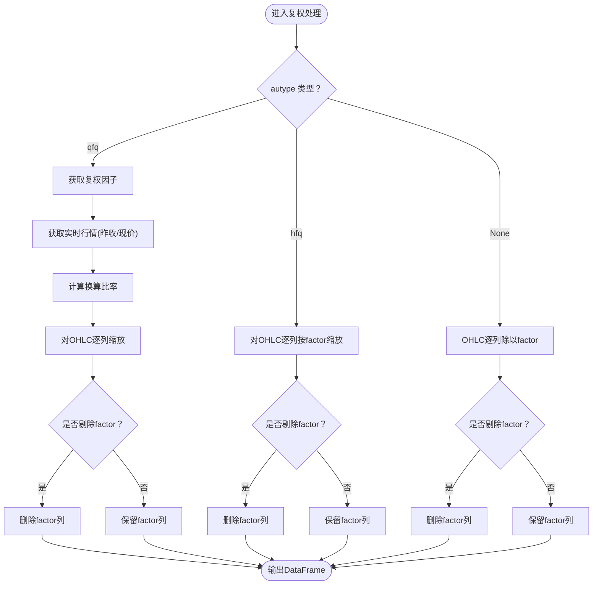
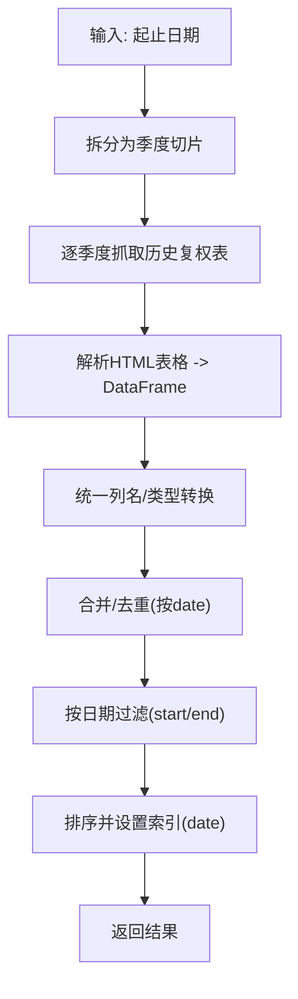
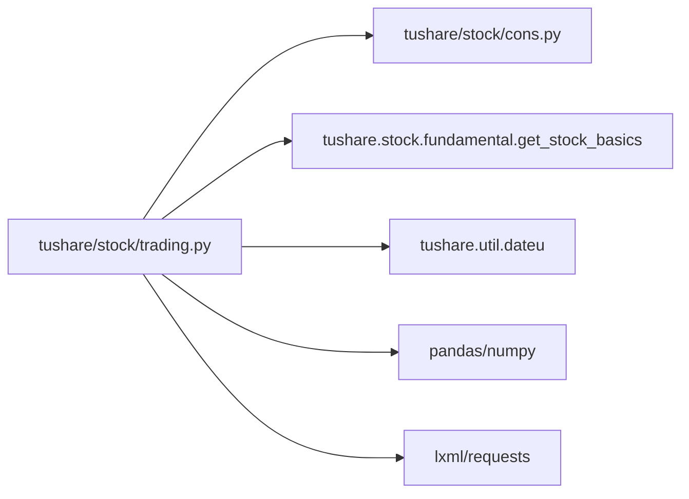

# 复权数据处理API

<cite>
**本文引用的文件**
- [tushare\stock\trading.py](file://tushare/stock/trading.py)
- [tushare\stock\cons.py](file://tushare/stock/cons.py)
- [tushare\__init__.py](file://tushare/__init__.py)
- [README.md](file://README.md)
- [test\trading_test.py](file://test/trading_test.py)
</cite>

## 目录
1. [简介](#简介)
2. [项目结构](#项目结构)
3. [核心组件](#核心组件)
4. [架构总览](#架构总览)
5. [详细组件分析](#详细组件分析)
6. [依赖分析](#依赖分析)
7. [性能考量](#性能考量)
8. [故障排查指南](#故障排查指南)
9. [结论](#结论)
10. [附录](#附录)

## 简介
本文件面向TuShare的复权数据处理API，系统化梳理并解读get_h_data()函数的功能特性、参数配置、复权机制与技术细节，并结合技术分析应用场景给出实践建议。该函数提供三种复权模式：前复权（qfq）、后复权（hfq）与不复权（None），并支持按日期区间筛选与复权因子的可选剔除，便于后续离线存储与二次分析。

## 项目结构
围绕复权数据处理的核心代码位于tushare/stock/trading.py，相关URL与字段常量定义位于tushare/stock/cons.py，对外入口在tushare/__init__.py中导出。README提供了使用示例与注意事项，test/trading_test.py展示了基本调用方式。

图表来源
- [tushare\__init__.py:11-18](file://tushare/__init__.py#L11-L18)
- [tushare\stock\trading.py:396-510](file://tushare/stock/trading.py#L396-L510)
- [tushare\stock\cons.py:116-126](file://tushare/stock/cons.py#L116-L126)

章节来源
- [tushare\__init__.py:11-18](file://tushare/__init__.py#L11-L18)
- [tushare\stock\trading.py:396-510](file://tushare/stock/trading.py#L396-L510)
- [tushare\stock\cons.py:116-126](file://tushare/stock/cons.py#L116-L126)

## 核心组件
- get_h_data函数：获取历史复权数据，支持qfq/hfq/None三种复权类型，支持开始/结束日期、复权因子剔除等参数。
- 复权因子获取：通过历史复权因子URL抓取，形成日期-因子映射。
- 数据解析与拼接：按季度切片抓取历史数据，合并去重后按日期过滤与排序。
- 输出规范：返回以日期为索引的DataFrame，包含开盘、最高、收盘、最低、成交量、成交金额等字段；可选剔除factor列。

章节来源
- [tushare\stock\trading.py:396-510](file://tushare/stock/trading.py#L396-L510)
- [tushare\stock\trading.py:512-532](file://tushare/stock/trading.py#L512-L532)
- [tushare\stock\trading.py:542-575](file://tushare/stock/trading.py#L542-L575)
- [tushare\stock\cons.py:172](file://tushare/stock/cons.py#L172)

## 架构总览
get_h_data的调用链路如下：参数校验与默认值设置 → 季度切片抓取 → 解析HTML表格 → 合并/去重 → 日期过滤 → 复权类型分支处理 → 输出索引化结果。

图表来源
- [tushare\stock\trading.py:396-510](file://tushare/stock/trading.py#L396-L510)
- [tushare\stock\trading.py:512-532](file://tushare/stock/trading.py#L512-L532)
- [tushare\stock\trading.py:542-575](file://tushare/stock/trading.py#L542-L575)

## 详细组件分析

### 函数签名与参数说明
- 参数
  - code：股票代码（如600848）
  - start/end：起止日期（YYYY-MM-DD），默认为近一年/当前日期
  - autype：复权类型，'qfq'（前复权，默认）、'hfq'（后复权）、None（不复权）
  - index：是否指数（布尔），内部使用
  - retry_count/pause：网络重试次数与间隔
  - drop_factor：是否移除factor列（布尔，默认True）
- 返回
  - 以date为索引的DataFrame，包含open/high/close/low/volume/amount等字段；若drop_factor为True则不含factor列

章节来源
- [tushare\stock\trading.py:396-427](file://tushare/stock/trading.py#L396-L427)

### 复权机制与算法
- 复权因子来源
  - 通过历史复权因子URL抓取，返回日期到因子的映射。
- 前复权（qfq）算法
  - 计算基准比率：以第一条有效记录对应的factor与实时昨收（或当前价）的比值作为换算系数。
  - 对开盘、最高、最低、收盘按该比率进行缩放，得到前复权价格序列。
- 后复权（hfq）算法
  - 直接使用factor列进行缩放，得到后复权价格序列。
- 不复权（None）
  - 将价格列除以factor，得到原始价格序列。

图表来源
- [tushare\stock\trading.py:456-509](file://tushare/stock/trading.py#L456-L509)
- [tushare\stock\trading.py:512-532](file://tushare/stock/trading.py#L512-L532)

章节来源
- [tushare\stock\trading.py:456-509](file://tushare/stock/trading.py#L456-L509)
- [tushare\stock\trading.py:512-532](file://tushare/stock/trading.py#L512-L532)

### 数据解析与拼接流程
- 季度切片：根据起止日期拆分为多个季度区间，逐个抓取历史复权表。
- HTML解析：定位目标表格，读取为DataFrame，统一列名，转换日期与数值类型。
- 合并与去重：按日期合并各季度数据，去除重复行。
- 日期过滤与排序：按start/end过滤，按日期升序排列并设置为索引。

图表来源
- [tushare\stock\trading.py:429-455](file://tushare/stock/trading.py#L429-L455)
- [tushare\stock\trading.py:542-575](file://tushare/stock/trading.py#L542-L575)

章节来源
- [tushare\stock\trading.py:429-455](file://tushare/stock/trading.py#L429-L455)
- [tushare\stock\trading.py:542-575](file://tushare/stock/trading.py#L542-L575)

### 常量与URL映射
- 历史复权URL模板：用于按季度抓取历史复权表。
- 历史复权因子URL：用于获取复权因子。
- 表格列名：历史复权数据的列名定义。
- 数值格式化：统一价格显示精度的lambda函数。

章节来源
- [tushare\stock\cons.py:116-126](file://tushare/stock/cons.py#L116-L126)
- [tushare\stock\cons.py:172](file://tushare/stock/cons.py#L172)
- [tushare\stock\cons.py:21-22](file://tushare/stock/cons.py#L21-L22)

### 使用示例与最佳实践
- 示例调用
  - 前复权：get_h_data('002337')
  - 后复权：get_h_data('002337', autype='hfq')
  - 不复权：get_h_data('002337', autype=None)
  - 指定区间：get_h_data('002337', start='2015-01-01', end='2015-03-16')
- 最佳实践
  - 明确起止日期，避免跨多年导致抓取过多，提升性能。
  - 若需离线存储后再分析，可保留factor列以便后续回测或对比。
  - 在回测中优先使用前复权，避免因分红/配股导致的非连续性。

章节来源
- [README.md:98-105](file://README.md#L98-L105)
- [test\trading_test.py:33-35](file://test/trading_test.py#L33-L35)

## 依赖分析
- 外部依赖
  - pandas/numpy：数据结构与数值计算
  - lxml/requests：HTML解析与网络请求
  - datetime/dateu：日期工具与节假日判断
- 内部依赖
  - tushare.stock.cons：URL模板、列名、格式化函数
  - tushare.stock.fundamental：实时行情接口（用于qfq基准）

图表来源
- [tushare\stock\trading.py:18-25](file://tushare/stock/trading.py#L18-L25)
- [tushare\stock\trading.py:475](file://tushare/stock/trading.py#L475)

章节来源
- [tushare\stock\trading.py:18-25](file://tushare/stock/trading.py#L18-L25)
- [tushare\stock\trading.py:475](file://tushare/stock/trading.py#L475)

## 性能考量
- 季度切片抓取：按季度拆分可降低单次请求规模，提高稳定性。
- 数据去重与类型转换：在合并后统一处理，减少重复计算。
- 输出索引化：以日期为索引便于后续回测与分析。
- 建议
  - 明确起止日期，避免跨多年抓取。
  - 大批量数据建议先保存至本地，再进行二次分析。

[本节为通用性能建议，无需特定文件引用]

## 故障排查指南
- 网络超时/返回空
  - 检查retry_count与pause参数，适当增大重试次数与间隔。
  - 确认URL可用性与数据源状态。
- 日期输入错误
  - 确保start/end格式正确且在有效范围内。
- 复权因子缺失
  - 部分股票可能存在历史复权因子缺失的情况，需检查因子表解析逻辑。
- 输出为空
  - 检查日期区间是否合理，确保存在有效数据。

章节来源
- [tushare\stock\trading.py:67-100](file://tushare/stock/trading.py#L67-L100)
- [tushare\stock\trading.py:568-575](file://tushare/stock/trading.py#L568-L575)

## 结论
get_h_data为技术分析与量化回测提供了标准化的复权数据接口。通过qfq/hfq/None三种模式与灵活的日期区间控制，用户可在保证数据连续性的前提下开展均线、趋势、因子等分析工作。建议在生产环境中明确起止日期、合理使用复权因子剔除选项，并结合本地化存储以提升整体效率。

[本节为总结性内容，无需特定文件引用]

## 附录

### API参数一览
- code：股票代码
- start/end：起始/结束日期（YYYY-MM-DD）
- autype：复权类型（'qfq'/'hfq'/None）
- index：是否指数（内部使用）
- retry_count/pause：网络重试与间隔
- drop_factor：是否剔除factor列

章节来源
- [tushare\stock\trading.py:396-427](file://tushare/stock/trading.py#L396-L427)

### 技术分析应用示例（概念性说明）
- 均线与趋势
  - 使用前复权价格计算移动平均线，避免分红/配股导致的断层。
- 因子分析
  - 以不复权价格与复权价格对比，观察除权对收益的影响。
- 回测基线
  - 以复权价格构建净值曲线，确保收益计算的连续性。

[本节为概念性说明，无需特定文件引用]