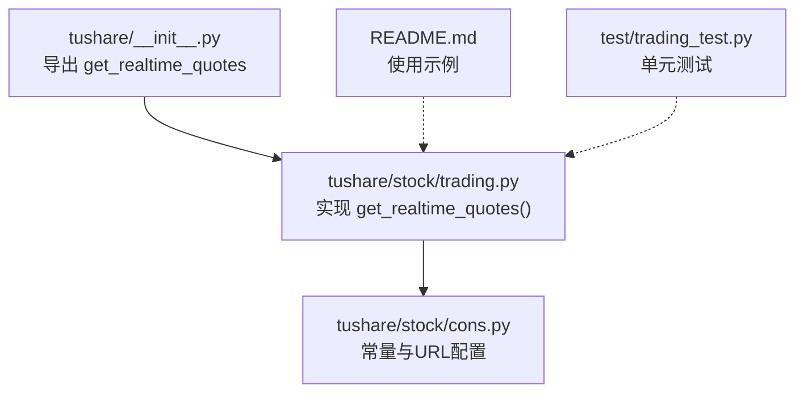
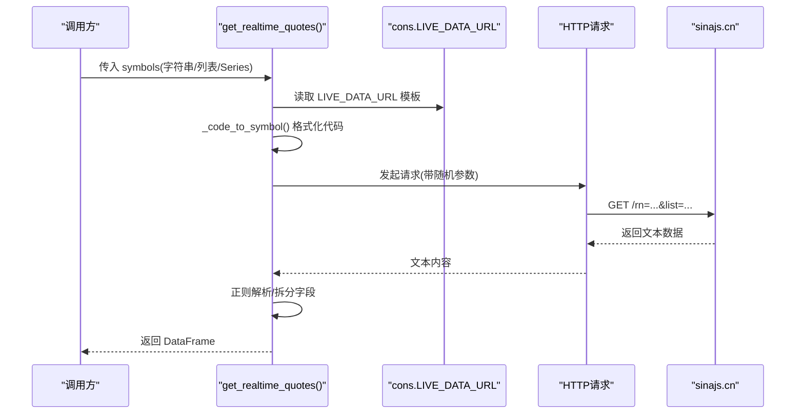
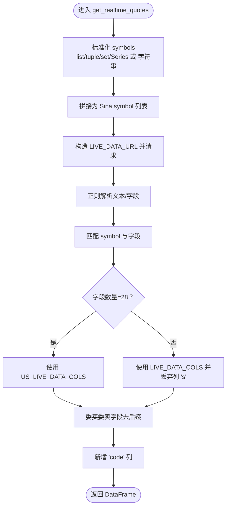
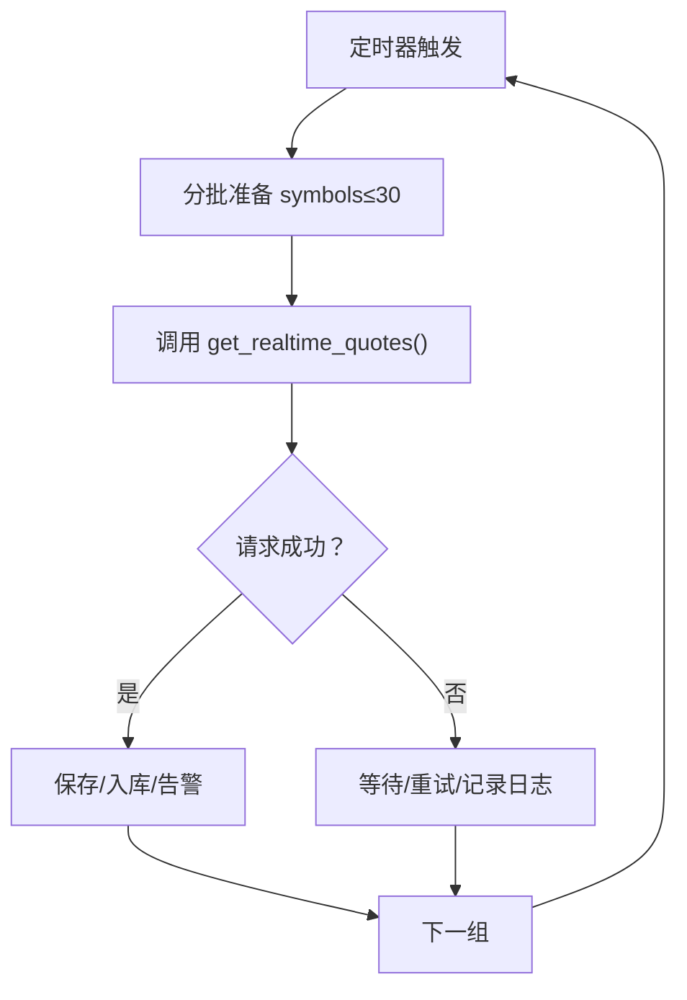
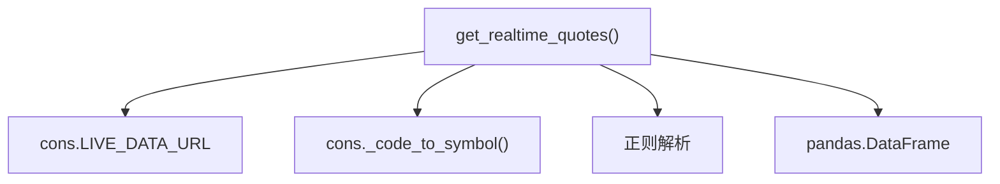

# 实时行情数据API

<cite>
**本文引用的文件**
- [tushare/__init__.py](file://tushare/__init__.py)
- [tushare/stock/trading.py](file://tushare/stock/trading.py)
- [tushare/stock/cons.py](file://tushare/stock/cons.py)
- [README.md](file://README.md)
- [test/trading_test.py](file://test/trading_test.py)
</cite>

## 目录
1. [简介](#简介)
2. [项目结构](#项目结构)
3. [核心组件](#核心组件)
4. [架构总览](#架构总览)
5. [详细组件分析](#详细组件分析)
6. [依赖分析](#依赖分析)
7. [性能考量](#性能考量)
8. [故障排查指南](#故障排查指南)
9. [结论](#结论)
10. [附录](#附录)

## 简介
本文件面向TuShare的实时行情数据API，聚焦于get_realtime_quotes()函数的能力与用法，涵盖：
- 实时股票报价、指数行情的获取方式
- 参数配置：股票代码列表、单个股票代码、Series等数组格式输入
- 返回值字段说明：名称、开盘价、昨收价、当前价、最高价、最低价、委买委卖盘口、成交量、成交金额、日期时间等
- 实时监控系统构建方案：批量获取、更新频率控制、异常处理
- 与定时任务、报警机制的集成思路

## 项目结构
- 接口入口位于tushare/__init__.py，导出get_realtime_quotes等交易数据接口
- 实现位于tushare/stock/trading.py，其中包含get_realtime_quotes()、常量与URL配置位于tushare/stock/cons.py
- README.md提供快速入门示例与接口说明
- test/trading_test.py包含单元测试样例，验证get_realtime_quotes的基本调用

**图示来源**
- [tushare/__init__.py:11-18](file://tushare/__init__.py#L11-L18)
- [tushare/stock/trading.py:323-394](file://tushare/stock/trading.py#L323-L394)
- [tushare/stock/cons.py:87-88](file://tushare/stock/cons.py#L87-L88)

**章节来源**
- [tushare/__init__.py:11-18](file://tushare/__init__.py#L11-L18)
- [README.md:166-182](file://README.md#L166-L182)
- [test/trading_test.py:29-31](file://test/trading_test.py#L29-L31)

## 核心组件
- get_realtime_quotes(symbols=None)
  - 功能：获取实时交易数据，支持单个或批量股票/指数
  - 输入：字符串或数组类对象（list、tuple、set、pd.Series）
  - 输出：DataFrame，包含名称、开盘价、昨收价、当前价、最高价、最低价、委买委卖盘口、成交量、成交金额、日期时间等字段
- 常量与URL
  - LIVE_DATA_URL：实时行情请求地址模板
  - LIVE_DATA_COLS/US_LIVE_DATA_COLS：字段列名映射
  - _code_to_symbol：将代码转换为Sina行情标准symbol

**章节来源**
- [tushare/stock/trading.py:323-394](file://tushare/stock/trading.py#L323-L394)
- [tushare/stock/cons.py:67-70](file://tushare/stock/cons.py#L67-L70)
- [tushare/stock/cons.py:87](file://tushare/stock/cons.py#L87)
- [tushare/stock/cons.py:409-421](file://tushare/stock/cons.py#L409-L421)

## 架构总览
get_realtime_quotes()通过构造Sina行情URL，向sinajs.cn发起HTTP请求，解析返回的文本数据，提取各股票/指数的实时字段，最终形成DataFrame返回。

**图示来源**
- [tushare/stock/trading.py:323-394](file://tushare/stock/trading.py#L323-L394)
- [tushare/stock/cons.py:87](file://tushare/stock/cons.py#L87)
- [tushare/stock/cons.py:409-421](file://tushare/stock/cons.py#L409-L421)

## 详细组件分析

### 函数：get_realtime_quotes()
- 参数
  - symbols：支持字符串（单个）、列表、元组、集合、pandas.Series
- 处理流程
  - 将输入标准化为Sina可识别的symbol列表
  - 构造LIVE_DATA_URL请求，附加随机参数避免缓存
  - 解析返回文本，按逗号分割字段，匹配对应symbol
  - 根据字段数量判断是否为美股数据，选择不同列名映射
  - 对委买委卖字段进行后缀裁剪，统一为数值
- 返回值
  - DataFrame，列名来自LIVE_DATA_COLS或US_LIVE_DATA_COLS
  - 新增'code'列，映射原始symbol
  - 包含name、open、pre_close、price、high、low、bid、ask、volume、amount、b1_v…a5_p、date、time等字段

**图示来源**
- [tushare/stock/trading.py:323-394](file://tushare/stock/trading.py#L323-L394)
- [tushare/stock/cons.py:67-70](file://tushare/stock/cons.py#L67-L70)
- [tushare/stock/cons.py:87](file://tushare/stock/cons.py#L87)

**章节来源**
- [tushare/stock/trading.py:323-394](file://tushare/stock/trading.py#L323-L394)
- [tushare/stock/cons.py:67-70](file://tushare/stock/cons.py#L67-L70)

### 参数配置与调用方式
- 单个股票代码：传入字符串，如'600848'
- 多个股票：传入list、tuple、set或pd.Series，如['600848','000980']
- 指数：传入指数标识，如'sh'、'sz'或具体指数代码
- 注意事项
  - 一次请求的symbol数量建议不超过30个，避免服务端限制
  - 代码会被转换为Sina标准symbol，如6位数字代码自动加' sh'/' sz'前缀

**章节来源**
- [README.md:178-181](file://README.md#L178-L181)
- [tushare/stock/cons.py:409-421](file://tushare/stock/cons.py#L409-L421)

### 返回值字段说明
- 基础字段：name、open、pre_close、price、high、low、bid、ask、volume、amount
- 委买委卖盘口：b1_v、b1_p、b2_v、b2_p、…、b5_v、b5_p、a1_v、a1_p、…、a5_v、a5_p
- 时间维度：date、time
- 其他：当为美股数据时，字段集与顺序不同，列名映射由US_LIVE_DATA_COLS决定

**章节来源**
- [tushare/stock/trading.py:334-360](file://tushare/stock/trading.py#L334-L360)
- [tushare/stock/cons.py:67-70](file://tushare/stock/cons.py#L67-L70)

### 实时监控系统构建方案
- 批量获取
  - 使用list/tuple/set/pd.Series传入多个symbol，减少请求次数
  - 分批策略：每批不超过30个，避免触发限流
- 数据更新频率控制
  - 建议至少间隔1秒以上，避免频繁请求导致超时或被限流
  - 可结合业务需求设置固定周期（如每1分钟、每5分钟）
- 异常处理
  - 网络异常：捕获IOError/Timeout，重试n次，间隔pause秒
  - 空结果：当返回None时，记录日志并跳过该批次
  - 字段解析：若字段数量异常，回退到默认列名映射逻辑
- 存储与可视化
  - 将DataFrame写入数据库或CSV，保留时间戳
  - 可基于DataFrame绘制分时图、对比多标的涨跌幅

[本图为概念流程示意，无需图示来源]

### 与定时任务、报警机制的集成
- 定时任务
  - 使用apscheduler/cron等调度框架，按固定周期调用get_realtime_quotes()
  - 对异常或空结果进行告警（邮件/IM/短信）
- 报警机制
  - 价格阈值：当price/pre_close偏离超过阈值触发预警
  - 成交量异常：volume较前一周期显著放大
  - 盘口失衡：bid/ask差价异常扩大
  - 建议将告警规则抽象为配置项，便于动态调整

[本节为通用实践建议，无需章节来源]

## 依赖分析
- get_realtime_quotes()直接依赖：
  - cons.LIVE_DATA_URL：实时行情URL模板
  - cons._code_to_symbol：symbol转换
  - 正则表达式：文本解析
- 间接依赖：
  - pandas：DataFrame构造与处理
  - urllib/requests：HTTP请求（根据Python版本选择）
  - re：正则匹配

**图示来源**
- [tushare/stock/trading.py:323-394](file://tushare/stock/trading.py#L323-L394)
- [tushare/stock/cons.py:87](file://tushare/stock/cons.py#L87)
- [tushare/stock/cons.py:409-421](file://tushare/stock/cons.py#L409-L421)

**章节来源**
- [tushare/stock/trading.py:26-29](file://tushare/stock/trading.py#L26-L29)
- [tushare/stock/trading.py:323-394](file://tushare/stock/trading.py#L323-L394)

## 性能考量
- 请求频率
  - 建议每次请求间至少1秒间隔，避免触发服务端限流
- 批量大小
  - 单次请求建议不超过30个symbol，提升成功率与稳定性
- 数据处理
  - 字段后缀裁剪与类型转换在内存中完成，注意大数据量时的内存占用
- 网络与超时
  - 设置合理timeout与retry_count，避免长时间阻塞

[本节为通用指导，无需章节来源]

## 故障排查指南
- 网络错误
  - 现象：抛出IOError或超时
  - 处理：增加pause间隔、提高retry_count、检查代理/防火墙
- 返回空数据
  - 现象：返回None
  - 处理：检查symbol是否有效、是否为休市时段、是否超过批量上限
- 字段解析异常
  - 现象：列数与预期不符
  - 处理：确认是否为美股数据，使用US_LIVE_DATA_COLS映射
- 代码格式错误
  - 现象：_code_to_symbol无法识别
  - 处理：确保传入6位数字或受支持的指数标识

**章节来源**
- [tushare/stock/trading.py:100](file://tushare/stock/trading.py#L100)
- [tushare/stock/trading.py:383-384](file://tushare/stock/trading.py#L383-L384)
- [tushare/stock/cons.py:409-421](file://tushare/stock/cons.py#L409-L421)

## 结论
get_realtime_quotes()提供了简洁高效的实时行情获取能力，支持单个与批量调用，返回字段覆盖关键价格、成交量与盘口信息。结合合理的频率控制、异常处理与报警机制，可构建稳定可靠的实时监控系统。建议在生产环境中配合分批策略、重试与日志记录，确保数据连续性与可追溯性。

## 附录
- 快速示例路径
  - README中的实时行情示例：[README.md:166-182](file://README.md#L166-L182)
  - 单元测试调用示例：[test/trading_test.py:29-31](file://test/trading_test.py#L29-L31)
- 导出入口
  - 接口导出位置：[tushare/__init__.py:11-18](file://tushare/__init__.py#L11-L18)