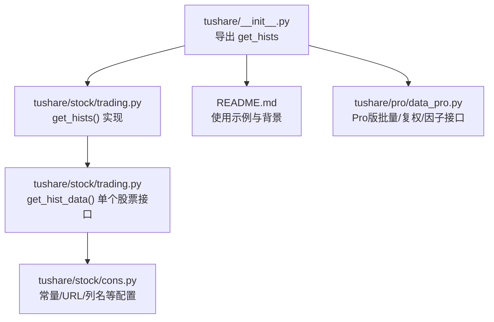
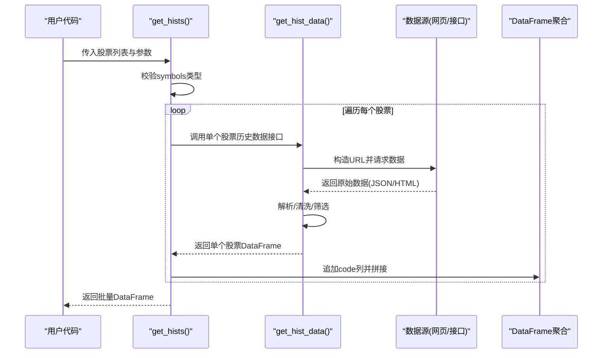
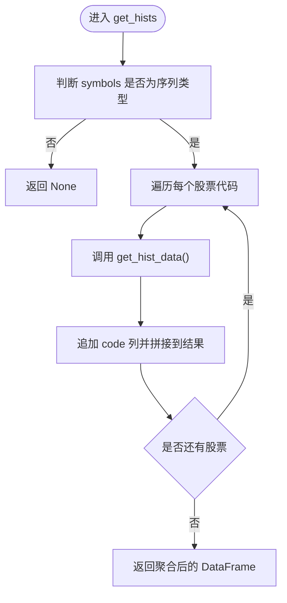
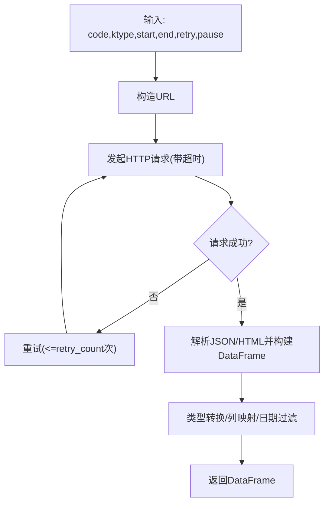
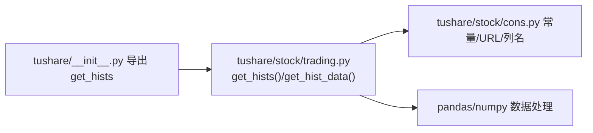

# 批量数据获取API

<cite>
**本文引用的文件**
- [tushare\stock\trading.py](file://tushare/stock/trading.py)
- [tushare\stock\cons.py](file://tushare/stock/cons.py)
- [tushare\__init__.py](file://tushare/__init__.py)
- [README.md](file://README.md)
- [tushare\pro\data_pro.py](file://tushare/pro/data_pro.py)
- [test\trading_test.py](file://test/trading_test.py)
</cite>

## 目录
1. [简介](#简介)
2. [项目结构](#项目结构)
3. [核心组件](#核心组件)
4. [架构总览](#架构总览)
5. [详细组件分析](#详细组件分析)
6. [依赖分析](#依赖分析)
7. [性能考量](#性能考量)
8. [故障排查指南](#故障排查指南)
9. [结论](#结论)
10. [附录](#附录)

## 简介
本文件面向TuShare的批量历史行情数据获取API，系统性梳理并说明get_hists()函数的能力边界、参数配置、实现机制与最佳实践。文档同时对比单个股票数据获取与批量获取的差异，给出在大数据量场景下的注意事项与解决方案，帮助用户在保证稳定性的同时提升数据获取效率。

## 项目结构
- 批量接口位于tushare/stock/trading.py中，核心函数为get_hists()，其内部通过循环调用单个股票的历史数据接口实现批量聚合。
- 常量与URL模板等配置位于tushare/stock/cons.py，为get_hist_data()等底层接口提供统一的常量与URL映射。
- 顶层入口导出get_hists()，便于直接按模块名调用。
- README提供了基础使用示例与背景说明，有助于理解接口定位与适用场景。
- pro/data_pro.py展示了更高阶的批量/复权/因子等能力，可作为批量数据获取的升级路径参考。

**图示来源**
- [tushare\__init__.py:11-18](file://tushare/__init__.py#L11-L18)
- [tushare\stock\trading.py:750-766](file://tushare/stock/trading.py#L750-L766)
- [tushare\stock\cons.py:1-453](file://tushare/stock/cons.py#L1-L453)
- [README.md:43-105](file://README.md#L43-L105)
- [tushare\pro\data_pro.py:34-140](file://tushare/pro/data_pro.py#L34-L140)

**章节来源**
- [tushare\__init__.py:11-18](file://tushare/__init__.py#L11-L18)
- [README.md:43-105](file://README.md#L43-L105)

## 核心组件
- get_hists(symbols, start=None, end=None, ktype='D', retry_count=3, pause=0.001)
  - 功能：批量获取多个股票的历史行情数据，内部逐个调用get_hist_data()，并在结果中附加code列以标识来源。
  - 参数要点：
    - symbols：支持list、set、tuple、pd.Series等序列类型；非序列类型将直接返回None。
    - start/end：日期字符串，用于筛选区间。
    - ktype：K线类型，支持日线、周线、月线及多种分钟线。
    - retry_count：网络异常时的最大重试次数。
    - pause：每次请求间的暂停秒数，避免请求过于频繁。
  - 返回：拼接后的DataFrame，包含各股票的历史行情与code列；若输入非序列则返回None。

- get_hist_data(code, start=None, end=None, ktype='D', retry_count=3, pause=0.001)
  - 功能：获取单个股票的历史行情数据，负责构造URL、发起HTTP请求、解析JSON/HTML、清洗与筛选数据。
  - 关键行为：根据ktype选择不同URL模板；对返回数据进行类型转换、日期过滤、列名标准化等。

**章节来源**
- [tushare\stock\trading.py:750-766](file://tushare/stock/trading.py#L750-L766)
- [tushare\stock\trading.py:32-100](file://tushare/stock/trading.py#L32-L100)

## 架构总览
批量接口的调用链路如下：

**图示来源**
- [tushare\stock\trading.py:750-766](file://tushare/stock/trading.py#L750-L766)
- [tushare\stock\trading.py:32-100](file://tushare/stock/trading.py#L32-L100)

## 详细组件分析

### get_hists()函数
- 输入校验：仅当symbols为序列类型时才进入循环；否则直接返回None。
- 循环策略：逐个调用get_hist_data()，并将每个结果追加到统一的DataFrame中。
- 结果增强：在每个子DataFrame中添加code列，确保后续按股票维度分析与合并。
- 错误处理：依赖get_hist_data()内部的重试与异常抛出机制；若某只股票请求失败，整体仍会返回已成功获取的部分数据（除非外部逻辑中断）。

**图示来源**
- [tushare\stock\trading.py:750-766](file://tushare/stock/trading.py#L750-L766)

**章节来源**
- [tushare\stock\trading.py:750-766](file://tushare/stock/trading.py#L750-L766)

### get_hist_data()函数
- URL构建：依据ktype选择日线/分钟线URL模板，拼接股票代码。
- 请求与解析：使用urllib发起HTTP请求，解析JSON或HTML表格，映射到标准列名。
- 数据清洗：去除逗号、空值替换、数值类型转换、日期过滤、列裁剪（如指数分钟线）。
- 重试与超时：内置重试循环与超时控制，失败时抛出网络错误提示。

**图示来源**
- [tushare\stock\trading.py:32-100](file://tushare/stock/trading.py#L32-L100)
- [tushare\stock\cons.py:84-88](file://tushare/stock/cons.py#L84-L88)

**章节来源**
- [tushare\stock\trading.py:32-100](file://tushare/stock/trading.py#L32-L100)
- [tushare\stock\cons.py:84-88](file://tushare/stock/cons.py#L84-L88)

### 常量与URL配置
- K线类型映射：K_LABELS、K_MIN_LABELS、K_TYPE、TT_K_TYPE等，决定URL模板与列名。
- 列名与索引：DAY_PRICE_COLUMNS、INX_DAY_PRICE_COLUMNS等，确保输出字段一致。
- URL模板：DAY_PRICE_URL、DAY_PRICE_MIN_URL等，承载数据源地址。

**章节来源**
- [tushare\stock\cons.py:10-18](file://tushare/stock/cons.py#L10-L18)
- [tushare\stock\cons.py:63-66](file://tushare/stock/cons.py#L63-L66)
- [tushare\stock\cons.py:84-88](file://tushare/stock/cons.py#L84-L88)

### 与单个股票接口的差异
- get_hist_data()：面向单只股票，返回该股票的历史行情DataFrame。
- get_hists()：面向多只股票，内部循环调用get_hist_data()，并在结果中增加code列，最终返回拼接后的DataFrame。
- 使用场景：批量回测、跨市场对比、统一格式入库等。

**章节来源**
- [tushare\stock\trading.py:750-766](file://tushare/stock/trading.py#L750-L766)
- [tushare\stock\trading.py:32-100](file://tushare/stock/trading.py#L32-L100)

### 与Pro版批量接口的对比
- tushare/pro/data_pro.py中的pro_bar()提供更丰富的资产类别、复权、因子与均线支持，适合对齐TuShare Pro能力。
- 若需要更高性能、更稳定的服务与更丰富的字段，建议结合Pro版接口使用。

**章节来源**
- [tushare\pro\data_pro.py:34-140](file://tushare/pro/data_pro.py#L34-L140)

## 依赖分析
- get_hists()依赖get_hist_data()完成单个股票数据获取。
- get_hist_data()依赖cons.py中的常量与URL模板，以及pandas/numpy等库进行数据处理。
- 顶层__init__.py导出get_hists()，便于直接按模块名导入使用。

**图示来源**
- [tushare\__init__.py:11-18](file://tushare/__init__.py#L11-L18)
- [tushare\stock\trading.py:32-100](file://tushare/stock/trading.py#L32-L100)
- [tushare\stock\cons.py:1-453](file://tushare/stock/cons.py#L1-L453)

**章节来源**
- [tushare\__init__.py:11-18](file://tushare/__init__.py#L11-L18)
- [tushare\stock\trading.py:32-100](file://tushare/stock/trading.py#L32-L100)
- [tushare\stock\cons.py:1-453](file://tushare/stock/cons.py#L1-L453)

## 性能考量
- 并发控制：当前实现为顺序循环调用，未引入并发。在大批量场景下，建议：
  - 自行封装为并发任务（如使用线程池/进程池），并合理设置pause以避免触发风控或限流。
  - 将pause调整为更大的间隔，降低请求频率，提高成功率。
- 内存管理：批量拼接DataFrame时，注意及时释放中间变量，避免内存峰值过高。
- 数据去重与格式统一：在入库前进行去重与类型统一，确保后续分析一致性。
- 分批策略：将大列表拆分为小批次，分时段拉取，减少单次请求压力。

[本节为通用性能建议，无需特定文件引用]

## 故障排查指南
- 网络错误：get_hist_data()在多次重试后仍失败会抛出网络错误提示。建议检查网络状态与代理设置。
- 输入类型错误：symbols必须为序列类型，否则get_hists()直接返回None。
- 日期格式与范围：start/end应为合法日期字符串；若超出数据源可提供的范围，可能导致空结果。
- 请求过于频繁：适当增大pause，避免被目标站点限制访问。
- 数据为空：若某只股票无数据或解析失败，整体仍会返回已成功获取的部分数据；可在调用后检查缺失项并补充重试。

**章节来源**
- [tushare\stock\trading.py:32-100](file://tushare/stock/trading.py#L32-L100)
- [tushare\stock\trading.py:750-766](file://tushare/stock/trading.py#L750-L766)

## 结论
get_hists()通过顺序循环调用get_hist_data()实现了对多只股票的历史行情批量获取，并在结果中保留股票标识，便于后续统一分析。在大数据量场景下，建议结合并发控制、分批策略与合理的pause配置，以平衡性能与稳定性。对于更复杂的批量/复权/因子需求，可参考TuShare Pro版的接口能力。

[本节为总结性内容，无需特定文件引用]

## 附录

### 参数配置清单
- symbols：股票代码序列（list/set/tuple/pd.Series）
- start：开始日期（字符串，YYYY-MM-DD）
- end：结束日期（字符串，YYYY-MM-DD）
- ktype：K线类型（D/W/M/5/15/30/60）
- retry_count：重试次数（默认3）
- pause：请求间暂停秒数（默认0.001）

**章节来源**
- [tushare\stock\trading.py:750-766](file://tushare/stock/trading.py#L750-L766)

### 使用示例与参考
- README中提供了get_hist_data的基础使用示例，可作为get_hists()使用的参考模板。
- trading_test.py展示了如何在测试中调用相关接口，便于验证批量获取流程。

**章节来源**
- [README.md:43-105](file://README.md#L43-L105)
- [test\trading_test.py:18-21](file://test/trading_test.py#L18-L21)