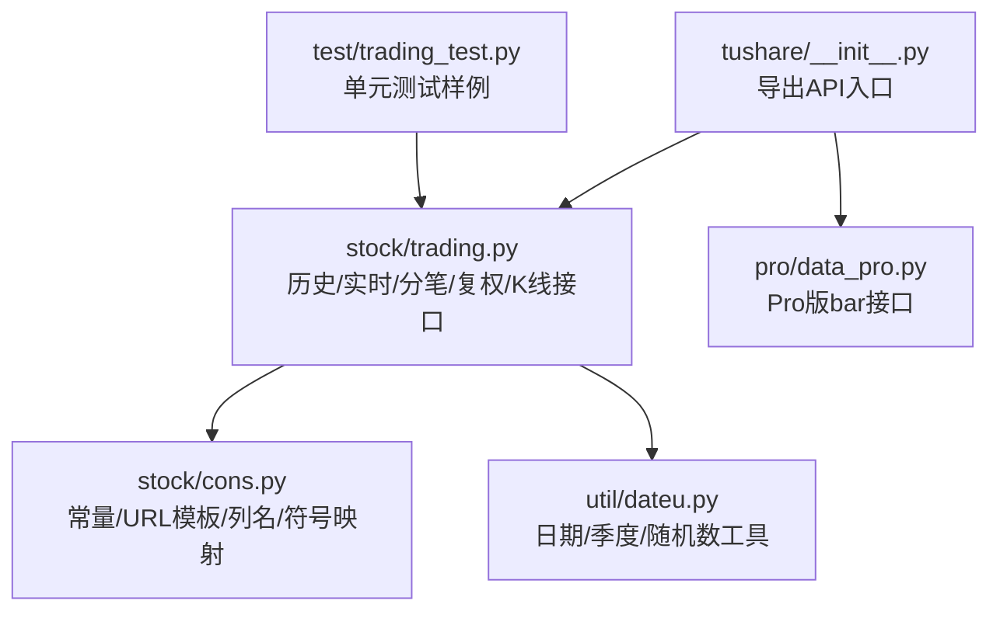
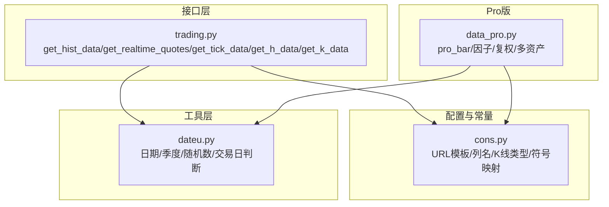
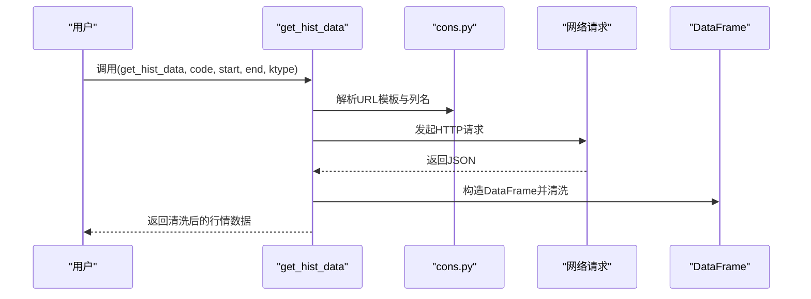
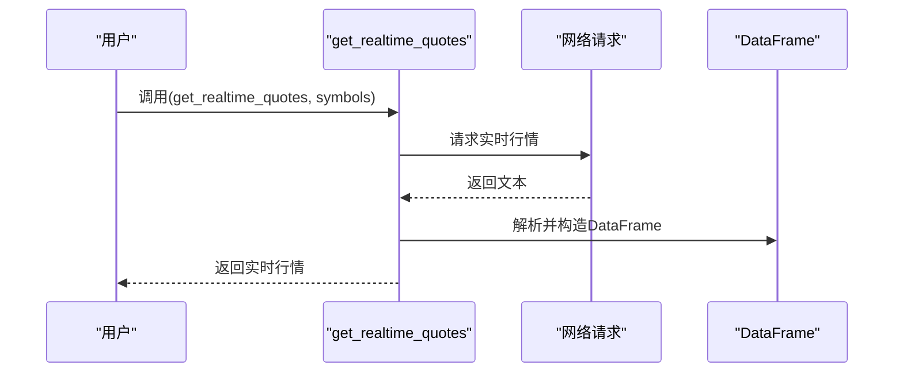
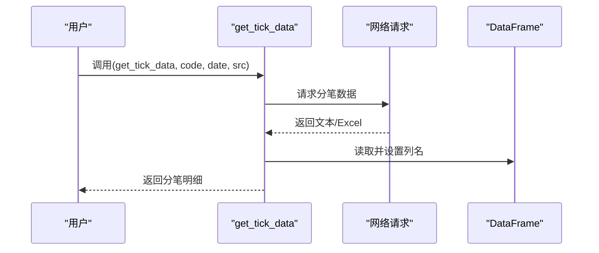
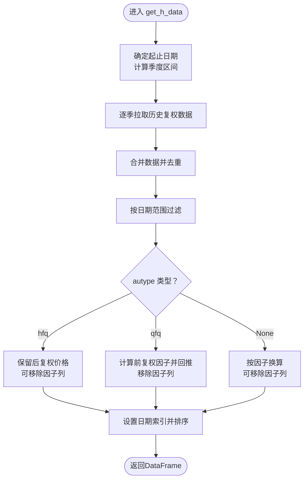
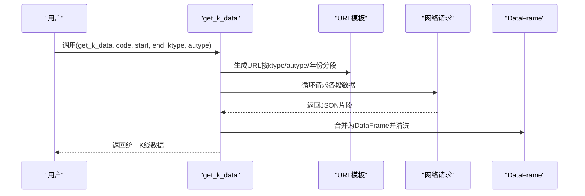
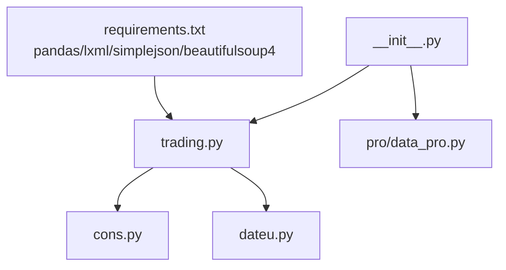
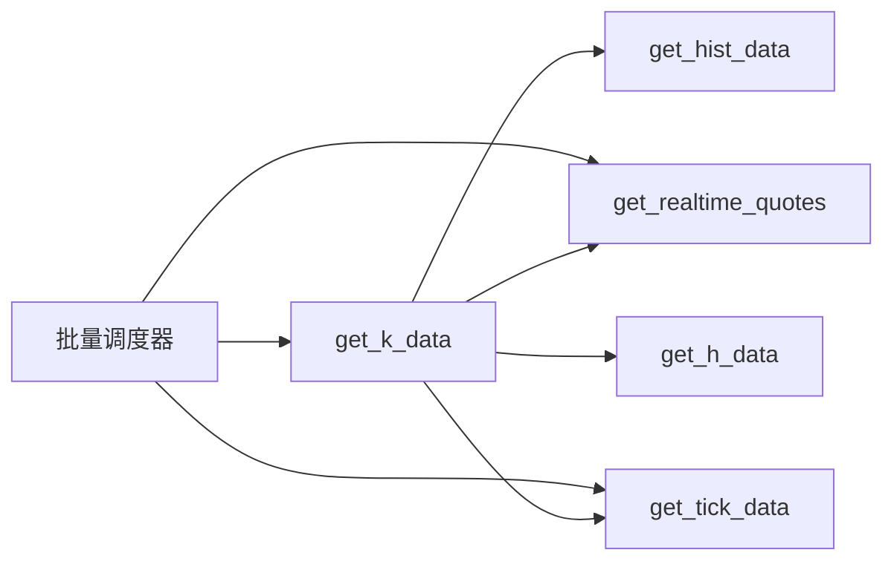

# 股票数据API

<cite>
**本文引用的文件**
- [README.md](file://README.md)
- [__init__.py](file://tushare/__init__.py)
- [trading.py](file://tushare/stock/trading.py)
- [cons.py](file://tushare/stock/cons.py)
- [dateu.py](file://tushare/util/dateu.py)
- [data_pro.py](file://tushare/pro/data_pro.py)
- [trading_test.py](file://test/trading_test.py)
- [requirements.txt](file://requirements.txt)
</cite>

## 目录
1. [简介](#简介)
2. [项目结构](#项目结构)
3. [核心组件](#核心组件)
4. [架构总览](#架构总览)
5. [详细组件分析](#详细组件分析)
6. [依赖分析](#依赖分析)
7. [性能考量](#性能考量)
8. [故障排查指南](#故障排查指南)
9. [结论](#结论)
10. [附录](#附录)

## 简介
本文件面向TuShare股票数据API的使用者与开发者，系统化梳理历史行情、实时行情、分笔数据、复权数据等核心功能接口，重点覆盖以下函数：
- get_hist_data：历史日/周/月线与分钟线
- get_realtime_quotes：实时行情
- get_tick_data：历史分笔
- get_h_data：历史复权数据（前复权/后复权/不复权）
- get_k_data：统一K线接口（支持复权与时间段分段拉取）

文档同时解释K线数据类型、复权机制、数据格式标准化、批量数据获取、时间范围筛选、数据验证等技术细节，并给出调用关系与最佳实践，帮助构建高效的数据获取流程。

## 项目结构
TuShare采用模块化组织，股票交易数据集中在stock/trading模块，公共常量与URL模板位于stock/cons，日期工具位于util/dateu，Pro版API位于pro/data_pro，入口导出位于tushare/__init__.py。

图示来源
- [__init__.py:11-18](file://tushare/__init__.py#L11-L18)
- [trading.py:32-100](file://tushare/stock/trading.py#L32-L100)
- [cons.py:13-45](file://tushare/stock/cons.py#L13-L45)
- [dateu.py:118-129](file://tushare/util/dateu.py#L118-L129)
- [data_pro.py:34-140](file://tushare/pro/data_pro.py#L34-L140)

章节来源
- [__init__.py:11-18](file://tushare/__init__.py#L11-L18)
- [README.md:43-182](file://README.md#L43-L182)

## 核心组件
- 历史行情接口：get_hist_data
  - 功能：获取个股历史日线、周线、月线以及分钟线数据，支持起止时间过滤。
  - 关键参数：code、start、end、ktype（D/W/M/5/15/30/60）、retry_count、pause。
  - 返回：DataFrame，列包含日期、开盘、最高、收盘、最低、成交量、涨跌幅、均线、换手率等。
- 实时行情接口：get_realtime_quotes
  - 功能：获取单只或多只股票的实时快照，字段涵盖买卖盘口、时间、成交量/金额等。
  - 关键参数：symbols（字符串或序列）。
  - 返回：DataFrame，列名来自LIVE_DATA_COLS或US_LIVE_DATA_COLS。
- 分笔数据接口：get_tick_data
  - 功能：获取指定日期的历史分笔明细，支持多数据源（新浪/腾讯/网易）。
  - 关键参数：code、date、src（sn/tt/nt）、retry_count、pause。
  - 返回：DataFrame，列包含时间、价格、成交量、金额、买卖类型等。
- 复权数据接口：get_h_data
  - 功能：获取历史复权数据，支持前复权(qfq)、后复权(hfq)、不复权(None)。
  - 关键参数：code、start、end、autype、drop_factor等。
  - 返回：DataFrame，列包含date索引与OHLCV等。
- K线统一接口：get_k_data
  - 功能：统一获取日线/周线/月线/分钟线，支持复权与跨年分段拉取。
  - 关键参数：code、start、end、ktype、autype、index、retry_count、pause。
  - 返回：DataFrame，列包含date索引与OHLCV/成交额/换手率等。

章节来源
- [trading.py:32-100](file://tushare/stock/trading.py#L32-L100)
- [trading.py:135-188](file://tushare/stock/trading.py#L135-L188)
- [trading.py:324-395](file://tushare/stock/trading.py#L324-L395)
- [trading.py:397-510](file://tushare/stock/trading.py#L397-L510)
- [trading.py:624-707](file://tushare/stock/trading.py#L624-L707)

## 架构总览
TuShare通过统一的入口导出对外API，内部以模块化方式组织：数据接口层（trading.py）、常量与URL模板层（cons.py）、日期工具层（dateu.py），以及Pro版增强层（data_pro.py）。接口层负责HTTP请求、解析与数据清洗，工具层提供日期与随机数等辅助能力。

图示来源
- [trading.py:1-30](file://tushare/stock/trading.py#L1-L30)
- [cons.py:13-45](file://tushare/stock/cons.py#L13-L45)
- [dateu.py:118-129](file://tushare/util/dateu.py#L118-L129)
- [data_pro.py:34-140](file://tushare/pro/data_pro.py#L34-L140)

## 详细组件分析

### get_hist_data 历史行情
- 参数要点
  - code：股票代码
  - start/end：日期范围，格式YYYY-MM-DD
  - ktype：K线类型，D/W/M/5/15/30/60
  - retry_count/pause：重试次数与请求间隔
- 数据处理
  - 解析JSON并构造DataFrame，对数值列进行类型转换
  - 日线/周线/月线去除千分位逗号并转浮点
  - 支持指数分钟线时剔除换手率列
  - 按start/end过滤并按日期降序排序
- 使用示例路径
  - [README.md 示例：历史行情与时间范围:45-96](file://README.md#L45-L96)
  - [trading_test.py 测试用例:18-21](file://test/trading_test.py#L18-L21)

图示来源
- [trading.py:32-100](file://tushare/stock/trading.py#L32-L100)
- [cons.py:86-89](file://tushare/stock/cons.py#L86-L89)
- [cons.py:63-66](file://tushare/stock/cons.py#L63-L66)

章节来源
- [trading.py:32-100](file://tushare/stock/trading.py#L32-L100)
- [README.md:45-96](file://README.md#L45-L96)
- [trading_test.py:18-21](file://test/trading_test.py#L18-L21)

### get_realtime_quotes 实时行情
- 参数要点
  - symbols：单个代码或序列（列表/元组/Series）
- 数据处理
  - 将symbols转换为目标格式并拼接URL
  - 解析返回文本，拆分字段，构造DataFrame
  - 自动识别中/美市场列名并清理冗余列
- 使用示例路径
  - [README.md 示例：实时行情:166-182](file://README.md#L166-L182)
  - [trading_test.py 测试用例:29-31](file://test/trading_test.py#L29-L31)

图示来源
- [trading.py:324-395](file://tushare/stock/trading.py#L324-L395)

章节来源
- [trading.py:324-395](file://tushare/stock/trading.py#L324-L395)
- [README.md:166-182](file://README.md#L166-L182)
- [trading_test.py:29-31](file://test/trading_test.py#L29-L31)

### get_tick_data 历史分笔
- 参数要点
  - code/date：股票代码与日期
  - src：数据源sn/tt/nt
  - retry_count/pause：重试与间隔
- 数据处理
  - 根据src选择不同URL与解析方式
  - 网易源使用Excel读取，其余使用分隔符读取
  - 设置列名并返回DataFrame
- 使用示例路径
  - [README.md 示例：历史分笔:142-165](file://README.md#L142-L165)
  - [trading_test.py 测试用例:22-24](file://test/trading_test.py#L22-L24)

图示来源
- [trading.py:135-188](file://tushare/stock/trading.py#L135-L188)
- [cons.py:79-83](file://tushare/stock/cons.py#L79-L83)

章节来源
- [trading.py:135-188](file://tushare/stock/trading.py#L135-L188)
- [README.md:142-165](file://README.md#L142-L165)
- [trading_test.py:22-24](file://test/trading_test.py#L22-L24)

### get_h_data 历史复权
- 参数要点
  - code、start、end、autype（qfq/hfq/None）、drop_factor
- 复权机制
  - 前复权(qfq)：基于复权因子回推历史价格
  - 后复权(hfq)：直接使用后复权价格
  - 不复权：使用原始价格并可选移除复权因子列
- 数据流程
  - 计算季度区间并逐季拉取
  - 合并后按日期过滤，必要时计算前复权因子并回推
  - 设置日期索引并排序
- 使用示例路径
  - [README.md 示例：复权历史数据:98-105](file://README.md#L98-L105)
  - [trading_test.py 测试用例:33-35](file://test/trading_test.py#L33-L35)

图示来源
- [trading.py:397-510](file://tushare/stock/trading.py#L397-L510)
- [dateu.py:72-75](file://tushare/util/dateu.py#L72-L75)

章节来源
- [trading.py:397-510](file://tushare/stock/trading.py#L397-L510)
- [README.md:98-105](file://README.md#L98-L105)
- [trading_test.py:33-35](file://test/trading_test.py#L33-L35)

### get_k_data 统一K线接口
- 参数要点
  - code、start、end、ktype（D/W/M/5/15/30/60）、autype（qfq/hfq/None）、index
  - 支持批量时间段分段拉取（年份分段）
- 数据流程
  - 根据ktype选择URL模板与列名
  - 对于日线/周线/月线，若指定复权则自动拼接fq标识
  - 对于分钟线，使用独立URL模板
  - 合并多段数据并按日期范围过滤
- 使用示例路径
  - [README.md 示例：历史行情与get_k_data:45-51](file://README.md#L45-L51)
  - [trading_test.py 测试用例:18-21](file://test/trading_test.py#L18-L21)

图示来源
- [trading.py:624-707](file://tushare/stock/trading.py#L624-L707)
- [cons.py:84-86](file://tushare/stock/cons.py#L84-L86)
- [cons.py:77-78](file://tushare/stock/cons.py#L77-L78)

章节来源
- [trading.py:624-707](file://tushare/stock/trading.py#L624-L707)
- [README.md:45-51](file://README.md#L45-L51)
- [trading_test.py:18-21](file://test/trading_test.py#L18-L21)

## 依赖分析
- 外部依赖
  - pandas、lxml、simplejson、beautifulsoup4等，详见requirements.txt
- 内部依赖
  - trading.py依赖cons.py（URL模板/列名/常量）、dateu.py（日期/季度/随机数）、util/netbase.Client（Pro版）
  - __init__.py集中导出交易、基本面、宏观、分类、参考、Shibor、Pro等模块接口

图示来源
- [requirements.txt:1-6](file://requirements.txt#L1-L6)
- [__init__.py:11-18](file://tushare/__init__.py#L11-L18)
- [trading.py:1-30](file://tushare/stock/trading.py#L1-L30)

章节来源
- [requirements.txt:1-6](file://requirements.txt#L1-L6)
- [__init__.py:11-18](file://tushare/__init__.py#L11-L18)

## 性能考量
- 请求频率控制
  - 接口普遍提供pause参数，建议在批量请求时适当增大pause，避免触发服务端限流
- 数据范围控制
  - 复权数据建议明确start/end，避免一次性拉取过长时间跨度导致内存压力
- 数据清洗成本
  - 数值列转换与字符串清洗（如千分位去除）存在CPU开销，建议仅在必要时进行
- 并发与重试
  - retry_count默认为3，可根据网络状况适度调整
- Pro版替代方案
  - 对高频/高质量数据需求，可考虑Pro版pro_bar接口，支持复权、因子与多资产

[本节为通用指导，无需特定文件引用]

## 故障排查指南
- 网络超时/失败
  - 现象：抛出网络错误提示
  - 处理：增大retry_count与pause，检查网络与代理设置
  - 参考：统一网络错误消息常量
- 日期格式错误
  - 现象：输入日期格式不正确
  - 处理：确保YYYY-MM-DD格式，使用dateu工具辅助
- 数据源不可用
  - 现象：返回空DataFrame或None
  - 处理：切换src（sn/tt/nt），或改用其他接口
- 复权因子缺失
  - 现象：复权数据为空或异常
  - 处理：检查股票是否长期停牌或无分红送股，适当缩小时间范围

章节来源
- [cons.py:195-201](file://tushare/stock/cons.py#L195-L201)
- [dateu.py:65-69](file://tushare/util/dateu.py#L65-L69)
- [trading.py:135-188](file://tushare/stock/trading.py#L135-L188)
- [trading.py:397-510](file://tushare/stock/trading.py#L397-L510)

## 结论
TuShare提供了覆盖历史行情、实时行情、分笔数据、复权数据与统一K线接口的完整能力集。通过合理设置时间范围、复权类型与请求间隔，可在保证稳定性的同时高效获取所需数据。对于更高阶需求，可结合Pro版接口进一步扩展。

[本节为总结性内容，无需特定文件引用]

## 附录

### API调用关系与最佳实践
- 历史数据优先使用get_k_data统一接口，兼顾复权与分钟线
- 实时监控使用get_realtime_quotes，注意symbols数量限制
- 分笔数据使用get_tick_data，注意数据源差异
- 复权数据使用get_h_data，明确autype与时间范围
- 批量场景建议封装统一调度器，控制并发与重试

图示来源
- [trading.py:32-100](file://tushare/stock/trading.py#L32-L100)
- [trading.py:135-188](file://tushare/stock/trading.py#L135-L188)
- [trading.py:324-395](file://tushare/stock/trading.py#L324-L395)
- [trading.py:397-510](file://tushare/stock/trading.py#L397-L510)
- [trading.py:624-707](file://tushare/stock/trading.py#L624-L707)

### 常用参数与返回字段速查
- get_hist_data
  - 关键列：date/open/high/close/low/volume/ma*/turnover等
- get_realtime_quotes
  - 关键列：name/open/pre_close/price/high/low/买卖盘口/时间等
- get_tick_data
  - 关键列：time/price/change/volume/amount/type等
- get_h_data
  - 关键列：date(open/high/close/low/volume/amount)与factor（可选）
- get_k_data
  - 关键列：date/open/high/close/low/volume/amount/turnoverratio/code

章节来源
- [cons.py:63-70](file://tushare/stock/cons.py#L63-L70)
- [cons.py:77-78](file://tushare/stock/cons.py#L77-L78)
- [cons.py:172-173](file://tushare/stock/cons.py#L172-L173)