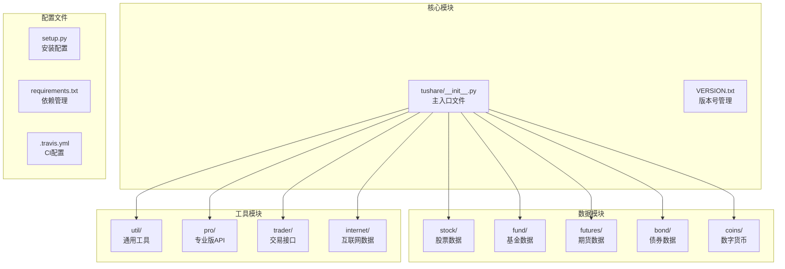
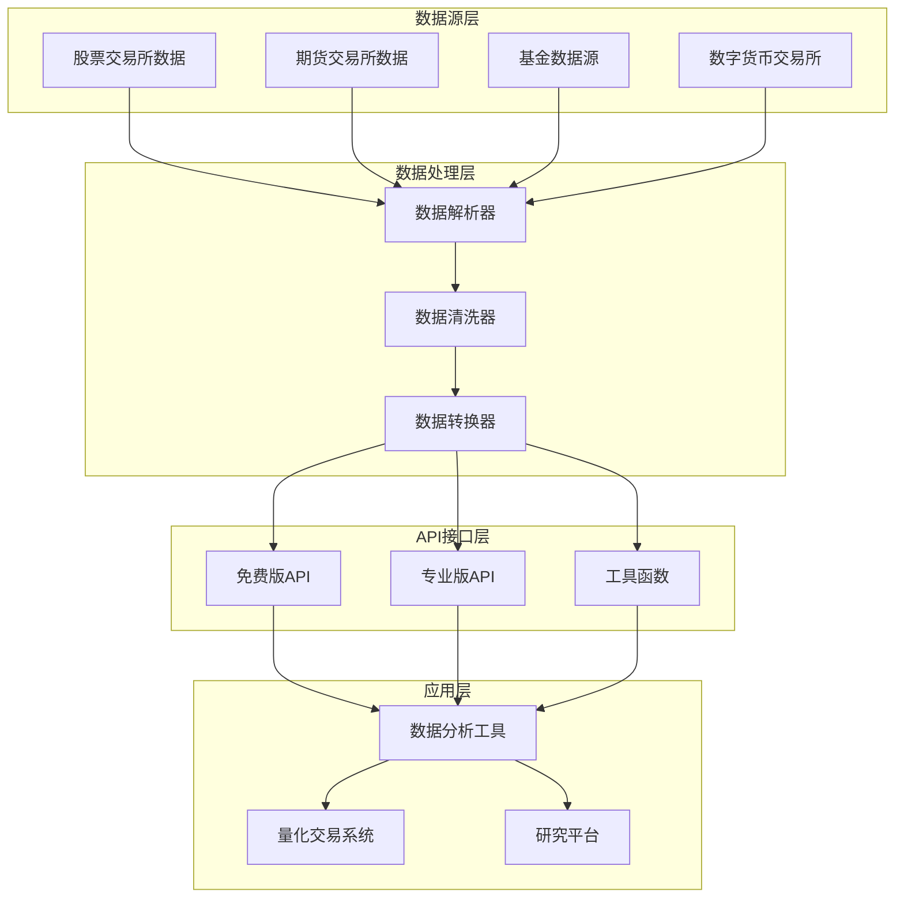
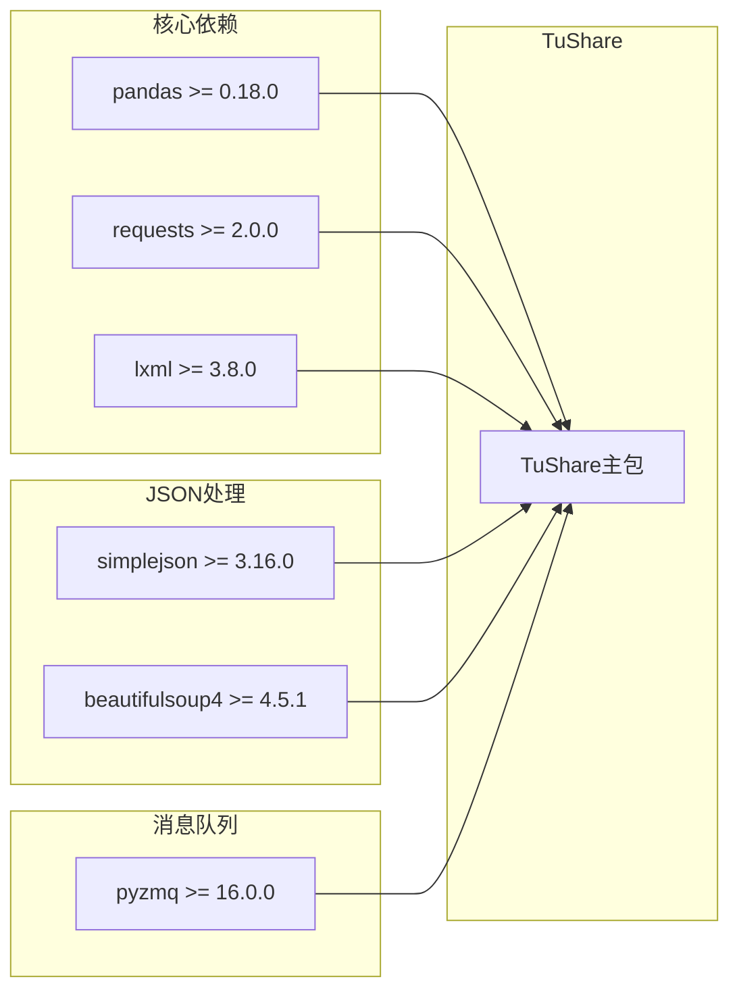
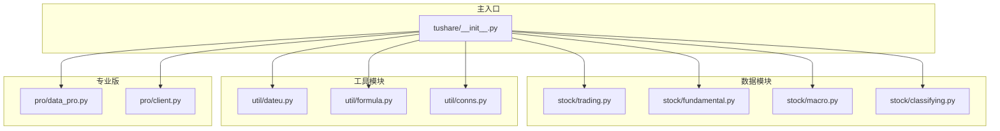

# 版本历史

<cite>
**本文档引用的文件**
- [README.md](file://README.md)
- [whats_new.md](file://whats_new.md)
- [setup.py](file://setup.py)
- [tushare/VERSION.txt](file://tushare/VERSION.txt)
- [tushare/__init__.py](file://tushare/__init__.py)
- [tushare/pro/data_pro.py](file://tushare/pro/data_pro.py)
- [tushare/stock/trading.py](file://tushare/stock/trading.py)
- [.travis.yml](file://.travis.yml)
- [requirements.txt](file://requirements.txt)
</cite>

## 目录
1. [简介](#简介)
2. [项目结构](#项目结构)
3. [核心组件](#核心组件)
4. [架构概览](#架构概览)
5. [详细组件分析](#详细组件分析)
6. [依赖关系分析](#依赖关系分析)
7. [性能考虑](#性能考虑)
8. [故障排除指南](#故障排除指南)
9. [结论](#结论)
10. [附录](#附录)

## 简介

TuShare是一个用于获取中国金融市场数据的Python工具包，专注于实现从数据采集、清洗加工到数据存储的完整流程。该项目自2014年创建以来，经历了多个重要版本的演进，逐步发展成为涵盖股票、期货、基金、数字货币等多种金融产品数据获取的综合性工具包。

该项目的主要特点包括：
- 数据覆盖范围广泛，涵盖股票、期货、基金、数字货币等多类金融产品
- 接口调用简单，响应快速
- 提供pandas DataFrame对象作为主要数据输出格式
- 支持多种数据源和数据格式

## 项目结构

TuShare项目采用模块化组织结构，按照功能领域进行划分：



**图表来源**
- [tushare/__init__.py:1-140](file://tushare/__init__.py#L1-L140)
- [setup.py:1-100](file://setup.py#L1-L100)

**章节来源**
- [tushare/__init__.py:1-140](file://tushare/__init__.py#L1-L140)
- [setup.py:1-100](file://setup.py#L1-L100)

## 核心组件

### 主要功能模块

TuShare的核心功能通过多个专门的模块实现：

1. **股票交易数据模块** (`tushare/stock/trading.py`)
   - 历史K线数据获取
   - 实时行情数据
   - 分笔交易数据
   - 复权数据处理

2. **基本面数据模块** (`tushare/stock/fundamental.py`)
   - 财务报表数据
   - 股票基本信息
   - 盈利能力指标

3. **宏观数据模块** (`tushare/stock/macro.py`)
   - GDP、CPI等宏观经济指标
   - 存贷款利率
   - 货币供应量

4. **专业版API模块** (`tushare/pro/data_pro.py`)
   - Tushare Pro版专业数据接口
   - 统一的数据访问层
   - 多资产类别支持

**章节来源**
- [tushare/stock/trading.py:1-200](file://tushare/stock/trading.py#L1-L200)
- [tushare/pro/data_pro.py:1-158](file://tushare/pro/data_pro.py#L1-L158)

## 架构概览

TuShare采用了分层架构设计，从底层数据源到上层应用接口形成了清晰的层次结构：



**图表来源**
- [tushare/pro/data_pro.py:21-40](file://tushare/pro/data_pro.py#L21-L40)
- [tushare/stock/trading.py:32-100](file://tushare/stock/trading.py#L32-L100)

## 详细组件分析

### 版本演进历程

根据项目文档，TuShare经历了以下重要发展阶段：

#### 早期版本 (0.1.0 - 0.2.0)
- **2014年12月**: 创建第一个版本，实现个股历史数据获取
- **2015年1月**: 增加实时交易数据获取功能
- **2015年3月**: 新增历史复权数据接口，支持前复权、后复权、不复权三种模式

#### 功能扩展期 (0.2.0 - 0.4.0)
- **2015年4月**: 新增指数成分股和权重分类，支持沪深300、上证50、中证500等
- **2015年6月**: 新增"龙虎榜"模块，包含每日龙虎榜列表、个股统计等功能
- **2015年7月**: 完成Python 2.x和3.x兼容性支持

#### 数据丰富期 (0.4.0 - 0.8.0)
- **2015年9月**: 新增期权隐含波动率数据
- **2015年10月**: 新增电影票房数据
- **2015年12月**: 新增申万行业分类和交易日历

#### 专业版发展期 (0.8.0 - 1.2.18)
- **2017年6月**: 新增期货行情数据接口
- **2017年8月**: 新增分红送股数据
- **2017年11月**: 新增可转债数据
- **2018年6月**: 发布专业版第一稿
- **2018年8月**: 发布专业版网站
- **2018年10月**: 增加通用行情pro_bar接口
- **2018年11月**: Pro版增加期货数据、周/月数据

### 版本兼容性分析

#### Python版本兼容性
- **Python 2.6+**: 支持早期版本
- **Python 2.7**: 完全支持
- **Python 3.2+**: 完全支持
- **Python 3.5**: 完全支持

#### pandas版本要求
- **pandas >= 0.18.0**: 最低版本要求
- **pandas >= 0.21**: 高级功能需要

#### 依赖关系
- requests >= 2.0.0
- lxml >= 3.8.0  
- simplejson >= 3.16.0
- beautifulsoup4 >= 4.5.1

**章节来源**
- [setup.py:65-75](file://setup.py#L65-L75)
- [requirements.txt:1-6](file://requirements.txt#L1-L6)
- [tushare/pro/data_pro.py:46-56](file://tushare/pro/data_pro.py#L46-L56)

### API接口演进

#### 免费版API发展历程
1. **基础数据接口** (`get_hist_data`, `get_tick_data`)
   - 支持日线、周线、月线数据
   - 支持5分钟、15分钟、30分钟、60分钟分钟线
   - 支持指数和个股数据

2. **行情数据接口** (`get_realtime_quotes`)
   - 实时股票行情获取
   - 支持批量查询
   - 支持多个数据源

3. **基本面数据接口**
   - 财务报表数据获取
   - 股票基本信息
   - 盈利能力指标

#### 专业版API特性
1. **统一数据接口** (`pro_bar`)
   - 支持多资产类别：股票、指数、期货、期权、基金、数字货币
   - 支持多时间频率：1分钟到年线
   - 支持复权处理：前复权、后复权

2. **增强功能**
   - 技术指标计算：均线、成交量均线等
   - 因子数据：换手率、量比等
   - 错误处理和重试机制

**章节来源**
- [tushare/stock/trading.py:32-100](file://tushare/stock/trading.py#L32-L100)
- [tushare/pro/data_pro.py:34-134](file://tushare/pro/data_pro.py#L34-L134)

## 依赖关系分析

### 外部依赖管理



**图表来源**
- [setup.py:65-75](file://setup.py#L65-L75)
- [requirements.txt:1-6](file://requirements.txt#L1-L6)

### 内部模块依赖



**图表来源**
- [tushare/__init__.py:11-139](file://tushare/__init__.py#L11-L139)

**章节来源**
- [setup.py:65-75](file://setup.py#L65-L75)
- [tushare/__init__.py:11-139](file://tushare/__init__.py#L11-L139)

## 性能考虑

### 数据获取性能优化

1. **网络请求优化**
   - 支持重试机制，避免网络波动影响
   - 可配置的请求间隔时间
   - 批量数据获取支持

2. **数据处理优化**
   - 使用pandas进行高效数据处理
   - 内存映射和数据类型优化
   - 缓存机制减少重复请求

3. **并发处理**
   - 支持多线程数据获取
   - 异步请求处理
   - 连接池管理

### 版本性能对比

| 版本 | 主要性能改进 | 影响范围 |
|------|-------------|----------|
| 0.7.0 | `get_today_all`接口提速 | 实时数据获取 |
| 0.8.8 | 数据类型优化 | 复权数据处理 |
| 1.0.2 | 新增稳定接口 | 多品种支持 |
| 1.2.12 | 专业版发布 | 大规模数据处理 |

## 故障排除指南

### 常见问题及解决方案

#### 版本兼容性问题
1. **Python版本问题**
   - 症状：导入错误或运行时异常
   - 解决方案：升级到Python 2.7或3.x版本

2. **pandas版本问题**
   - 症状：数据类型转换错误
   - 解决方案：升级pandas到0.18.0以上版本

#### 网络连接问题
1. **数据获取失败**
   - 症状：超时或连接错误
   - 解决方案：检查网络连接，调整重试参数

2. **API限制**
   - 症状：频繁请求被拒绝
   - 解决方案：遵守API使用限制，合理设置请求间隔

#### 数据质量问题
1. **数据缺失**
   - 症状：某些字段为空
   - 解决方案：检查数据源状态，使用备用数据源

2. **数据格式问题**
   - 症状：数据类型不匹配
   - 解决方案：手动转换数据类型或更新pandas版本

**章节来源**
- [tushare/pro/data_pro.py:135-140](file://tushare/pro/data_pro.py#L135-L140)
- [tushare/stock/trading.py:74-100](file://tushare/stock/trading.py#L74-L100)

## 结论

TuShare项目经过近十年的发展，已经从最初简单的股票数据获取工具，发展成为涵盖多资产类别、多数据源的综合性金融数据平台。其版本演进体现了以下几个重要趋势：

1. **功能不断完善**：从单一股票数据到多资产类别支持
2. **技术持续升级**：从Python 2.x到Python 3.x全面支持
3. **专业服务发展**：从免费版到专业版的商业化转型
4. **性能持续优化**：从简单数据获取到大规模数据处理

对于用户而言，选择合适的版本主要取决于：
- **数据需求复杂度**：基础需求选择免费版，专业需求选择专业版
- **技术栈兼容性**：确保Python和pandas版本兼容
- **性能要求**：大数据量场景建议使用专业版

## 附录

### 版本发布计划

#### 短期规划 (未来3-6个月)
- **API稳定性提升**：优化现有接口，减少breaking changes
- **性能监控**：添加数据获取性能监控和报告
- **文档完善**：补充API使用示例和最佳实践

#### 中期规划 (未来6-12个月)
- **数据质量提升**：改进数据准确性验证机制
- **多语言支持**：考虑国际化支持
- **云服务集成**：提供云端部署选项

#### 长期规划 (未来12个月以上)
- **机器学习集成**：提供数据预处理和特征工程功能
- **实时数据服务**：扩展实时数据获取能力
- **生态建设**：构建开发者社区和第三方插件生态

### 用户升级指南

#### 从免费版升级到专业版
1. **准备工作**
   - 确认Python和pandas版本兼容性
   - 准备专业版API密钥
   - 评估数据量和使用频率

2. **升级步骤**
   ```python
   import tushare as ts
   
   # 设置API密钥
   ts.set_token('your_pro_token')
   
   # 初始化专业版API
   pro = ts.pro_api()
   
   # 使用专业版接口
   df = ts.pro_bar(ts_code='000001.SZ', start_date='20200101', end_date='20201231')
   ```

3. **注意事项**
   - 专业版API有使用限制和费用
   - 建议先在测试环境验证功能
   - 注意数据延迟和准确性差异

#### 版本迁移注意事项
1. **API接口变更**
   - 检查现有代码中的API调用
   - 更新到新的接口参数和返回值
   - 测试数据获取功能

2. **数据格式变化**
   - 关注数据列名和数据类型的变更
   - 更新数据处理逻辑
   - 验证数据完整性

3. **性能影响评估**
   - 评估升级后的性能变化
   - 优化数据获取策略
   - 调整缓存和存储策略

**章节来源**
- [README.md:38-42](file://README.md#L38-L42)
- [tushare/pro/data_pro.py:21-32](file://tushare/pro/data_pro.py#L21-L32)