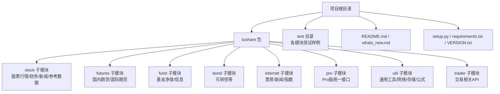
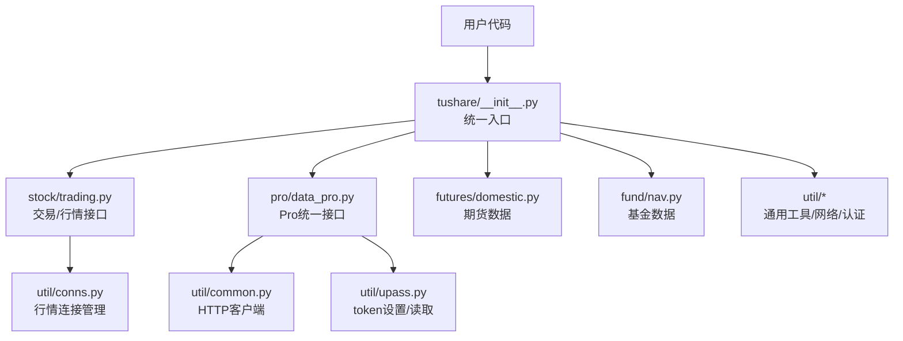
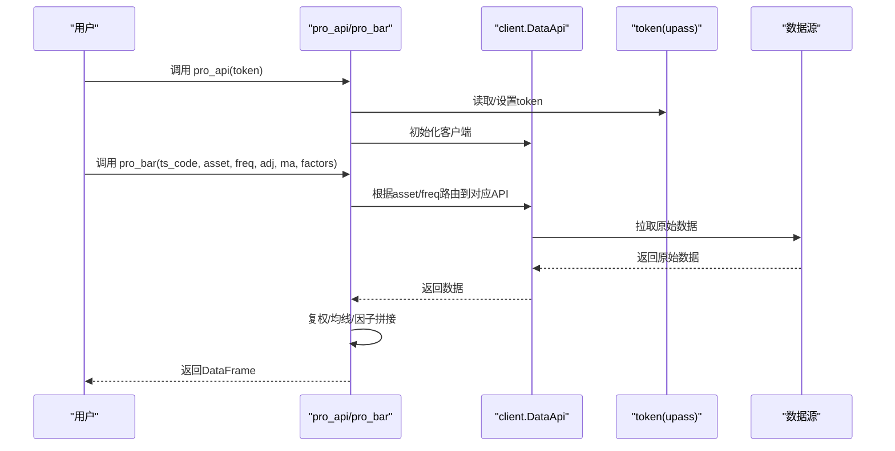
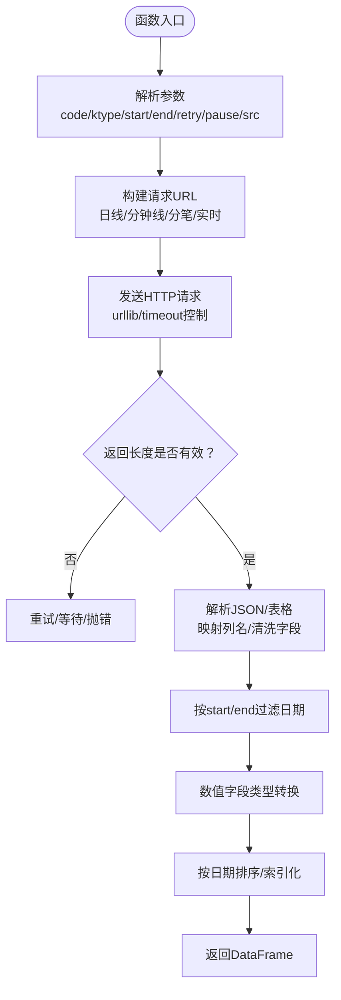
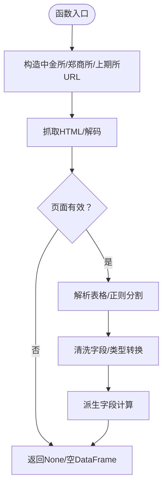
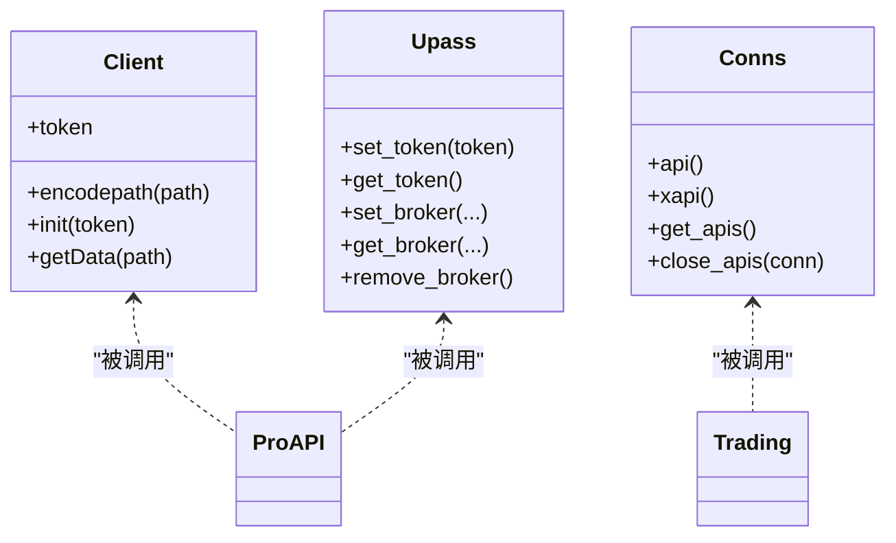
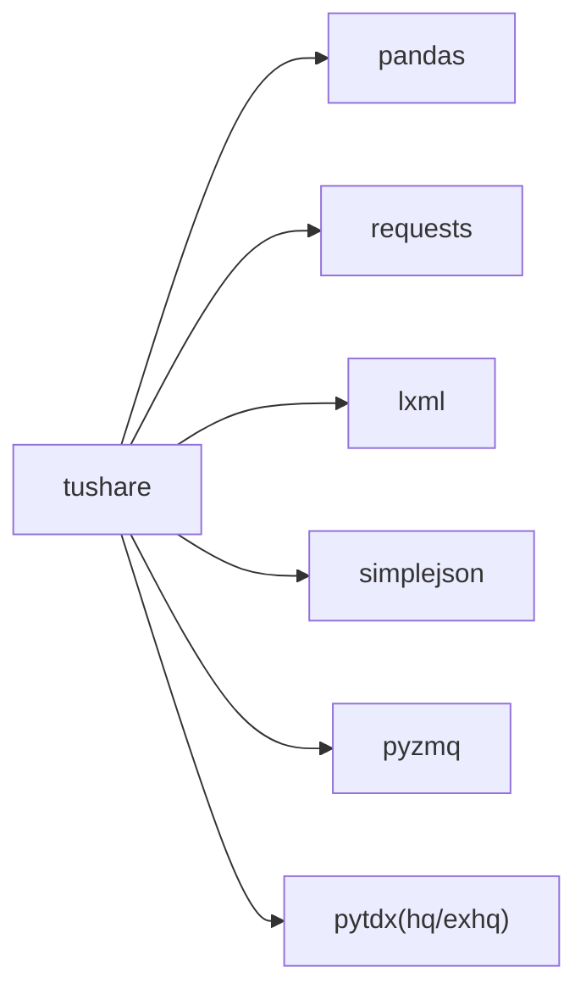

# 项目概述

<cite>
**本文引用的文件**
- [README.md](file://README.md)
- [whats_new.md](file://whats_new.md)
- [setup.py](file://setup.py)
- [requirements.txt](file://requirements.txt)
- [tushare/VERSION.txt](file://tushare/VERSION.txt)
- [tushare/__init__.py](file://tushare/__init__.py)
- [tushare/pro/data_pro.py](file://tushare/pro/data_pro.py)
- [tushare/util/common.py](file://tushare/util/common.py)
- [tushare/util/conns.py](file://tushare/util/conns.py)
- [tushare/util/upass.py](file://tushare/util/upass.py)
- [tushare/stock/trading.py](file://tushare/stock/trading.py)
- [tushare/futures/domestic.py](file://tushare/futures/domestic.py)
- [test/trading_test.py](file://test/trading_test.py)
- [test/fund_test.py](file://test/fund_test.py)
</cite>

## 目录
1. [引言](#引言)
2. [项目结构](#项目结构)
3. [核心组件](#核心组件)
4. [架构总览](#架构总览)
5. [详细组件分析](#详细组件分析)
6. [依赖分析](#依赖分析)
7. [性能考量](#性能考量)
8. [故障排查指南](#故障排查指南)
9. [结论](#结论)
10. [附录](#附录)

## 引言
TuShare 是面向中国金融市场的数据获取工具库，致力于从“数据采集、清洗加工到数据存储”的全链路，为量化分析师、数据科学家以及金融从业者提供易用、稳定、覆盖面广的数据接口。其核心定位是通过统一的API与标准化的数据输出（以pandas DataFrame为主），降低获取中国金融市场数据的门槛；同时强调接口调用简单、响应快速、覆盖范围广，适配从入门学习到专业研究的广泛场景。

- 数据覆盖范围广：涵盖股票、指数、期货、基金、债券、宏观、新闻事件、Shibor、互联网数据、数字货币等多个领域。
- 接口调用简单：提供高层封装，多数返回DataFrame，便于直接进行后续分析与可视化。
- 响应快速：内置重试机制、超时控制与多数据源适配，兼顾稳定性与效率。
- 统一API与模块化设计：按业务域划分模块，顶层通过__init__.py聚合导出，形成清晰的使用入口。

## 项目结构
仓库采用按“业务域+工具层”的组织方式：
- 核心包 tushare 下按模块划分：stock（股票）、futures（期货）、fund（基金）、bond（债券）、internet（互联网相关）、pro（Pro版接口封装）、util（通用工具）、trader（交易相关）等。
- 顶层入口 tushare/__init__.py 聚合导出各类API，便于用户通过单一导入即可使用。
- 测试目录 test 下包含各模块的单元测试样例，展示典型调用方式。
- 文档与配置：README.md 提供使用说明与变更日志；whats_new.md 记录近期更新；setup.py/requirements.txt 管理安装与依赖。

图表来源
- [tushare/__init__.py:1-140](file://tushare/__init__.py#L1-L140)
- [README.md:1-411](file://README.md#L1-L411)
- [whats_new.md:1-162](file://whats_new.md#L1-L162)

章节来源
- [README.md:1-411](file://README.md#L1-L411)
- [tushare/__init__.py:1-140](file://tushare/__init__.py#L1-L140)

## 核心组件
- 统一入口与API聚合
  - 顶层通过 tushare/__init__.py 导出交易、财务、宏观、分类、新闻、参考、Shibor、Pro接口、期货、基金、数字货币、交易器、工具等模块的常用API，形成“单一导入、多域可用”的使用体验。
- Pro版统一接口
  - tushare/pro/data_pro.py 提供 pro_api 与 pro_bar，支持股票/指数/期货/期权/基金/数字货币等多资产、多周期（日/周/月/年、分钟级）、复权处理、均线与因子（换手率、量比）等增强能力。
- 通用工具与网络层
  - tushare/util/common.py 封装基于HTTP的客户端与路径编码逻辑，用于Pro版数据拉取。
  - tushare/util/conns.py 提供对接行情服务器的连接管理（心跳、重试、断开），支撑高频/稳定的数据抓取。
  - tushare/util/upass.py 提供token设置与持久化，保障Pro版认证流程。
- 交易数据与行情
  - tushare/stock/trading.py 提供历史行情、分笔、实时报价、指数行情、复权数据、K线扩展等接口，覆盖日常研究与回测所需的基础数据。
- 期货数据
  - tushare/futures/domestic.py 提供中金所、郑商所、上期所等国内期货/期权日线数据解析与清洗，统一输出DataFrame。

章节来源
- [tushare/__init__.py:1-140](file://tushare/__init__.py#L1-L140)
- [tushare/pro/data_pro.py:1-158](file://tushare/pro/data_pro.py#L1-L158)
- [tushare/util/common.py:1-86](file://tushare/util/common.py#L1-L86)
- [tushare/util/conns.py:1-61](file://tushare/util/conns.py#L1-L61)
- [tushare/util/upass.py:1-62](file://tushare/util/upass.py#L1-L62)
- [tushare/stock/trading.py:1-200](file://tushare/stock/trading.py#L1-L200)
- [tushare/futures/domestic.py:1-200](file://tushare/futures/domestic.py#L1-L200)

## 架构总览
TuShare 的架构围绕“模块化 + 统一API + 数据标准化”展开：
- 模块化设计：按业务域拆分子模块，职责清晰、边界明确，便于维护与扩展。
- 统一API接口：顶层__init__.py将各模块常用接口集中导出，用户只需 import tushare 即可使用。
- 数据标准化：统一返回pandas DataFrame，字段命名规范，便于后续分析与入库。
- 网络与认证：Pro版通过token认证与统一客户端，结合重试与超时策略，保证稳定性。
- 扩展与兼容：支持Python 2.x/3.x，依赖pandas、requests、lxml、simplejson、pyzmq等，满足主流生态。

图表来源
- [tushare/__init__.py:1-140](file://tushare/__init__.py#L1-L140)
- [tushare/pro/data_pro.py:1-158](file://tushare/pro/data_pro.py#L1-L158)
- [tushare/util/common.py:1-86](file://tushare/util/common.py#L1-L86)
- [tushare/util/conns.py:1-61](file://tushare/util/conns.py#L1-L61)
- [tushare/util/upass.py:1-62](file://tushare/util/upass.py#L1-L62)
- [tushare/stock/trading.py:1-200](file://tushare/stock/trading.py#L1-L200)
- [tushare/futures/domestic.py:1-200](file://tushare/futures/domestic.py#L1-L200)

## 详细组件分析

### 组件A：Pro版统一接口（pro_api / pro_bar）
- 设计理念
  - 通过 pro_api 初始化认证，pro_bar 统一处理多资产、多周期、复权与因子计算，屏蔽底层差异。
  - 支持股票/指数/期货/期权/基金/数字货币等资产类型，支持分钟/日/周/月/年等周期。
- 关键流程
  - 参数校验与标准化（ts_code大小写、freq大小写、asset类型）。
  - 根据资产类型路由到对应API（日线/周线/月线/指数/期货/期权/基金/数字货币）。
  - 可选复权（前复权/后复权）与均线、换手率/量比等因子拼接。
- 错误处理
  - 内置重试与异常捕获，失败时返回None或抛出IO错误提示。

图表来源
- [tushare/pro/data_pro.py:21-141](file://tushare/pro/data_pro.py#L21-L141)
- [tushare/util/upass.py:16-31](file://tushare/util/upass.py#L16-L31)

章节来源
- [tushare/pro/data_pro.py:1-158](file://tushare/pro/data_pro.py#L1-L158)
- [tushare/util/upass.py:1-62](file://tushare/util/upass.py#L1-L62)

### 组件B：交易数据与行情（get_hist_data / get_tick_data / get_realtime_quotes）
- 设计理念
  - 面向研究与回测的高频数据需求，提供历史K线、分笔、实时报价等接口。
  - 自动处理编码、日期过滤、字段清洗与类型转换，统一返回DataFrame。
- 关键流程
  - get_hist_data：根据ktype选择日线/分钟线URL，解析JSON，清洗字段，按start/end过滤，排序返回。
  - get_tick_data：支持新浪/腾讯/网易三类数据源，自动识别Excel/文本格式，映射列名。
  - get_realtime_quotes：批量获取实时行情，限制单次数量避免风控。
- 错误处理
  - 超时/空数据返回None，重试与pause参数缓解网络抖动。

图表来源
- [tushare/stock/trading.py:32-100](file://tushare/stock/trading.py#L32-L100)
- [tushare/stock/trading.py:135-187](file://tushare/stock/trading.py#L135-L187)

章节来源
- [tushare/stock/trading.py:1-200](file://tushare/stock/trading.py#L1-L200)

### 组件C：期货数据（国内期货/期权日线）
- 设计理念
  - 针对中金所、郑商所、上期所等官方HTML页面，统一解析与清洗，输出标准字段。
- 关键流程
  - 依据日期构造URL，抓取HTML，正则/BeautifulSoup解析表格。
  - 字段类型转换（整型/浮点/字符串），补全衍生字段（如前结算价）。
- 错误处理
  - 404/页面错误/格式不符时返回空，避免异常中断。

图表来源
- [tushare/futures/domestic.py:26-86](file://tushare/futures/domestic.py#L26-L86)
- [tushare/futures/domestic.py:89-180](file://tushare/futures/domestic.py#L89-L180)

章节来源
- [tushare/futures/domestic.py:1-200](file://tushare/futures/domestic.py#L1-L200)

### 组件D：网络与认证（HTTP客户端/连接池/Token）
- 设计理念
  - HTTP客户端负责路径编码与Authorization头注入，确保Pro版请求合规。
  - 连接管理封装心跳与重连，减少断连风险。
  - Token持久化于用户家目录，避免每次初始化重复输入。
- 关键流程
  - Client.getData：拼接路径、编码、发送请求、状态判断、编码转换。
  - conns.api/xapi：建立与行情服务器的连接，支持多实例。
  - upass.set_token/get_token：CSV持久化/读取token。

图表来源
- [tushare/util/common.py:18-85](file://tushare/util/common.py#L18-L85)
- [tushare/util/conns.py:14-61](file://tushare/util/conns.py#L14-L61)
- [tushare/util/upass.py:16-61](file://tushare/util/upass.py#L16-L61)

章节来源
- [tushare/util/common.py:1-86](file://tushare/util/common.py#L1-L86)
- [tushare/util/conns.py:1-61](file://tushare/util/conns.py#L1-L61)
- [tushare/util/upass.py:1-62](file://tushare/util/upass.py#L1-L62)

## 依赖分析
- 安装与运行时依赖
  - pandas、requests、lxml、simplejson、pyzmq 等，满足数据处理、HTTP抓取、XML/JSON解析与消息队列通信。
- 版本与兼容
  - setup.py 明确支持Python 2.6/2.7/3.x系列，兼容历史环境。
- 第三方库集成
  - pytdx 用于行情连接（TdxHq_API/TdxExHq_API），提升行情数据获取的稳定性与并发能力。

图表来源
- [setup.py:65-74](file://setup.py#L65-L74)
- [requirements.txt:1-6](file://requirements.txt#L1-L6)
- [tushare/util/conns.py:9-11](file://tushare/util/conns.py#L9-L11)

章节来源
- [setup.py:1-100](file://setup.py#L1-L100)
- [requirements.txt:1-6](file://requirements.txt#L1-L6)
- [tushare/util/conns.py:1-61](file://tushare/util/conns.py#L1-L61)

## 性能考量
- 网络与重试
  - 多处接口内置 retry_count 与 pause，降低网络抖动对结果的影响。
- 超时控制
  - urllib 请求设置timeout，避免阻塞导致的资源占用。
- 数据类型与清洗
  - 统一数值字段类型转换与缺失值处理，减少后续分析成本。
- 并发与连接
  - 通过连接池与心跳机制，提高行情数据获取的稳定性与吞吐。
- 输出标准化
  - DataFrame统一字段与索引，便于缓存、合并与二次加工。

## 故障排查指南
- 网络/超时问题
  - 现象：请求失败或返回空。
  - 排查：检查retry_count/pause设置、网络连通性、目标站点可用性。
  - 参考：交易数据接口的异常捕获与重试逻辑。
- 编码问题
  - 现象：中文乱码或解析失败。
  - 排查：确认数据源返回编码（如GBK），并在读取时正确解码。
  - 参考：分笔数据读取与编码处理。
- 认证/Token问题
  - 现象：Pro版初始化失败。
  - 排查：确认token是否设置、文件是否存在、权限是否正确。
  - 参考：token设置与读取流程。
- 期货数据为空
  - 现象：指定日期无交易数据或页面错误。
  - 排查：确认日期是否为交易日、URL是否正确、页面结构是否变化。
  - 参考：期货日线解析与错误分支。

章节来源
- [tushare/stock/trading.py:67-100](file://tushare/stock/trading.py#L67-L100)
- [tushare/stock/trading.py:169-187](file://tushare/stock/trading.py#L169-L187)
- [tushare/util/upass.py:23-31](file://tushare/util/upass.py#L23-L31)
- [tushare/futures/domestic.py:50-62](file://tushare/futures/domestic.py#L50-L62)

## 结论
TuShare 以“统一API + 模块化设计 + 数据标准化”为核心，覆盖中国金融市场的主要数据域，提供易用、稳定、高性能的数据获取能力。其Pro版进一步强化了多资产、多周期与复权/因子处理，适合从入门学习到专业研究的全栈用户。建议在生产环境中结合重试、超时与连接池策略，配合DataFrame标准化输出，构建稳健的数据管线。

## 附录
- 目标用户
  - 量化分析师、数据科学家、金融从业者、学生与研究者。
- 快速开始
  - 安装与升级：pip install tushare 与 pip install tushare --upgrade。
  - 使用示例：参见README.md中的示例与文档链接。
- 版本与演进
  - 从0.1.0到当前版本1.2.18，持续扩展数据域与接口能力，Pro版逐步完善。
- 测试参考
  - test/trading_test.py 与 test/fund_test.py 展示典型调用方式，可作为集成测试与回归测试的参考。

章节来源
- [README.md:30-42](file://README.md#L30-L42)
- [tushare/VERSION.txt:1-1](file://tushare/VERSION.txt#L1-L1)
- [test/trading_test.py:1-43](file://test/trading_test.py#L1-L43)
- [test/fund_test.py:1-43](file://test/fund_test.py#L1-L43)