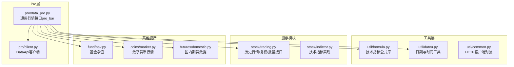
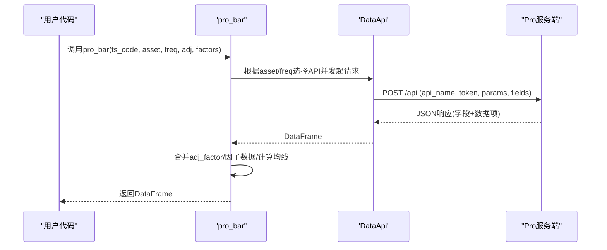
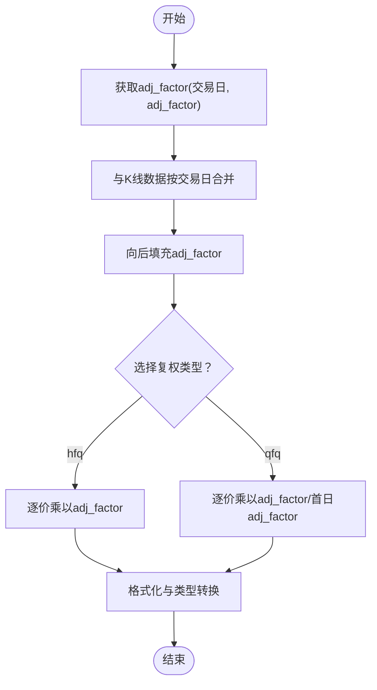
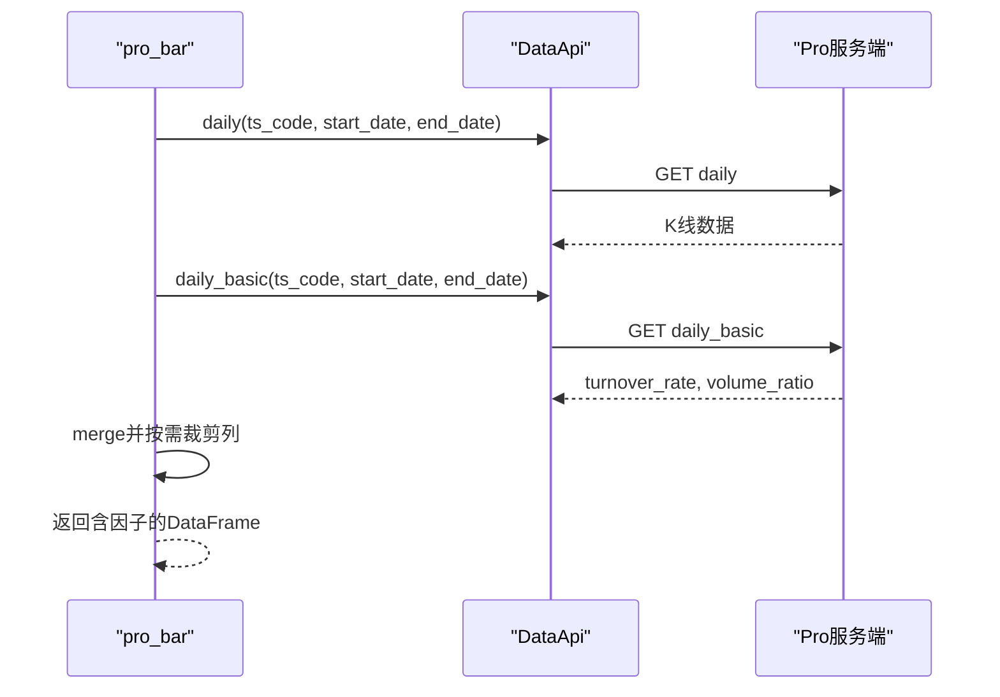
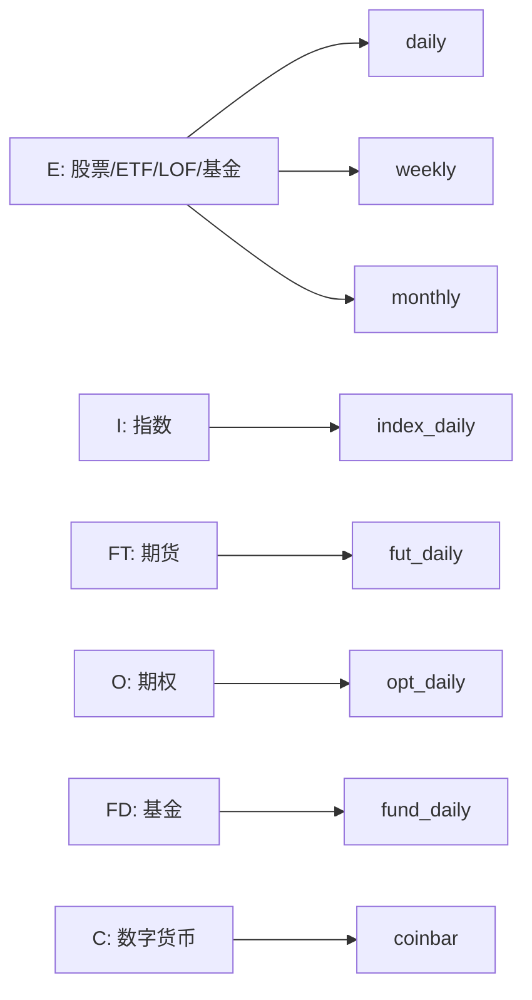
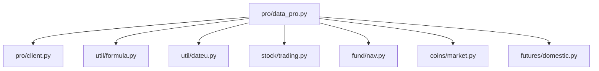

# Pro版API高级特性

<cite>
**本文档引用的文件**
- [data_pro.py](file://tushare/pro/data_pro.py)
- [client.py](file://tushare/pro/client.py)
- [formula.py](file://tushare/util/formula.py)
- [indictor.py](file://tushare/stock/indictor.py)
- [nav.py](file://tushare/fund/nav.py)
- [market.py](file://tushare/coins/market.py)
- [domestic.py](file://tushare/futures/domestic.py)
- [trading.py](file://tushare/stock/trading.py)
- [dateu.py](file://tushare/util/dateu.py)
- [common.py](file://tushare/util/common.py)
- [README.md](file://README.md)
</cite>

## 目录
1. [简介](#简介)
2. [项目结构](#项目结构)
3. [核心组件](#核心组件)
4. [架构总览](#架构总览)
5. [详细组件分析](#详细组件分析)
6. [依赖关系分析](#依赖关系分析)
7. [性能考量](#性能考量)
8. [故障排查指南](#故障排查指南)
9. [结论](#结论)
10. [附录](#附录)

## 简介
本文件面向专业用户，系统化梳理TuShare Pro版API的高级特性与实现原理，重点覆盖：
- 复权处理机制：前复权(qfq)与后复权(hfq)的计算方法、调整因子的作用与数据修正流程
- 因子数据支持：量比(vr)、换手率(tor)等技术指标的获取与计算
- 批量数据获取优化：分页、并发与内存管理策略
- 多资产类别支持：股票、指数、期货、期权、基金、数字货币等
- 高级参数配置：频率设置、时间范围选择、数据格式转换等
- 最佳实践：生产环境部署、错误处理与性能优化建议

## 项目结构
仓库采用按功能域划分的模块化组织，Pro版API核心位于tushare/pro目录，数据层与工具层分别位于tushare/data与tushare/util，各资产类别的专用模块分布在对应子包中。

图表来源
- [data_pro.py:1-158](file://tushare/pro/data_pro.py#L1-L158)
- [client.py:1-52](file://tushare/pro/client.py#L1-L52)
- [formula.py:1-262](file://tushare/util/formula.py#L1-L262)
- [trading.py:1-800](file://tushare/stock/trading.py#L1-L800)
- [indictor.py:1-999](file://tushare/stock/indictor.py#L1-L999)
- [nav.py:1-420](file://tushare/fund/nav.py#L1-L420)
- [market.py:1-269](file://tushare/coins/market.py#L1-L269)
- [domestic.py:1-452](file://tushare/futures/domestic.py#L1-L452)

章节来源
- [data_pro.py:1-158](file://tushare/pro/data_pro.py#L1-L158)
- [client.py:1-52](file://tushare/pro/client.py#L1-L52)
- [README.md:1-411](file://README.md#L1-L411)

## 核心组件
- DataApi客户端：统一的HTTP请求封装，负责与Pro服务端交互，返回DataFrame结果
- pro_bar通用接口：面向多资产类别的统一行情入口，支持复权、均线、因子数据等高级特性
- 技术指标库：提供常用技术指标的计算实现，支撑因子数据与均线生成
- 资产专用模块：股票、指数、期货、期权、基金、数字货币各自的数据获取与解析

章节来源
- [client.py:17-52](file://tushare/pro/client.py#L17-L52)
- [data_pro.py:21-141](file://tushare/pro/data_pro.py#L21-L141)
- [formula.py:1-262](file://tushare/util/formula.py#L1-L262)

## 架构总览
Pro版API采用“客户端-服务端”两层架构：
- 客户端层：DataApi负责HTTP请求、参数组装与响应解析
- 业务层：pro_bar根据asset/freq参数路由到具体API，并进行数据合并、复权与因子计算

图表来源
- [data_pro.py:34-141](file://tushare/pro/data_pro.py#L34-L141)
- [client.py:32-48](file://tushare/pro/client.py#L32-L48)

## 详细组件分析

### 复权处理机制
复权的核心在于“调整因子”的应用，分为前复权(qfq)与后复权(hfq)两种模式：
- 后复权(hfq)：以当前复权因子为基准，将历史价格乘以调整因子
- 前复权(qfq)：以上市首日复权因子为基准，将历史价格乘以调整因子/首日因子

实现要点：
- 通过adj_factor接口获取交易日序列的调整因子
- 使用pandas merge按交易日对齐，填充缺失值
- 对开盘、最高、最低、收盘价逐列应用复权公式
- 保留原始涨跌幅与涨跌幅百分比列

图表来源
- [data_pro.py:91-107](file://tushare/pro/data_pro.py#L91-L107)

章节来源
- [data_pro.py:91-107](file://tushare/pro/data_pro.py#L91-L107)

### 因子数据支持（量比、换手率）
pro_bar支持通过factors参数获取量比(vr)与换手率(tor)：
- 当freq为日线且asset为股票时，自动拉取daily_basic中的turnover_rate与volume_ratio
- 通过trade_date索引对齐后合并，再按需保留或剔除相应列
- 仅当指定factors包含对应项时才返回对应因子列

图表来源
- [data_pro.py:77-86](file://tushare/pro/data_pro.py#L77-L86)

章节来源
- [data_pro.py:77-86](file://tushare/pro/data_pro.py#L77-L86)

### 批量数据获取优化
- 分页策略：通过start_date/end_date限定每次请求的时间窗口，避免单次请求过大
- 并发处理：在用户侧可并行调用多个pro_bar实例，注意控制并发度与限流
- 内存管理：优先按需返回列，避免不必要的字段；对数值列进行格式化与类型转换，减少内存占用
- 错误重试：内置retry_count参数，网络异常时自动重试

章节来源
- [data_pro.py:40-57](file://tushare/pro/data_pro.py#L40-L57)
- [data_pro.py:135-140](file://tushare/pro/data_pro.py#L135-L140)

### 多资产类别支持
- 股票/ETF/LOF/基金：asset='E'，支持日线、周线、月线与复权
- 指数：asset='I'，支持日线
- 期货：asset='FT'，支持日线
- 期权：asset='O'，支持日线
- 基金：asset='FD'，支持日线
- 数字货币：asset='C'，支持d/w级别与交易所选择

图表来源
- [data_pro.py:108-126](file://tushare/pro/data_pro.py#L108-L126)

章节来源
- [data_pro.py:34-67](file://tushare/pro/data_pro.py#L34-L67)
- [data_pro.py:108-126](file://tushare/pro/data_pro.py#L108-L126)

### 高级参数配置
- 频率设置：D/W/M/1MIN/5MIN/15MIN/30MIN/60MIN，数字货币使用小写d/w
- 时间范围：start_date/end_date，支持YYYYMMDD格式
- 复权类型：adj=None/qfq/hfq
- 均线：ma=[5,10,20,...]，内部使用MA函数计算
- 因子数据：factors=['vr','tor']
- 交易所与合约类型：exchange、contract_type

章节来源
- [data_pro.py:34-67](file://tushare/pro/data_pro.py#L34-L67)
- [formula.py:12-13](file://tushare/util/formula.py#L12-L13)

### 技术指标与均线计算
- 均线：使用MA函数，支持对价格与成交量分别计算
- 指标库：提供多种技术指标实现，便于扩展或二次计算

章节来源
- [data_pro.py:127-133](file://tushare/pro/data_pro.py#L127-L133)
- [formula.py:12-13](file://tushare/util/formula.py#L12-L13)
- [indictor.py:12-42](file://tushare/stock/indictor.py#L12-L42)

### 资产专用接口
- 基金净值：支持开放式、封闭式、分级子基金净值与历史净值
- 数字货币：支持火币、OKCoin、CHBTC三大交易所，提供K线、快照、交易数据
- 国内期货：支持中金所、郑商所、上期所、大商所日线与期权数据

章节来源
- [nav.py:25-190](file://tushare/fund/nav.py#L25-L190)
- [market.py:86-249](file://tushare/coins/market.py#L86-L249)
- [domestic.py:26-452](file://tushare/futures/domestic.py#L26-L452)

## 依赖关系分析
- pro_bar依赖DataApi进行远程调用，依赖formula进行均线计算，依赖dateu进行日期处理
- 股票模块提供历史复权与批量接口，可作为复权逻辑的参考实现
- 各资产模块独立维护，通过统一的asset参数在pro_bar中路由

图表来源
- [data_pro.py:1-158](file://tushare/pro/data_pro.py#L1-L158)
- [client.py:1-52](file://tushare/pro/client.py#L1-L52)
- [formula.py:1-262](file://tushare/util/formula.py#L1-L262)
- [dateu.py:1-129](file://tushare/util/dateu.py#L1-L129)
- [trading.py:1-800](file://tushare/stock/trading.py#L1-L800)
- [nav.py:1-420](file://tushare/fund/nav.py#L1-L420)
- [market.py:1-269](file://tushare/coins/market.py#L1-L269)
- [domestic.py:1-452](file://tushare/futures/domestic.py#L1-L452)

章节来源
- [data_pro.py:1-158](file://tushare/pro/data_pro.py#L1-L158)
- [client.py:1-52](file://tushare/pro/client.py#L1-L52)

## 性能考量
- 复权计算：对大量交易日进行逐价乘法，建议在数据量较大时分批处理或限制时间范围
- 因子合并：merge操作按交易日对齐，确保索引与排序一致，避免重复计算
- 均线计算：MA/SMA等滚动窗口计算，窗口越大性能开销越高，建议按需设置ma长度
- 网络请求：合理设置retry_count与并发度，避免触发服务端限流
- 内存占用：对数值列进行格式化与类型转换，及时释放中间变量

## 故障排查指南
- Token认证失败：确认token正确性与有效期，检查DataApi初始化
- 网络异常：启用retry_count，检查代理与防火墙设置
- 数据为空：核对start_date/end_date范围与asset/freq参数，确认目标市场存在该品种
- 复权异常：检查adj_factor数据完整性，确保交易日连续性
- 因子缺失：确认factors参数与daily_basic可用性

章节来源
- [client.py:42-43](file://tushare/pro/client.py#L42-L43)
- [data_pro.py:135-140](file://tushare/pro/data_pro.py#L135-L140)

## 结论
TuShare Pro版API通过pro_bar实现了多资产、多频率、多复权模式的一体化接口，结合因子数据与均线计算，满足专业用户的复杂分析需求。建议在生产环境中合理设置时间范围、控制并发度与重试次数，并针对不同资产类别选择合适的频率与参数组合，以获得稳定高效的行情数据服务。

## 附录
- 快速开始与变更日志可参考项目根目录README
- 更多资产接口与示例可参考各模块的实现文件

章节来源
- [README.md:1-411](file://README.md#L1-L411)