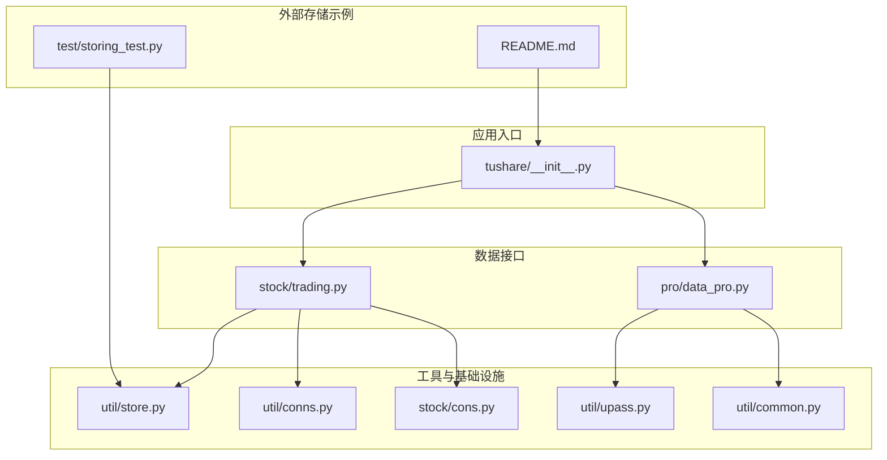
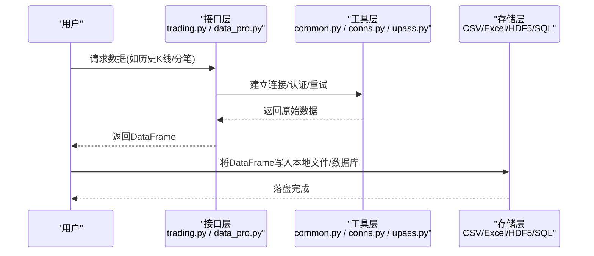
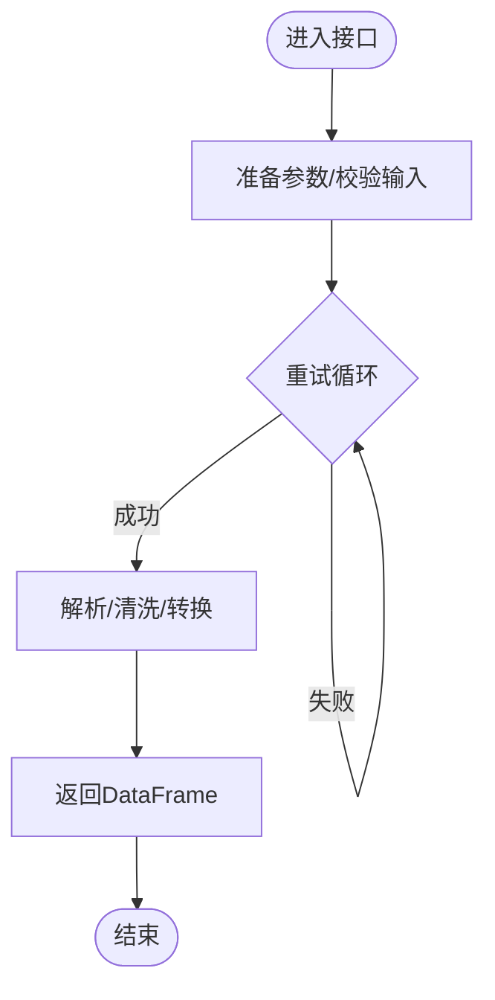
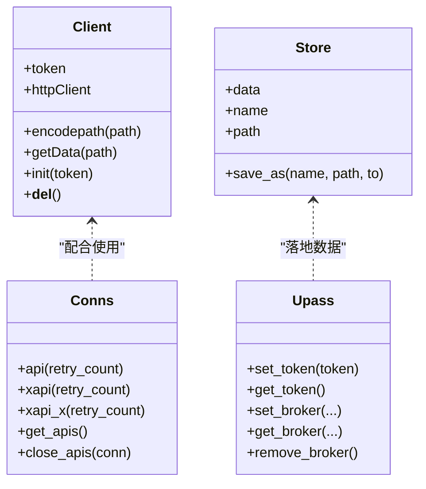
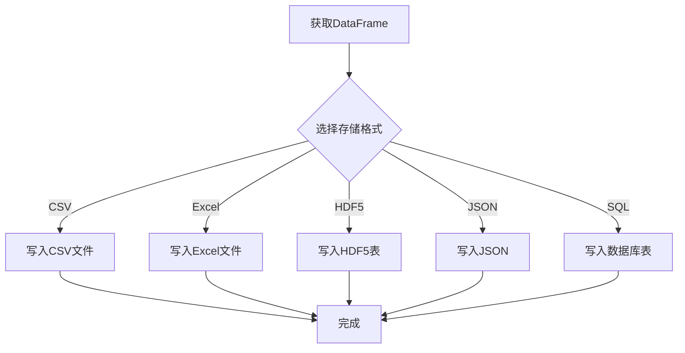
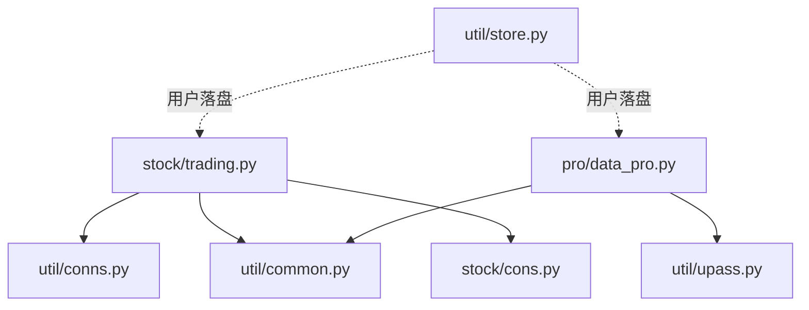

# 数据缓存机制

<cite>
**本文引用的文件**
- [README.md](file://README.md)
- [tushare/__init__.py](file://tushare/__init__.py)
- [tushare/util/store.py](file://tushare/util/store.py)
- [tushare/util/common.py](file://tushare/util/common.py)
- [tushare/util/conns.py](file://tushare/util/conns.py)
- [tushare/util/upass.py](file://tushare/util/upass.py)
- [tushare/pro/data_pro.py](file://tushare/pro/data_pro.py)
- [tushare/stock/trading.py](file://tushare/stock/trading.py)
- [tushare/stock/cons.py](file://tushare/stock/cons.py)
- [test/storing_test.py](file://test/storing_test.py)
</cite>

## 目录
1. [简介](#简介)
2. [项目结构](#项目结构)
3. [核心组件](#核心组件)
4. [架构总览](#架构总览)
5. [详细组件分析](#详细组件分析)
6. [依赖分析](#依赖分析)
7. [性能考量](#性能考量)
8. [故障排查指南](#故障排查指南)
9. [结论](#结论)
10. [附录](#附录)

## 简介
本文件围绕 TuShare 的数据缓存机制进行系统化技术说明，目标涵盖：
- 本地缓存策略设计与实现：存储格式、数据组织方式与访问模式
- 缓存更新规则与失效机制：时间戳管理、数据同步策略与一致性保障
- 性能优化技术：内存管理、磁盘存储优化与查询性能提升
- 配置选项与参数调优：缓存大小限制、过期时间设置与清理策略
- 使用最佳实践：缓存命中率优化、并发访问处理与异常处理
- 高级扩展：自定义缓存策略的扩展指导

说明：当前仓库中未发现内置的统一“本地缓存”模块或持久化缓存实现；实际缓存行为主要依赖于用户侧的数据落地（CSV、Excel、HDF5、数据库等）。本文基于现有代码与测试样例，给出可操作的缓存实践方案与扩展建议。

## 项目结构
TuShare 采用按功能域分层的模块化组织方式，与数据缓存相关的模块与入口如下：
- 工具与基础能力：util/store.py、util/common.py、util/conns.py、util/upass.py
- 接口入口与导出：tushare/__init__.py
- Pro 数据接口：tushare/pro/data_pro.py
- 历史行情与交易数据：tushare/stock/trading.py
- 常量与配置：tushare/stock/cons.py
- 存储与落盘示例：test/storing_test.py
- 项目说明：README.md

图表来源
- [tushare/__init__.py:1-140](file://tushare/__init__.py#L1-L140)
- [tushare/stock/trading.py:1-200](file://tushare/stock/trading.py#L1-L200)
- [tushare/pro/data_pro.py:1-158](file://tushare/pro/data_pro.py#L1-L158)
- [tushare/util/store.py:1-44](file://tushare/util/store.py#L1-L44)
- [tushare/util/conns.py:1-61](file://tushare/util/conns.py#L1-L61)
- [tushare/util/common.py:1-86](file://tushare/util/common.py#L1-L86)
- [tushare/util/upass.py:1-62](file://tushare/util/upass.py#L1-L62)
- [tushare/stock/cons.py:1-200](file://tushare/stock/cons.py#L1-L200)
- [test/storing_test.py:1-61](file://test/storing_test.py#L1-L61)
- [README.md:1-411](file://README.md#L1-L411)

章节来源
- [tushare/__init__.py:1-140](file://tushare/__init__.py#L1-L140)
- [README.md:1-411](file://README.md#L1-L411)

## 核心组件
- 数据接口层：提供历史行情、分笔、实时行情等数据获取能力，典型函数包括历史行情与分笔数据接口。
- 工具与基础设施层：提供通用网络客户端、连接池与重试、令牌持久化、存储封装等。
- 存储与落盘层：通过测试样例展示 CSV、Excel、HDF5、JSON、SQL 等多种落地方式，体现用户侧的本地缓存实践。

章节来源
- [tushare/stock/trading.py:32-100](file://tushare/stock/trading.py#L32-L100)
- [tushare/stock/trading.py:135-187](file://tushare/stock/trading.py#L135-L187)
- [tushare/util/store.py:14-44](file://tushare/util/store.py#L14-L44)
- [tushare/util/common.py:18-86](file://tushare/util/common.py#L18-L86)
- [tushare/util/conns.py:14-61](file://tushare/util/conns.py#L14-L61)
- [tushare/util/upass.py:16-31](file://tushare/util/upass.py#L16-L31)
- [test/storing_test.py:8-47](file://test/storing_test.py#L8-L47)

## 架构总览
TuShare 的数据流通常遵循“接口层 -> 工具层 -> 外部存储”的路径。接口层负责拉取原始数据，工具层负责网络与连接管理、令牌与配置管理，最终由用户决定将数据以何种格式落盘到本地。

图表来源
- [tushare/stock/trading.py:32-100](file://tushare/stock/trading.py#L32-L100)
- [tushare/pro/data_pro.py:21-31](file://tushare/pro/data_pro.py#L21-L31)
- [tushare/util/common.py:68-85](file://tushare/util/common.py#L68-L85)
- [tushare/util/conns.py:14-23](file://tushare/util/conns.py#L14-L23)
- [tushare/util/upass.py:16-31](file://tushare/util/upass.py#L16-L31)
- [test/storing_test.py:8-47](file://test/storing_test.py#L8-L47)

## 详细组件分析

### 组件A：数据接口与重试机制
- 历史行情接口：支持多周期（日/周/月/分钟），具备重试与超时控制，返回标准化的 DataFrame。
- 分笔数据接口：支持多数据源（新浪/腾讯/网易），具备重试与超时控制，返回标准化的 DataFrame。
- Pro 接口：提供统一的 pro_bar 接口，支持股票/指数/期货/基金/数字货币等多资产类型，具备复权与均线等后处理逻辑。

图表来源
- [tushare/stock/trading.py:32-100](file://tushare/stock/trading.py#L32-L100)
- [tushare/stock/trading.py:135-187](file://tushare/stock/trading.py#L135-L187)
- [tushare/pro/data_pro.py:34-140](file://tushare/pro/data_pro.py#L34-L140)

章节来源
- [tushare/stock/trading.py:32-100](file://tushare/stock/trading.py#L32-L100)
- [tushare/stock/trading.py:135-187](file://tushare/stock/trading.py#L135-L187)
- [tushare/pro/data_pro.py:34-140](file://tushare/pro/data_pro.py#L34-L140)

### 组件B：工具与基础设施
- 通用网络客户端：封装 HTTPS 请求、URL 编码、状态码处理与字符集转换。
- 连接池与重试：提供稳定的心跳连接与重试机制，降低网络波动带来的失败概率。
- 令牌持久化：将 Token 写入用户目录下的 CSV 文件，便于后续初始化使用。
- 存储封装：提供简单的文件保存接口，支持目录创建与文件名拼接。

图表来源
- [tushare/util/common.py:18-86](file://tushare/util/common.py#L18-L86)
- [tushare/util/store.py:14-44](file://tushare/util/store.py#L14-L44)
- [tushare/util/upass.py:16-61](file://tushare/util/upass.py#L16-L61)
- [tushare/util/conns.py:14-61](file://tushare/util/conns.py#L14-L61)

章节来源
- [tushare/util/common.py:18-86](file://tushare/util/common.py#L18-L86)
- [tushare/util/store.py:14-44](file://tushare/util/store.py#L14-L44)
- [tushare/util/upass.py:16-61](file://tushare/util/upass.py#L16-L61)
- [tushare/util/conns.py:14-61](file://tushare/util/conns.py#L14-L61)

### 组件C：存储与落盘实践
- CSV：适合轻量级、易读性高的场景。
- Excel：适合需要可视化编辑的场景。
- HDF5：适合大规模时间序列数据的高效读写。
- JSON：适合跨语言/跨平台共享。
- SQL：适合与数据库集成，支持索引与查询优化。

图表来源
- [test/storing_test.py:8-47](file://test/storing_test.py#L8-L47)
- [tushare/util/store.py:24-44](file://tushare/util/store.py#L24-L44)

章节来源
- [test/storing_test.py:8-47](file://test/storing_test.py#L8-L47)
- [tushare/util/store.py:24-44](file://tushare/util/store.py#L24-L44)

## 依赖分析
- 接口层依赖工具层：历史行情与分笔接口依赖连接与网络工具，Pro 接口依赖令牌与通用客户端。
- 工具层内部耦合度低：网络客户端、连接池、令牌管理相互独立，便于替换与扩展。
- 存储层为用户侧实现：仓库未提供统一的缓存中间件，落盘策略由用户根据 test 示例选择。

图表来源
- [tushare/stock/trading.py:24-25](file://tushare/stock/trading.py#L24-L25)
- [tushare/pro/data_pro.py:9-11](file://tushare/pro/data_pro.py#L9-L11)
- [tushare/util/conns.py:9-11](file://tushare/util/conns.py#L9-L11)
- [tushare/util/common.py:14-16](file://tushare/util/common.py#L14-L16)
- [tushare/util/upass.py:10-12](file://tushare/util/upass.py#L10-L12)
- [tushare/util/store.py:8-11](file://tushare/util/store.py#L8-L11)

章节来源
- [tushare/stock/trading.py:24-25](file://tushare/stock/trading.py#L24-L25)
- [tushare/pro/data_pro.py:9-11](file://tushare/pro/data_pro.py#L9-L11)
- [tushare/util/conns.py:9-11](file://tushare/util/conns.py#L9-L11)
- [tushare/util/common.py:14-16](file://tushare/util/common.py#L14-L16)
- [tushare/util/upass.py:10-12](file://tushare/util/upass.py#L10-L12)
- [tushare/util/store.py:8-11](file://tushare/util/store.py#L8-L11)

## 性能考量
- 内存管理
  - 使用分块读取与延迟计算，避免一次性加载超大数据集到内存。
  - 对数值列进行类型优化（如 float32），减少内存占用。
- 磁盘存储优化
  - 优先选择列式存储（如 HDF5）以提升时间序列查询效率。
  - 合理设置索引列（如日期），便于筛选与排序。
- 查询性能提升
  - 在数据库场景下建立复合索引，加速按时间与标的过滤。
  - 使用分区表（按日期/标的）提升扫描效率。
- 并发访问
  - 多进程/多线程写入时注意文件锁与原子写入，避免竞态。
  - 对热点数据可引入内存缓存（如 Python 字典/内存映射）作为只读副本。

## 故障排查指南
- 网络与连接
  - 若连接失败，检查重试次数与心跳参数，确认服务端地址与端口配置。
- 数据解析
  - 对空响应或异常字符集进行容错处理，必要时回退到备用数据源。
- 存储异常
  - 检查目标路径权限与磁盘空间，确保目录存在且可写。
- 令牌与认证
  - 确认令牌文件存在且可读，避免因认证失败导致接口调用失败。

章节来源
- [tushare/util/conns.py:14-23](file://tushare/util/conns.py#L14-L23)
- [tushare/util/common.py:68-85](file://tushare/util/common.py#L68-L85)
- [tushare/util/upass.py:23-31](file://tushare/util/upass.py#L23-L31)
- [test/storing_test.py:8-47](file://test/storing_test.py#L8-L47)

## 结论
- 仓库未提供内置的统一本地缓存中间件，缓存行为由用户侧落盘实践决定。
- 基于现有接口与工具，可灵活组合 CSV/Excel/HDF5/JSON/SQL 等多种存储方案。
- 通过合理的重试、连接管理与存储格式选择，可在性能与可靠性之间取得平衡。
- 建议在生产环境中结合业务需求，制定统一的落盘规范与监控告警机制。

## 附录

### A. 缓存策略设计与实现要点
- 存储格式选择
  - 小规模/易读：CSV
  - 规模化/高效：HDF5 或数据库
  - 跨平台/共享：JSON
- 数据组织方式
  - 以“标的+周期”命名文件夹或表名，便于检索与管理。
  - 时间列为索引，支持快速切片与范围查询。
- 访问模式
  - 优先读取本地缓存，若缺失或过期再发起网络请求。
  - 对高频访问的数据可驻留内存，但需注意内存上限与刷新策略。

### B. 缓存更新规则与失效机制
- 时间戳管理
  - 为每个缓存文件附加生成时间戳或版本号，用于判断是否过期。
- 数据同步策略
  - 增量更新：仅拉取新增日期区间的数据，合并到本地文件。
  - 全量替换：定期全量拉取并覆盖旧文件，保证一致性。
- 一致性保证
  - 使用原子写入（先写临时文件，再重命名为正式文件）避免读取半成品。
  - 对数据库场景，使用事务批量写入，失败回滚。

### C. 性能优化技术
- 内存管理
  - 使用惰性加载与分块处理，避免 OOM。
  - 对数值列进行 dtype 优化，降低内存占用。
- 磁盘存储优化
  - HDF5 列式存储与压缩，显著提升读写性能。
  - 合理分区与索引，缩短查询路径。
- 查询性能提升
  - 建立时间与标的索引，减少扫描范围。
  - 对热点数据进行预聚合或物化视图。

### D. 配置选项与参数调优
- 缓存大小限制
  - 设置最大文件数量或总容量阈值，超过阈值触发清理策略。
- 过期时间设置
  - 按数据类型设定过期窗口（如日线数据可设为1天，分钟线可设为若干小时）。
- 清理策略
  - 基于 LRU 或 LFU 的淘汰算法，保留最近活跃的数据。
  - 定期任务清理过期文件，释放磁盘空间。

### E. 使用最佳实践
- 缓存命中率优化
  - 合理划分数据粒度与时间窗口，避免碎片化。
  - 对常用查询结果进行预热，提高冷启动阶段的命中率。
- 并发访问处理
  - 写入端使用互斥锁或队列串行化，读取端可并行。
  - 对只读场景允许多进程共享内存缓存副本。
- 异常情况处理
  - 网络异常时回退到本地缓存，或返回最近可用数据。
  - 存储异常时记录日志并尝试重试或降级到其他存储介质。

### F. 自定义缓存策略扩展指导
- 扩展点
  - 在接口层增加“缓存开关”与“过期策略”参数，统一调度落盘流程。
  - 在工具层封装“缓存适配器”，支持多种存储后端（文件/数据库/对象存储）。
- 设计建议
  - 明确缓存生命周期与失效条件，避免脏读。
  - 提供缓存统计与监控指标（命中率、吞吐量、延迟），持续优化。