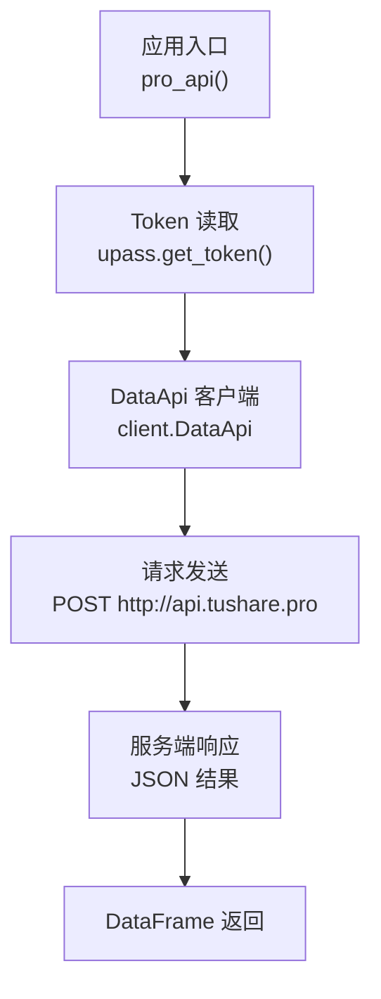
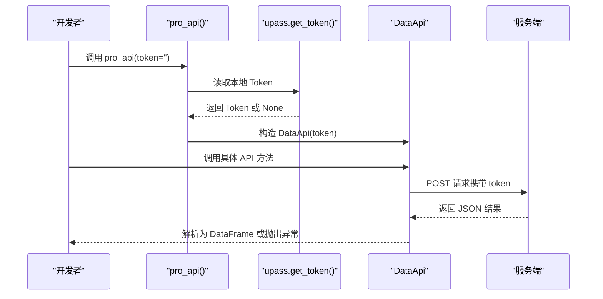
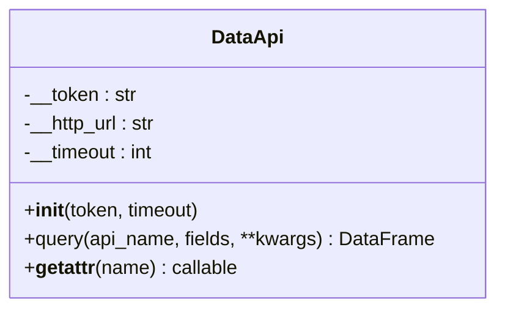
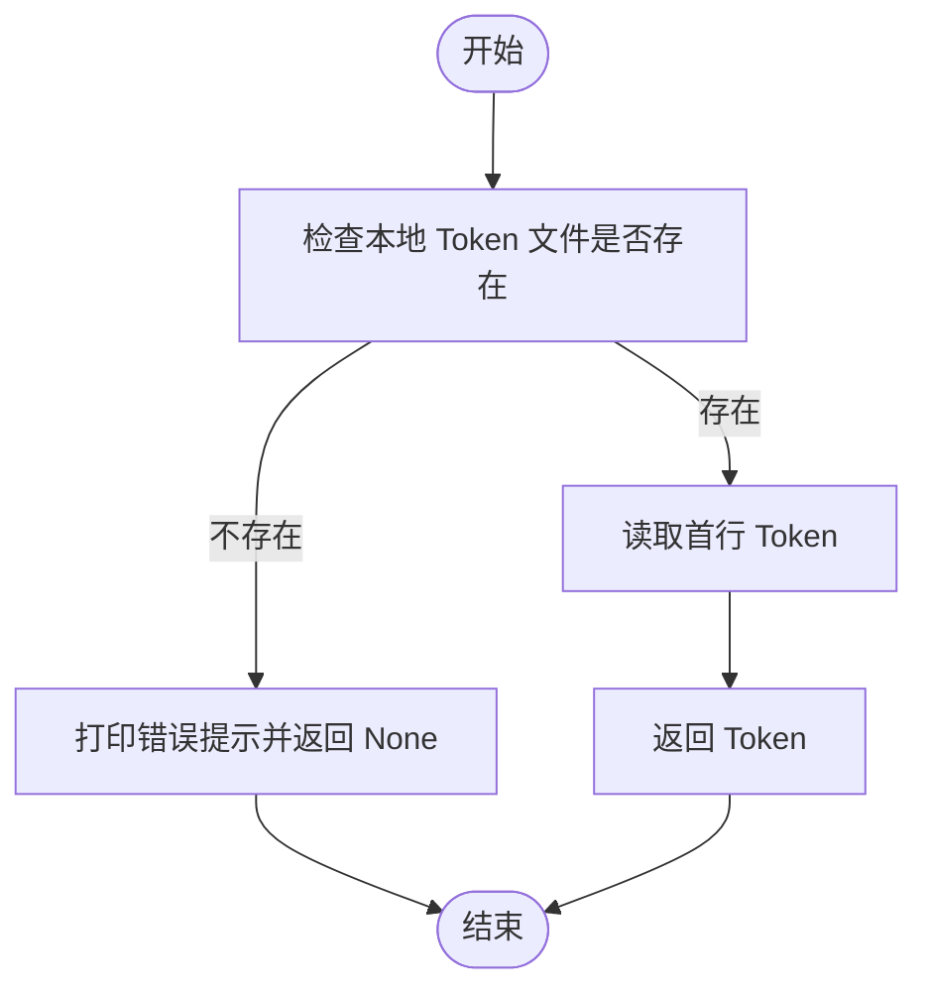
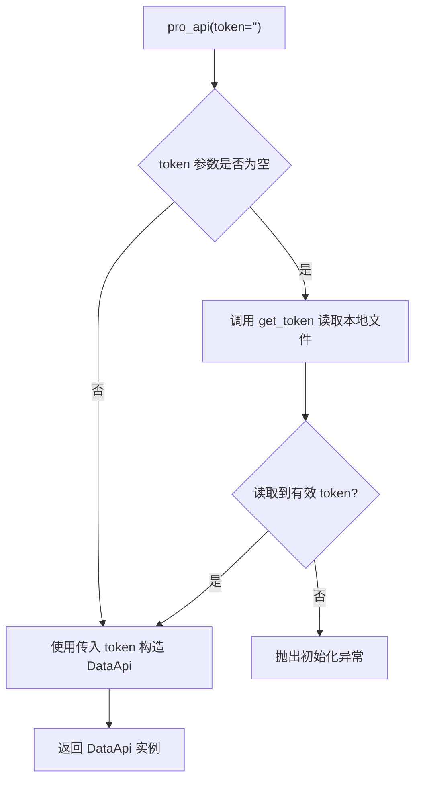
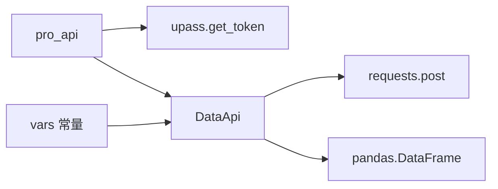

# 认证和授权

<cite>
**本文引用的文件**
- [tushare\pro\client.py](file://tushare/pro/client.py)
- [tushare\pro\data_pro.py](file://tushare/pro/data_pro.py)
- [tushare\util\upass.py](file://tushare/util/upass.py)
- [tushare\util\conns.py](file://tushare/util/conns.py)
- [tushare\util\vars.py](file://tushare/util/vars.py)
- [tushare\util\netbase.py](file://tushare/util/netbase.py)
- [tushare\stock\cons.py](file://tushare/stock/cons.py)
- [tushare\__init__.py](file://tushare/__init__.py)
- [README.md](file://README.md)
</cite>

## 目录
1. [简介](#简介)
2. [项目结构](#项目结构)
3. [核心组件](#核心组件)
4. [架构总览](#架构总览)
5. [详细组件分析](#详细组件分析)
6. [依赖分析](#依赖分析)
7. [性能考量](#性能考量)
8. [故障排除指南](#故障排除指南)
9. [结论](#结论)
10. [附录](#附录)

## 简介
本文件面向开发者，系统化阐述 TuShare 的认证与授权机制，重点覆盖以下方面：
- Token 管理体系：获取、存储、验证与更新
- API 权限控制：用户级别、访问限制与安全策略
- 使用限制：调用频率、数据访问与账户状态管理
- 认证流程：首次配置、Token 设置、权限验证的完整实现指南
- 客户端认证机制：DataApi 类的实现与安全通信协议
- 安全最佳实践与故障排除建议

## 项目结构
围绕认证与授权的关键模块如下：
- 认证入口与初始化：pro_api 函数负责加载 Token 并构造 DataApi 客户端
- Token 存储与读取：upass 提供 set_token/get_token 的持久化能力
- 客户端封装：DataApi 将请求封装为统一的 JSON 接口并处理返回结果
- 网络与安全常量：vars 定义 HTTP 地址、端口与状态码；netbase 提供基础网络请求头
- 连接与会话：conns 提供行情连接的建立与关闭
- 常量与提示：cons 提供 TOKEN 文件名、错误提示等

图表来源
- [tushare\pro\data_pro.py](file://tushare/pro/data_pro.py)
- [tushare\util\upass.py](file://tushare/util/upass.py)
- [tushare\pro\client.py](file://tushare/pro/client.py)

章节来源
- [tushare\pro\data_pro.py](file://tushare/pro/data_pro.py)
- [tushare\util\upass.py](file://tushare/util/upass.py)
- [tushare\pro\client.py](file://tushare/pro/client.py)
- [tushare\util\vars.py](file://tushare/util/vars.py)
- [tushare\util\netbase.py](file://tushare/util/netbase.py)
- [tushare\util\conns.py](file://tushare/util/conns.py)
- [tushare\stock\cons.py](file://tushare/stock/cons.py)
- [tushare\__init__.py](file://tushare/__init__.py)

## 核心组件
- DataApi 客户端
  - 负责将业务 API 名称与参数封装为统一请求体，携带 token 发送到服务端
  - 对服务端返回进行解析，若返回 code 非 0 则抛出异常
- Token 管理
  - set_token：将 Token 写入用户主目录下的 CSV 文件
  - get_token：从 CSV 文件读取 Token，不存在时打印错误提示并返回 None
- 认证入口
  - pro_api：优先从参数读取 Token，否则从本地文件读取；成功则返回 DataApi 实例，否则抛出初始化异常

章节来源
- [tushare\pro\client.py](file://tushare/pro/client.py)
- [tushare\util\upass.py](file://tushare/util/upass.py)
- [tushare\pro\data_pro.py](file://tushare/pro/data_pro.py)

## 架构总览
下面以序列图展示认证与数据请求的端到端流程：

图表来源
- [tushare\pro\data_pro.py](file://tushare/pro/data_pro.py)
- [tushare\util\upass.py](file://tushare/util/upass.py)
- [tushare\pro\client.py](file://tushare/pro/client.py)

## 详细组件分析

### DataApi 客户端
- 关键职责
  - 维护私有 token 与 HTTP 地址
  - query 方法将 api_name、fields、params 与 token 组装为请求体
  - 使用 requests.post 发送请求，超时由构造函数传入
  - 解析返回 JSON，当 code 不为 0 时抛出异常；否则提取字段与条目构建 DataFrame
  - __getattr__ 提供动态代理，使 api_name 可作为方法名直接调用
- 错误处理
  - 服务端返回非零 code 时立即抛出异常，便于上层捕获与重试
- 安全要点
  - token 以明文形式随请求体发送，建议配合 HTTPS 传输与可信网络环境
  - 未见内置签名或加密机制，需依赖外部防护（如防火墙、内网）

图表来源
- [tushare\pro\client.py](file://tushare/pro/client.py)

章节来源
- [tushare\pro\client.py](file://tushare/pro/client.py)

### Token 管理（upass）
- set_token
  - 将 token 写入用户主目录下的 CSV 文件（文件名来自常量）
- get_token
  - 从同一 CSV 读取首行 token；若文件不存在则打印错误提示并返回 None
- 使用建议
  - 建议仅在受信任的本地环境使用该文件存储方式
  - 生产环境建议采用密钥管理服务或环境变量注入

图表来源
- [tushare\util\upass.py](file://tushare/util/upass.py)
- [tushare\stock\cons.py](file://tushare/stock/cons.py)

章节来源
- [tushare\util\upass.py](file://tushare/util/upass.py)
- [tushare\stock\cons.py](file://tushare/stock/cons.py)

### 认证入口（pro_api）
- 行为
  - 若未提供 token 参数，则尝试从本地文件读取
  - 成功读取到有效 token 则返回 DataApi 实例
  - 否则抛出初始化异常
- 适用场景
  - 首次使用：先通过 set_token 写入本地文件
  - 临时使用：直接传入 token 参数

图表来源
- [tushare\pro\data_pro.py](file://tushare/pro/data_pro.py)
- [tushare\util\upass.py](file://tushare/util/upass.py)

章节来源
- [tushare\pro\data_pro.py](file://tushare/pro/data_pro.py)
- [tushare\util\upass.py](file://tushare/util/upass.py)

### 网络与安全常量（vars）
- 定义
  - HTTP_URL、HTTP_PORT：基础数据接口的主机与端口
  - HTTP_OK、HTTP_AUTHORIZATION_ERROR：HTTP 状态码常量
  - 大量 API 路径模板：用于其他数据源（非 Pro）
- 用途
  - 为 Client 类提供统一的 HTTP 访问常量
  - 为后续扩展提供清晰的路径与状态码约定

章节来源
- [tushare\util\vars.py](file://tushare/util/vars.py)

### 基础网络请求（netbase）
- Client
  - 提供设置请求头、Cookie、Referer 的能力
  - 通过 urlopen 发起请求，支持超时控制
- 与认证的关系
  - 本项目 Pro 数据接口使用 DataApi 的 JSON 请求方式，未直接使用该 Client
  - 但其请求头设置模式可作为安全通信的参考

章节来源
- [tushare\util\netbase.py](file://tushare/util/netbase.py)

### 连接与会话（conns）
- 功能
  - 建立与行情服务器的连接，支持重试与异常处理
  - 提供连接关闭能力
- 与认证的关系
  - 该模块服务于行情数据通道，与 Pro 的 Token 认证解耦

章节来源
- [tushare\util\conns.py](file://tushare/util/conns.py)

## 依赖分析
- 模块耦合
  - pro_api 依赖 upass 的 get_token
  - DataApi 依赖 requests 库进行 HTTP 请求
  - vars 为网络与状态码提供常量
- 外部依赖
  - requests：用于发送 POST 请求
  - pandas：用于将服务端返回转换为 DataFrame
- 潜在风险
  - Token 明文存储于本地 CSV 文件，建议结合文件权限与加密存储
  - 未见服务端签名校验逻辑，需依赖网络与平台侧的安全策略

图表来源
- [tushare\pro\data_pro.py](file://tushare/pro/data_pro.py)
- [tushare\util\upass.py](file://tushare/util/upass.py)
- [tushare\pro\client.py](file://tushare/pro/client.py)
- [tushare\util\vars.py](file://tushare/util/vars.py)

章节来源
- [tushare\pro\data_pro.py](file://tushare/pro/data_pro.py)
- [tushare\util\upass.py](file://tushare/util/upass.py)
- [tushare\pro\client.py](file://tushare/pro/client.py)
- [tushare\util\vars.py](file://tushare/util/vars.py)

## 性能考量
- 超时控制
  - DataApi 在构造时接收 timeout 参数，建议根据网络状况合理设置
- 重试策略
  - pro_bar 对网络异常提供有限次重试，有助于提升稳定性
- 数据处理
  - 服务端返回 JSON 后由 pandas 快速构建 DataFrame，减少二次解析成本

章节来源
- [tushare\pro\client.py](file://tushare/pro/client.py)
- [tushare\pro\data_pro.py](file://tushare/pro/data_pro.py)

## 故障排除指南
- 无法初始化
  - 现象：调用 pro_api 抛出初始化异常
  - 排查：确认本地 Token 文件是否存在且有效；或显式传入 token
  - 参考：[tushare\pro\data_pro.py](file://tushare/pro/data_pro.py)
- 服务端返回错误
  - 现象：调用 API 抛出异常
  - 排查：检查返回 JSON 的 code 字段；确认 token 是否过期或无效
  - 参考：[tushare\pro\client.py](file://tushare/pro/client.py)
- 网络超时或连接失败
  - 现象：请求超时或连接异常
  - 排查：调整 timeout；检查网络连通性；必要时启用代理或更换网络
  - 参考：[tushare\pro\client.py](file://tushare/pro/client.py)
- Token 读取失败
  - 现象：get_token 返回 None
  - 排查：确认 CSV 文件路径与权限；确保文件存在且可读
  - 参考：[tushare\util\upass.py](file://tushare/util/upass.py)

章节来源
- [tushare\pro\client.py](file://tushare/pro/client.py)
- [tushare\pro\data_pro.py](file://tushare/pro/data_pro.py)
- [tushare\util\upass.py](file://tushare/util/upass.py)

## 结论
- TuShare 的认证与授权以 Token 为核心，通过本地文件持久化与 DataApi 统一封装实现
- 当前实现简洁直观，适合入门与快速集成；在生产环境中建议加强 Token 存储与传输安全
- 通过合理的超时与重试策略，可在一定程度上提升稳定性

## 附录

### 认证流程实现指南（首次配置）
- 步骤
  1) 在官网获取个人 Token
  2) 调用 set_token 将 Token 写入本地文件
  3) 调用 pro_api 获取 DataApi 实例
  4) 通过实例调用具体 API 方法获取数据
- 参考文件
  - [tushare\util\upass.py](file://tushare/util/upass.py)
  - [tushare\pro\data_pro.py](file://tushare/pro/data_pro.py)
  - [tushare\pro\client.py](file://tushare/pro/client.py)

章节来源
- [tushare\util\upass.py](file://tushare/util/upass.py)
- [tushare\pro\data_pro.py](file://tushare/pro/data_pro.py)
- [tushare\pro\client.py](file://tushare/pro/client.py)

### API 权限与使用限制
- 用户级别与权限
  - 项目未提供多级权限模型；当前以 Token 有效性作为访问控制依据
- 调用频率限制
  - 未在客户端实现速率限制；建议在应用层自行控制并发与频率
- 数据访问限制
  - 未发现客户端侧的数据过滤逻辑；请遵循服务端返回的可用字段与数据范围
- 账户状态管理
  - 未发现客户端侧的状态轮询或自动续期机制；请在服务端页面确认账户状态

章节来源
- [tushare\pro\client.py](file://tushare/pro/client.py)
- [tushare\pro\data_pro.py](file://tushare/pro/data_pro.py)

### 安全最佳实践
- Token 存储
  - 优先使用环境变量或密钥管理服务，避免明文写入文件
- 传输安全
  - 确保网络链路安全，避免中间人攻击
- 访问控制
  - 限制 Token 的可见范围与使用范围，避免泄露
- 日志与监控
  - 记录关键操作与异常，便于审计与排障

章节来源
- [tushare\util\upass.py](file://tushare/util/upass.py)
- [tushare\util\netbase.py](file://tushare/util/netbase.py)
- [tushare\util\vars.py](file://tushare/util/vars.py)