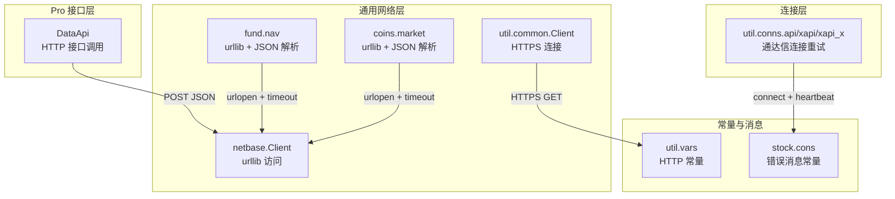
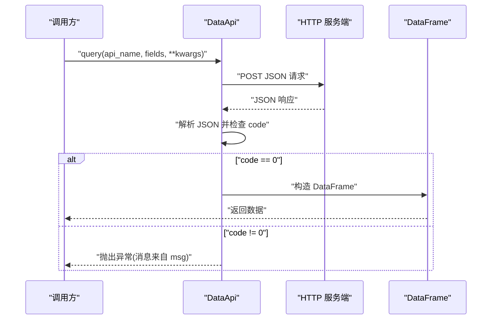
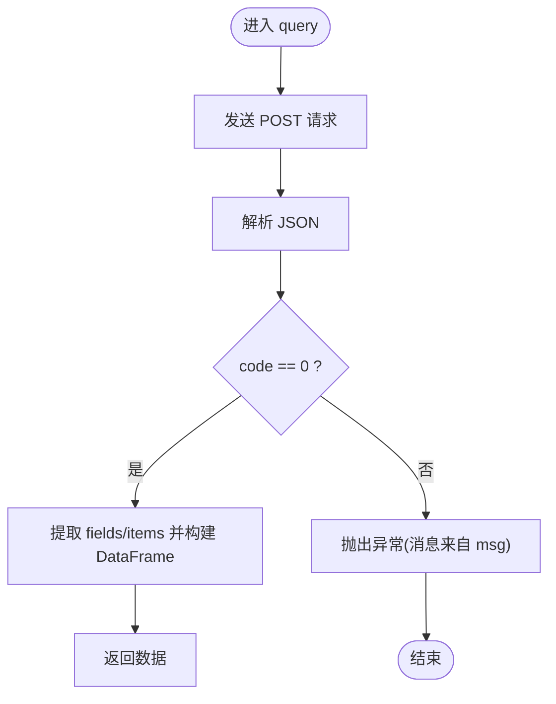
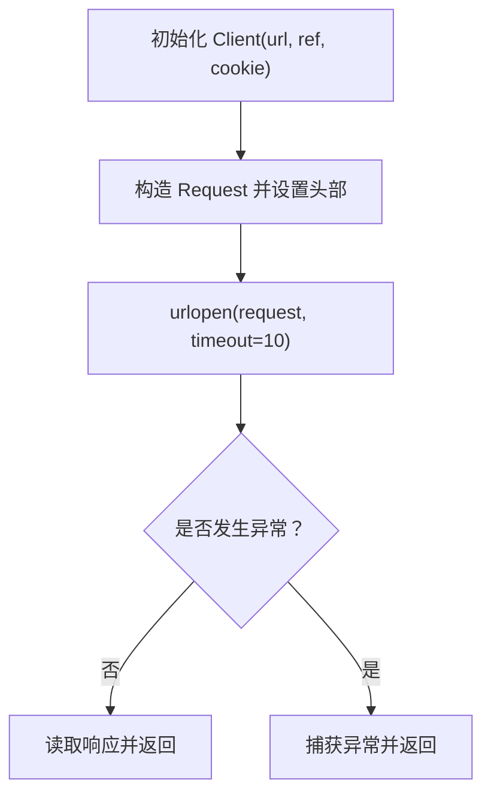
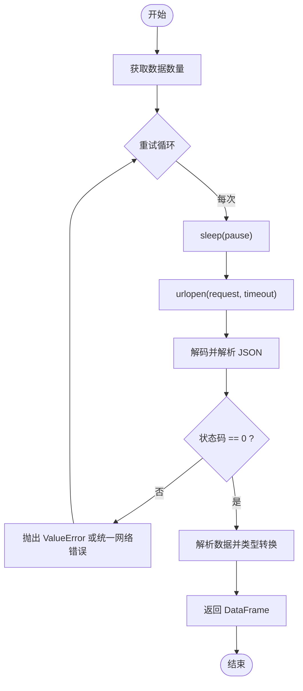
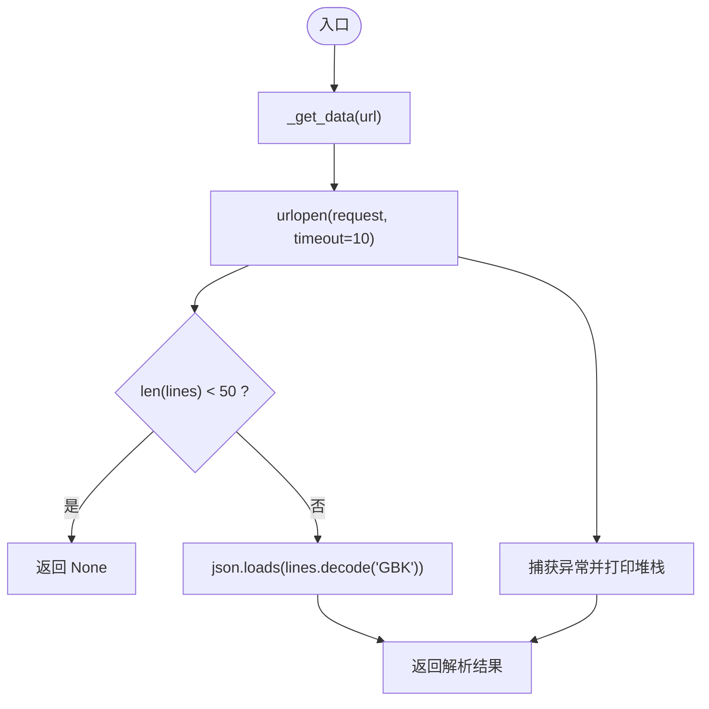
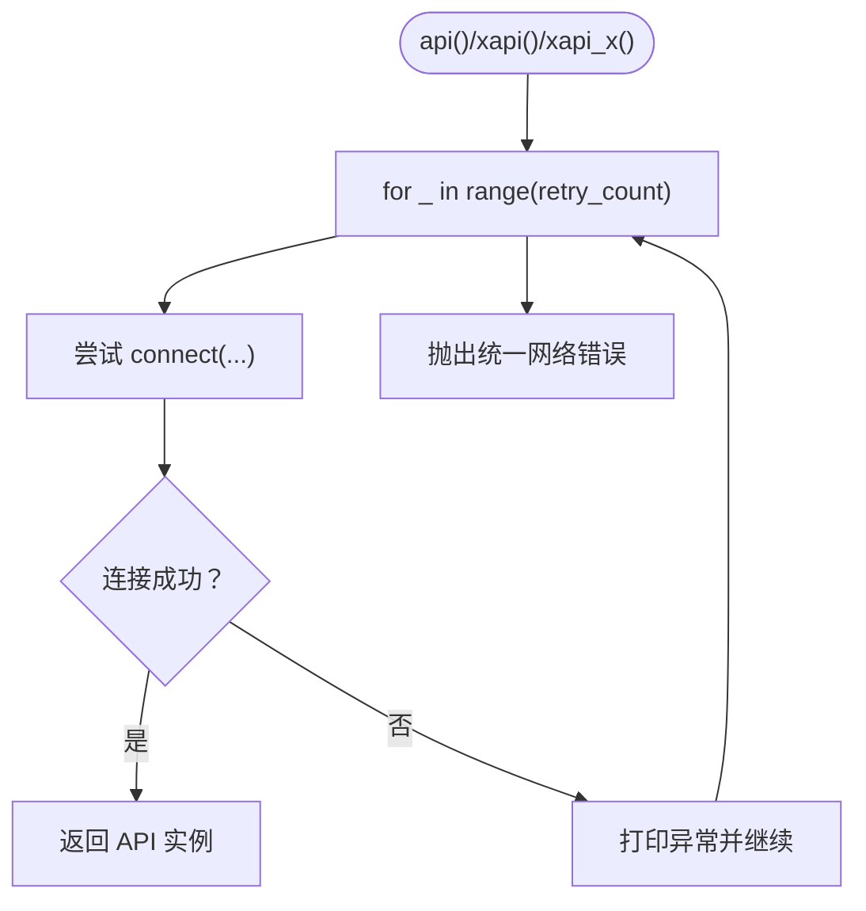
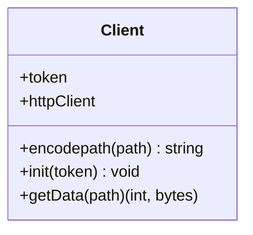
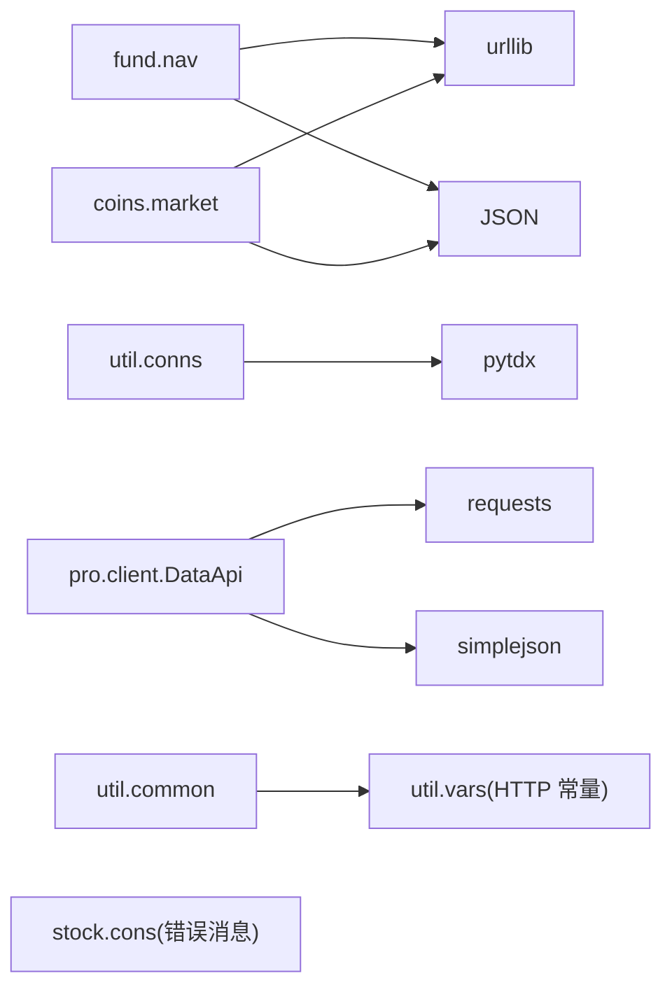

# 错误处理和重试

<cite>
**本文引用的文件**
- [tushare/pro/client.py](file://tushare/pro/client.py)
- [tushare/pro/data_pro.py](file://tushare/pro/data_pro.py)
- [tushare/util/netbase.py](file://tushare/util/netbase.py)
- [tushare/util/conns.py](file://tushare/util/conns.py)
- [tushare/util/common.py](file://tushare/util/common.py)
- [tushare/util/vars.py](file://tushare/util/vars.py)
- [tushare/stock/cons.py](file://tushare/stock/cons.py)
- [tushare/fund/nav.py](file://tushare/fund/nav.py)
- [tushare/coins/market.py](file://tushare/coins/market.py)
- [README.md](file://README.md)
</cite>

## 目录
1. [简介](#简介)
2. [项目结构](#项目结构)
3. [核心组件](#核心组件)
4. [架构总览](#架构总览)
5. [详细组件分析](#详细组件分析)
6. [依赖分析](#依赖分析)
7. [性能考量](#性能考量)
8. [故障排查指南](#故障排查指南)
9. [结论](#结论)
10. [附录](#附录)

## 简介
本文件聚焦于 TuShare 的错误处理与重试机制，系统梳理网络异常（连接超时、DNS 解析失败、服务器无响应）、数据解析错误（格式错误、字段缺失、类型转换失败）的识别与处置策略；阐述自动重试的实现原理（重试次数、暂停间隔、重试条件）；给出错误码与异常类型的参考与分类；并提供调试与监控建议以及容错设计最佳实践。

## 项目结构
TuShare 在不同模块中实现了多样化的网络访问与错误处理策略：
- Pro 数据接口：基于 HTTP 接口，统一校验返回码并在非零时抛出异常。
- 历史行情与实时行情：通过 urllib 访问第三方站点，内置超时与异常捕获。
- 基金净值：多处使用 urllib 请求，结合状态码与空数据检测进行错误处理。
- 数字货币行情：统一的请求封装，对空数据与异常进行处理。
- 通达信行情接口：连接建立阶段的重试与统一错误消息。

**图表来源**
- [tushare/pro/client.py:17-52](file://tushare/pro/client.py#L17-L52)
- [tushare/util/netbase.py:9-29](file://tushare/util/netbase.py#L9-L29)
- [tushare/fund/nav.py:193-420](file://tushare/fund/nav.py#L193-L420)
- [tushare/coins/market.py:252-262](file://tushare/coins/market.py#L252-L262)
- [tushare/util/common.py:18-86](file://tushare/util/common.py#L18-L86)
- [tushare/util/conns.py:14-52](file://tushare/util/conns.py#L14-L52)
- [tushare/util/vars.py:4-8](file://tushare/util/vars.py#L4-L8)
- [tushare/stock/cons.py:194-201](file://tushare/stock/cons.py#L194-L201)

**章节来源**
- [README.md:1-411](file://README.md#L1-L411)

## 核心组件
- Pro 数据接口 DataApi：负责向 tushare Pro 服务发起请求，统一解析返回码，非零即抛出异常。
- 通用网络客户端 netbase.Client：封装 urllib 请求，设置超时与请求头，读取响应。
- 基金净值模块 fund.nav：使用 urllib 获取数据，严格校验状态码与空数据，异常时抛出 ValueError 或统一网络错误消息。
- 数字货币行情 coins.market：统一请求封装，对空数据与异常进行捕获与打印。
- 通达信连接 util.conns：连接建立阶段的重试与统一错误消息。
- 常量与错误消息 util.vars、stock.cons：提供 HTTP 常量与错误提示文本。

**章节来源**
- [tushare/pro/client.py:17-52](file://tushare/pro/client.py#L17-L52)
- [tushare/util/netbase.py:9-29](file://tushare/util/netbase.py#L9-L29)
- [tushare/fund/nav.py:193-420](file://tushare/fund/nav.py#L193-L420)
- [tushare/coins/market.py:252-262](file://tushare/coins/market.py#L252-L262)
- [tushare/util/conns.py:14-52](file://tushare/util/conns.py#L14-L52)
- [tushare/util/vars.py:4-8](file://tushare/util/vars.py#L4-L8)
- [tushare/stock/cons.py:194-201](file://tushare/stock/cons.py#L194-L201)

## 架构总览
下面的序列图展示了 Pro 数据接口的典型调用流程与错误处理路径。

**图表来源**
- [tushare/pro/client.py:32-48](file://tushare/pro/client.py#L32-L48)

## 详细组件分析

### Pro 数据接口 DataApi（网络异常与业务错误）
- 网络异常处理
  - 使用 requests.post 发起请求并设置 timeout，避免长时间阻塞。
  - 对返回的 JSON 进行解析，若 result['code'] 不为 0，直接抛出异常，异常消息来自 result['msg']。
- 数据解析错误
  - 通过 result['data'] 提取 fields 与 items，构造 DataFrame。
  - 若字段缺失或结构异常，将在后续解析阶段引发异常，调用方需捕获并处理。
- 重试机制
  - 当前实现未内置自动重试逻辑，建议在调用方层面对异常进行重试包装。

**图表来源**
- [tushare/pro/client.py:32-48](file://tushare/pro/client.py#L32-L48)

**章节来源**
- [tushare/pro/client.py:17-52](file://tushare/pro/client.py#L17-L52)

### 通用网络客户端 netbase.Client（超时与基础异常）
- 超时控制：在 urlopen 中设置 timeout=10，避免网络阻塞。
- 异常捕获：对底层网络异常进行捕获，保证调用方能感知错误。
- 适用场景：适用于第三方站点的简单抓取场景。

**图表来源**
- [tushare/util/netbase.py:9-29](file://tushare/util/netbase.py#L9-L29)

**章节来源**
- [tushare/util/netbase.py:9-29](file://tushare/util/netbase.py#L9-L29)

### 基金净值模块 fund.nav（状态码与空数据校验）
- 状态码校验：对返回的 JSON 中的状态码进行检查，非零则抛出 ValueError。
- 空数据检测：当获取到的数据为 'null' 或空时，抛出明确的错误消息。
- 重试机制：在历史净值解析函数中，通过循环与 pause 参数实现重试与延迟，最终仍失败则抛出统一网络错误消息。
- 类型转换：对数值字段进行类型转换，确保后续计算与展示的稳定性。

**图表来源**
- [tushare/fund/nav.py:366-419](file://tushare/fund/nav.py#L366-L419)

**章节来源**
- [tushare/fund/nav.py:193-420](file://tushare/fund/nav.py#L193-L420)

### 数字货币行情 coins.market（统一异常与空数据处理）
- 统一请求封装：集中处理不同交易所的接口差异。
- 空数据检测：当响应长度过短（小于阈值）时，判定为无数据并返回 None。
- 异常捕获：对网络异常进行捕获并打印堆栈，便于定位问题。

**图表来源**
- [tushare/coins/market.py:252-262](file://tushare/coins/market.py#L252-L262)

**章节来源**
- [tushare/coins/market.py:86-269](file://tushare/coins/market.py#L86-L269)

### 通达信连接 util.conns（连接阶段重试）
- 连接建立：通过 pytdx 库建立连接，启用心跳。
- 重试策略：在连接失败时进行多次尝试，直至成功或抛出统一网络错误消息。
- 错误消息：统一使用常量 NETWORK_URL_ERROR_MSG 提示网络问题。

**图表来源**
- [tushare/util/conns.py:14-52](file://tushare/util/conns.py#L14-L52)

**章节来源**
- [tushare/util/conns.py:14-52](file://tushare/util/conns.py#L14-L52)

### HTTPS 客户端 util.common.Client（HTTP 常量与状态码）
- HTTP 常量：定义 HTTP_OK、HTTP_AUTHORIZATION_ERROR、主机与端口等常量。
- 状态码处理：根据 response.status 判断是否成功，必要时对 CSV 数据进行编码转换。
- 异常传播：在异常情况下向上抛出，便于上层统一处理。

**图表来源**
- [tushare/util/common.py:18-86](file://tushare/util/common.py#L18-L86)
- [tushare/util/vars.py:4-8](file://tushare/util/vars.py#L4-L8)

**章节来源**
- [tushare/util/common.py:18-86](file://tushare/util/common.py#L18-L86)
- [tushare/util/vars.py:4-8](file://tushare/util/vars.py#L4-L8)

## 依赖分析
- 模块耦合
  - fund.nav 与 coins.market 均依赖 urllib 与 JSON 解析，形成相似的错误处理模式。
  - util.conns 依赖外部库 pytdx，连接失败时通过统一错误消息反馈。
  - Pro 接口依赖 requests 与 simplejson，返回码驱动业务错误处理。
- 外部依赖
  - requests：用于 Pro 接口的 HTTP 请求。
  - urllib/urllib2：用于通用网络访问与 JSON 解析。
  - pytdx：用于通达信行情连接。
- 常量与消息
  - stock.cons 与 util.vars 提供统一的错误消息与 HTTP 常量，便于跨模块一致化处理。

**图表来源**
- [tushare/fund/nav.py:19-22](file://tushare/fund/nav.py#L19-L22)
- [tushare/coins/market.py:15-18](file://tushare/coins/market.py#L15-L18)
- [tushare/util/conns.py:9-11](file://tushare/util/conns.py#L9-L11)
- [tushare/pro/client.py:11-14](file://tushare/pro/client.py#L11-L14)
- [tushare/util/common.py:14-16](file://tushare/util/common.py#L14-L16)
- [tushare/util/vars.py:4-8](file://tushare/util/vars.py#L4-L8)
- [tushare/stock/cons.py:194-201](file://tushare/stock/cons.py#L194-L201)

**章节来源**
- [tushare/fund/nav.py:19-22](file://tushare/fund/nav.py#L19-L22)
- [tushare/coins/market.py:15-18](file://tushare/coins/market.py#L15-L18)
- [tushare/util/conns.py:9-11](file://tushare/util/conns.py#L9-L11)
- [tushare/pro/client.py:11-14](file://tushare/pro/client.py#L11-L14)
- [tushare/util/common.py:14-16](file://tushare/util/common.py#L14-L16)
- [tushare/util/vars.py:4-8](file://tushare/util/vars.py#L4-L8)
- [tushare/stock/cons.py:194-201](file://tushare/stock/cons.py#L194-L201)

## 性能考量
- 超时设置：各模块普遍采用 10 秒超时，平衡了响应速度与稳定性。
- 重试与暂停：fund.nav 提供 pause 参数与循环重试，有助于缓解瞬时网络抖动。
- 连接池与长连接：util.common.Client 使用 HTTPSConnection，适合复用连接；但未见显式的连接池管理。
- 数据类型转换：在解析后进行必要的类型转换，减少后续处理开销。

[本节为通用指导，无需特定文件引用]

## 故障排查指南
- 网络异常
  - 连接超时：检查 timeout 设置与网络状况，适当增大超时或启用重试。
  - DNS 解析失败：确认域名可用性与本地 DNS 配置。
  - 服务器无响应：通过 util.common.Client 的状态码判断，结合 HTTP 常量定位问题。
- 业务错误
  - Pro 接口：当 result['code'] 非 0 时，依据 result['msg'] 定位问题。
  - 基金净值：状态码非零或空数据时抛出 ValueError 或统一网络错误消息。
- 数据解析错误
  - 字段缺失：在解析前进行字段存在性检查，缺失时回退或报错。
  - 类型转换失败：在转换前进行类型检查与异常捕获，必要时使用默认值。
- 调试与监控
  - 日志记录：在异常捕获处输出上下文信息与堆栈，便于定位。
  - 性能监控：记录请求耗时与重试次数，识别热点与瓶颈。
  - 故障诊断：结合状态码与错误消息，快速区分网络、业务与系统错误。

**章节来源**
- [tushare/pro/client.py:42-43](file://tushare/pro/client.py#L42-L43)
- [tushare/fund/nav.py:270-273](file://tushare/fund/nav.py#L270-L273)
- [tushare/fund/nav.py:357-360](file://tushare/fund/nav.py#L357-L360)
- [tushare/fund/nav.py:387-390](file://tushare/fund/nav.py#L387-L390)
- [tushare/util/common.py:76-82](file://tushare/util/common.py#L76-L82)
- [tushare/util/vars.py:4-8](file://tushare/util/vars.py#L4-L8)
- [tushare/stock/cons.py:194-201](file://tushare/stock/cons.py#L194-L201)

## 结论
TuShare 在不同模块中形成了较为完善的错误处理与重试策略：Pro 接口通过返回码驱动业务错误处理；通用网络模块统一超时与异常捕获；基金净值模块在状态码与空数据层面进行严格校验，并提供重试与暂停机制；数字货币行情模块对空数据与异常进行统一处理；通达信连接在建立阶段进行重试并使用统一错误消息。建议在调用方层面对网络异常进行统一的重试包装，结合日志与监控持续优化性能与稳定性。

[本节为总结性内容，无需特定文件引用]

## 附录

### 错误码与异常类型参考
- HTTP 常量
  - HTTP_OK：成功状态码
  - HTTP_AUTHORIZATION_ERROR：鉴权错误状态码
  - HTTP_URL、HTTP_PORT：服务端地址与端口
- 错误消息常量
  - NETWORK_URL_ERROR_MSG：网络连接失败提示
  - TOKEN_ERR_MSG：Token 缺失提示
- 异常类型
  - ValueError：用于表示业务错误或数据解析错误
  - IOError：用于表示网络错误
  - Exception：用于表示通用异常（Pro 接口）

**章节来源**
- [tushare/util/vars.py:4-8](file://tushare/util/vars.py#L4-L8)
- [tushare/stock/cons.py:194-201](file://tushare/stock/cons.py#L194-L201)
- [tushare/pro/client.py:42-43](file://tushare/pro/client.py#L42-L43)
- [tushare/fund/nav.py:270-273](file://tushare/fund/nav.py#L270-L273)
- [tushare/fund/nav.py:357-360](file://tushare/fund/nav.py#L357-L360)
- [tushare/fund/nav.py:387-390](file://tushare/fund/nav.py#L387-L390)

### 自动重试机制实现要点
- 重试次数：通过 retry_count 控制最大重试次数。
- 暂停间隔：通过 pause 在每次重试前进行短暂休眠，降低请求频率。
- 重试条件：在状态码非零或空数据时触发重试；连接失败时在连接阶段重试。
- 退避算法：当前实现未使用指数退避，可在调用方层面对 pause 进行指数增长以缓解服务器压力。

**章节来源**
- [tushare/fund/nav.py:193-210](file://tushare/fund/nav.py#L193-L210)
- [tushare/fund/nav.py:366-419](file://tushare/fund/nav.py#L366-L419)
- [tushare/util/conns.py:14-52](file://tushare/util/conns.py#L14-L52)

### 容错设计最佳实践
- 在调用方层面对网络异常进行统一的重试包装，结合指数退避与抖动。
- 对关键数据进行字段存在性与类型检查，缺失或异常时提供默认值或回退策略。
- 记录详细的日志与指标，包括请求耗时、重试次数、错误类型分布，便于持续优化。
- 对第三方接口进行限流与熔断，避免雪崩效应。

[本节为通用指导，无需特定文件引用]