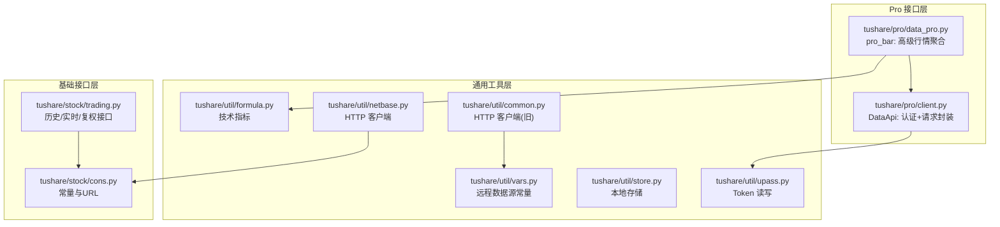
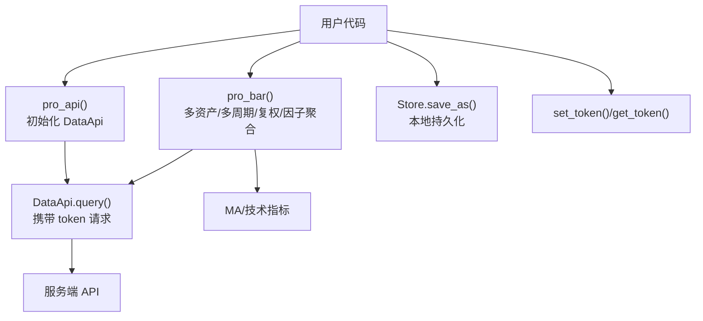
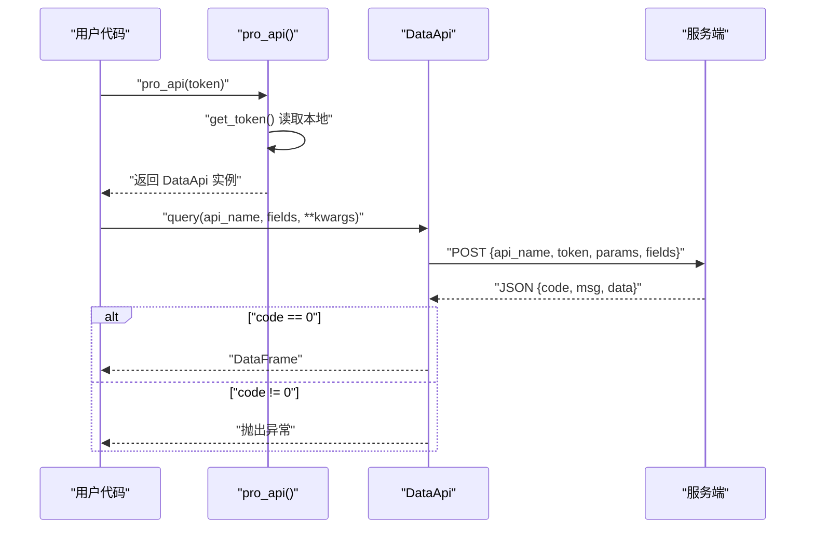
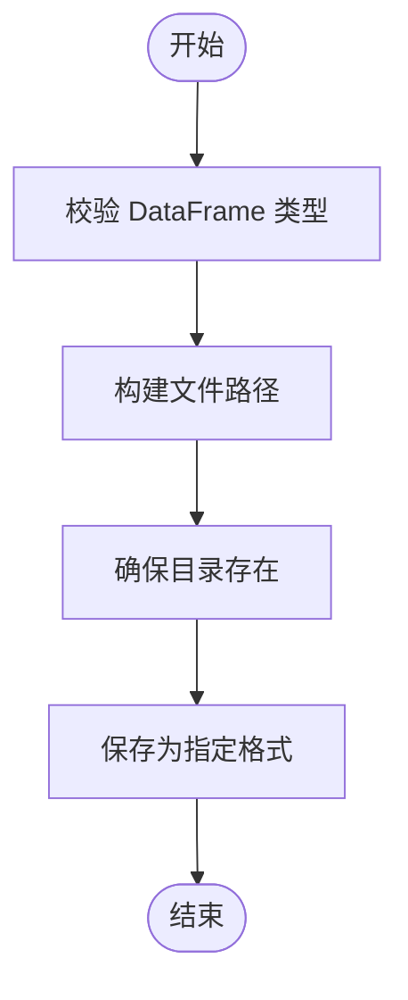
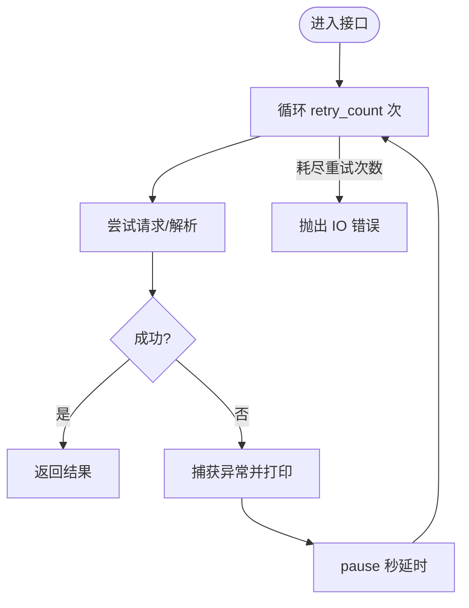
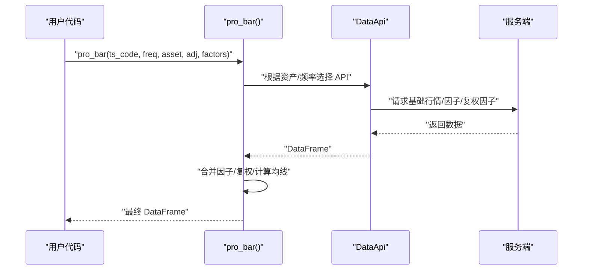
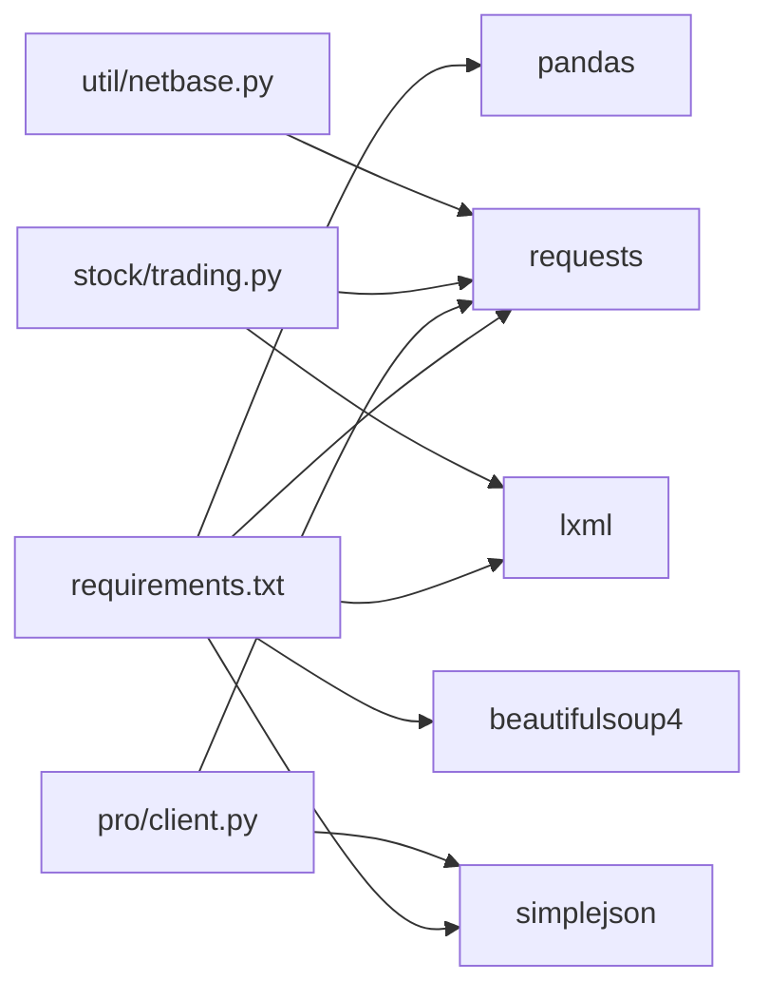

# 高级功能

<cite>
**本文引用的文件**
- [client.py](file://tushare/pro/client.py)
- [data_pro.py](file://tushare/pro/data_pro.py)
- [upass.py](file://tushare/util/upass.py)
- [formula.py](file://tushare/util/formula.py)
- [store.py](file://tushare/util/store.py)
- [netbase.py](file://tushare/util/netbase.py)
- [common.py](file://tushare/util/common.py)
- [trading.py](file://tushare/stock/trading.py)
- [cons.py](file://tushare/stock/cons.py)
- [vars.py](file://tushare/util/vars.py)
- [README.md](file://README.md)
- [requirements.txt](file://requirements.txt)
</cite>

## 目录
1. [引言](#引言)
2. [项目结构](#项目结构)
3. [核心组件](#核心组件)
4. [架构总览](#架构总览)
5. [详细组件分析](#详细组件分析)
6. [依赖分析](#依赖分析)
7. [性能考量](#性能考量)
8. [故障排查指南](#故障排查指南)
9. [结论](#结论)
10. [附录](#附录)

## 引言
本文件面向有经验的开发者，系统化梳理 TuShare 的高级功能与工程实现，重点覆盖：
- 认证与授权机制：Token 管理、API 权限控制、使用限制
- 数据缓存机制：本地缓存策略、更新规则、性能优化
- 错误处理与重试机制：网络异常、数据解析、自动重试
- Pro 版高级特性：复权处理、因子数据、批量数据获取
- 高级使用场景：大规模数据获取、实时监控、数据可视化
- 扩展与定制：接口扩展点、配置与部署建议

## 项目结构
TuShare 采用按领域分层的组织方式，核心目录与职责如下：
- tushare/pro：Pro 接口封装与高级行情聚合
- tushare/util：通用工具（网络、存储、公式、认证）
- tushare/stock：基础行情与历史数据接口
- tushare/fund、tushare/bond、tushare/futures 等：细分市场模块
- test：单元测试与示例
- README.md、requirements.txt：文档与依赖声明

图示来源
- [client.py:17-52](file://tushare/pro/client.py#L17-L52)
- [data_pro.py:21-158](file://tushare/pro/data_pro.py#L21-L158)
- [upass.py:16-31](file://tushare/util/upass.py#L16-L31)
- [store.py:14-44](file://tushare/util/store.py#L14-L44)
- [formula.py:8-262](file://tushare/util/formula.py#L8-L262)
- [netbase.py:9-29](file://tushare/util/netbase.py#L9-L29)
- [common.py:18-86](file://tushare/util/common.py#L18-L86)
- [trading.py:32-100](file://tushare/stock/trading.py#L32-L100)
- [cons.py:1-453](file://tushare/stock/cons.py#L1-L453)
- [vars.py:1-598](file://tushare/util/vars.py#L1-L598)

章节来源
- [README.md:1-411](file://README.md#L1-L411)
- [requirements.txt:1-6](file://requirements.txt#L1-L6)

## 核心组件
- 认证与授权
  - Token 管理：本地持久化与读取，初始化 Pro 接口
  - 请求封装：统一携带 token，处理服务端返回状态码
- 数据缓存
  - 本地存储：CSV/XLS/HDF/JSON/数据库
  - 技术指标：内置多种指标计算，便于二次加工
- 错误处理与重试
  - 多处接口采用固定次数重试与延迟，提升稳定性
  - 异常捕获与错误提示，避免中断
- Pro 高级特性
  - 复权处理：前复权/后复权/不复权
  - 因子数据：换手率、量比等
  - 批量数据：多周期/多资产/多字段聚合

章节来源
- [client.py:22-48](file://tushare/pro/client.py#L22-L48)
- [upass.py:16-31](file://tushare/util/upass.py#L16-L31)
- [data_pro.py:34-140](file://tushare/pro/data_pro.py#L34-L140)
- [formula.py:8-262](file://tushare/util/formula.py#L8-L262)
- [store.py:24-44](file://tushare/util/store.py#L24-L44)
- [trading.py:32-100](file://tushare/stock/trading.py#L32-L100)

## 架构总览
下图展示 Pro 接口与认证、存储、指标计算的交互关系。

图示来源
- [data_pro.py:21-158](file://tushare/pro/data_pro.py#L21-L158)
- [client.py:22-48](file://tushare/pro/client.py#L22-L48)
- [upass.py:16-31](file://tushare/util/upass.py#L16-L31)
- [formula.py:12-13](file://tushare/util/formula.py#L12-L13)
- [store.py:24-44](file://tushare/util/store.py#L24-L44)

## 详细组件分析

### 认证与授权机制
- Token 管理
  - set_token：将 token 写入用户主目录下的 CSV 文件
  - get_token：从 CSV 读取 token，未找到时输出提示
  - pro_api：优先从本地读取 token，否则使用传入参数
- 请求封装与权限控制
  - DataApi.query：构造请求体，包含 api_name、token、params、fields
  - 服务端返回 code!=0 时抛出异常，便于上层统一处理
- 使用限制
  - 通过服务端返回码进行权限/配额控制，客户端不做本地限制

图示来源
- [data_pro.py:21-31](file://tushare/pro/data_pro.py#L21-L31)
- [upass.py:16-31](file://tushare/util/upass.py#L16-L31)
- [client.py:32-48](file://tushare/pro/client.py#L32-L48)

章节来源
- [upass.py:16-31](file://tushare/util/upass.py#L16-L31)
- [client.py:19-48](file://tushare/pro/client.py#L19-L48)
- [data_pro.py:21-31](file://tushare/pro/data_pro.py#L21-L31)

### 数据缓存机制
- 本地存储
  - Store.save_as：支持 CSV/XLS/HDF/JSON 等格式，自动创建目录
  - 支持追加模式与数据库入库（SQLAlchemy/HDF5）
- 缓存策略建议
  - 按日期/代码分区存储，便于增量更新与清理
  - 对高频访问指标（如均线）可在内存中缓存，定期刷新
- 性能优化
  - 分批写入、压缩存储、索引列提前建立
  - 使用高效序列化（Parquet/HDF5）替代 CSV

图示来源
- [store.py:14-44](file://tushare/util/store.py#L14-L44)

章节来源
- [store.py:14-44](file://tushare/util/store.py#L14-L44)

### 错误处理与重试机制
- 固定次数重试
  - get_hist_data、get_tick_data、get_sina_dd 等接口均支持 retry_count 与 pause
  - 重试期间可设置最小请求间隔，避免触发服务端限流
- 异常捕获与提示
  - 多处 try/except 捕获网络异常，打印错误并返回 None 或抛出 IO 错误
- 复权数据与因子聚合
  - pro_bar：对复权因子缺失/填充、换手率/量比因子合并，异常时返回 None 并抛出 IO 错误

图示来源
- [trading.py:32-100](file://tushare/stock/trading.py#L32-L100)
- [trading.py:135-187](file://tushare/stock/trading.py#L135-L187)
- [trading.py:190-229](file://tushare/stock/trading.py#L190-L229)
- [data_pro.py:70-140](file://tushare/pro/data_pro.py#L70-L140)

章节来源
- [trading.py:32-100](file://tushare/stock/trading.py#L32-L100)
- [trading.py:135-187](file://tushare/stock/trading.py#L135-L187)
- [trading.py:190-229](file://tushare/stock/trading.py#L190-L229)
- [data_pro.py:70-140](file://tushare/pro/data_pro.py#L70-L140)

### Pro 版高级特性
- 复权处理
  - 支持前复权/后复权/不复权；缺失因子时回退逻辑
  - 通过 adj_factor 合并复权因子，填充缺失值
- 因子数据
  - 支持换手率/量比等因子字段，按需返回
- 批量数据获取
  - 支持多资产（股票/指数/期货/基金/数字货币）、多周期（日/周/月/分钟）
  - 自动拼接均线（MA）与成交量均线

图示来源
- [data_pro.py:34-140](file://tushare/pro/data_pro.py#L34-L140)
- [formula.py:12-13](file://tushare/util/formula.py#L12-L13)

章节来源
- [data_pro.py:34-140](file://tushare/pro/data_pro.py#L34-L140)
- [formula.py:8-262](file://tushare/util/formula.py#L8-L262)

### 高级使用场景与最佳实践
- 大规模数据获取
  - 分批拉取：按日期区间/代码分组，结合重试与延时
  - 并发策略：多进程/多线程拉取不同分组，注意限速与配额
  - 存储策略：HDF5/Parquet，分区表，索引列优化
- 实时监控系统
  - 使用 get_realtime_quotes 等接口定时轮询
  - 将结果写入数据库或消息队列，供下游消费
- 数据可视化
  - 结合 pro_bar 与技术指标，绘制 K 线与均线
  - 将因子数据（换手率/量比）作为辅助指标叠加

章节来源
- [trading.py:324-394](file://tushare/stock/trading.py#L324-L394)
- [data_pro.py:34-140](file://tushare/pro/data_pro.py#L34-L140)
- [formula.py:12-13](file://tushare/util/formula.py#L12-L13)

### 扩展与定制
- 接口扩展
  - 在 pro_api 返回的 DataApi 上新增方法，或通过 partial 绑定
  - 自定义因子：基于现有指标函数扩展新的技术指标
- 配置与部署
  - 将 Token 写入系统环境变量或配置文件，避免硬编码
  - 使用 Docker 化部署，挂载本地存储目录

章节来源
- [client.py:50-52](file://tushare/pro/client.py#L50-L52)
- [upass.py:16-31](file://tushare/util/upass.py#L16-L31)
- [formula.py:8-262](file://tushare/util/formula.py#L8-L262)

## 依赖分析
- Python 版本与第三方库
  - pandas、requests、lxml、simplejson、beautifulsoup4
- 关键依赖关系
  - pro 接口依赖 requests 与 simplejson
  - 历史/实时接口依赖 lxml、requests
  - 存储模块依赖 pandas、SQLAlchemy、PyTables

图示来源
- [requirements.txt:1-6](file://requirements.txt#L1-L6)
- [client.py:11-14](file://tushare/pro/client.py#L11-L14)
- [trading.py:15-29](file://tushare/stock/trading.py#L15-L29)
- [netbase.py:3-6](file://tushare/util/netbase.py#L3-L6)

章节来源
- [requirements.txt:1-6](file://requirements.txt#L1-L6)

## 性能考量
- 网络请求
  - 合理设置超时与重试次数，避免阻塞
  - 使用 keep-alive 与合适的 User-Agent，减少握手开销
- 数据处理
  - 使用向量化操作（pandas/numpy），避免逐行迭代
  - 指标计算尽量复用中间结果（如移动平均）
- 存储与查询
  - 选择合适格式（Parquet/HDF5），启用压缩
  - 建立索引列，优化时间序列查询

## 故障排查指南
- 认证失败
  - 确认本地 token 文件是否存在且有效
  - 检查服务端返回码与错误信息
- 网络异常
  - 提升 retry_count 与 pause，观察是否恢复
  - 检查代理/防火墙与 DNS 解析
- 数据解析错误
  - 检查字段映射与类型转换
  - 对缺失值进行填充或剔除
- 复权因子缺失
  - 回退到前复权或后复权策略
  - 补充缺失因子后再计算

章节来源
- [upass.py:23-31](file://tushare/util/upass.py#L23-L31)
- [client.py:42-43](file://tushare/pro/client.py#L42-L43)
- [trading.py:67-100](file://tushare/stock/trading.py#L67-L100)
- [data_pro.py:91-107](file://tushare/pro/data_pro.py#L91-L107)

## 结论
TuShare 的高级功能围绕“认证—请求—缓存—处理—存储—可视化”的完整链路展开。通过 Token 管理与统一请求封装，保障了安全性与一致性；通过重试与异常处理，提升了鲁棒性；通过复权与因子聚合，增强了数据可用性；通过本地存储与指标计算，支撑了大规模数据与复杂分析场景。建议在生产环境中结合并发、限速与缓存策略，进一步提升性能与稳定性。

## 附录
- 常用接口与参数
  - pro_api：初始化 Pro 接口，支持本地 Token 读取
  - pro_bar：通用行情接口，支持多资产/多周期/复权/因子
  - get_hist_data/get_tick_data：历史/分笔数据，支持重试与延时
  - Store.save_as：本地存储，支持多种格式
- 参考文档
  - README 文档与变更日志

章节来源
- [README.md:43-230](file://README.md#L43-L230)
- [data_pro.py:21-158](file://tushare/pro/data_pro.py#L21-L158)
- [trading.py:32-100](file://tushare/stock/trading.py#L32-L100)
- [store.py:24-44](file://tushare/util/store.py#L24-L44)